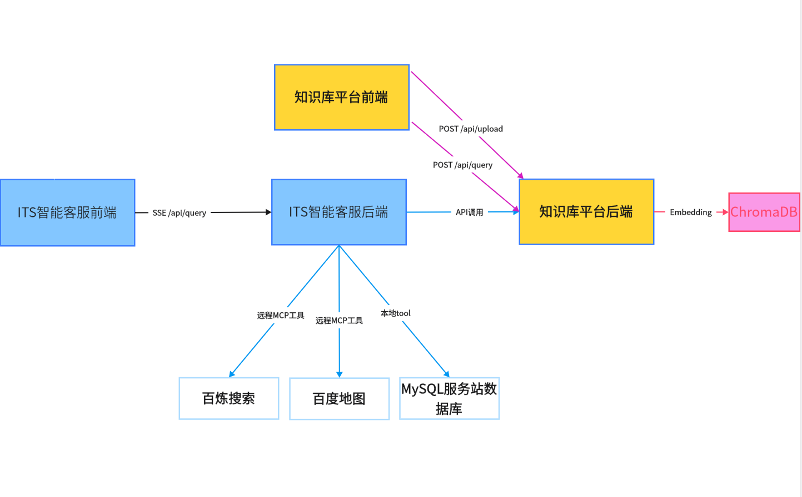
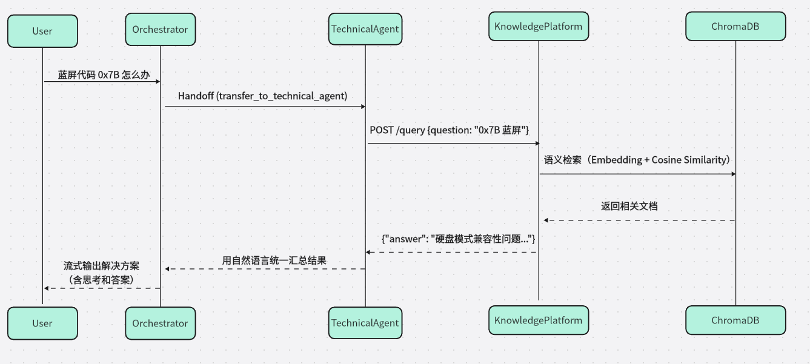
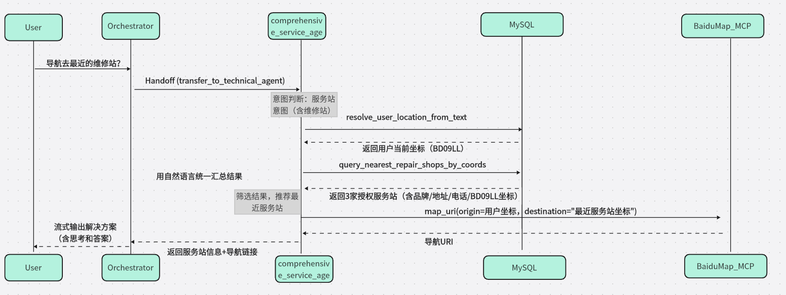
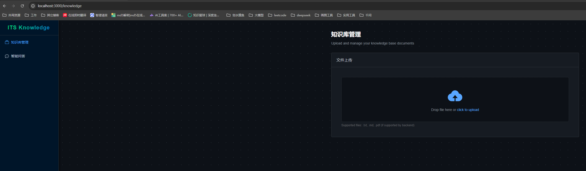
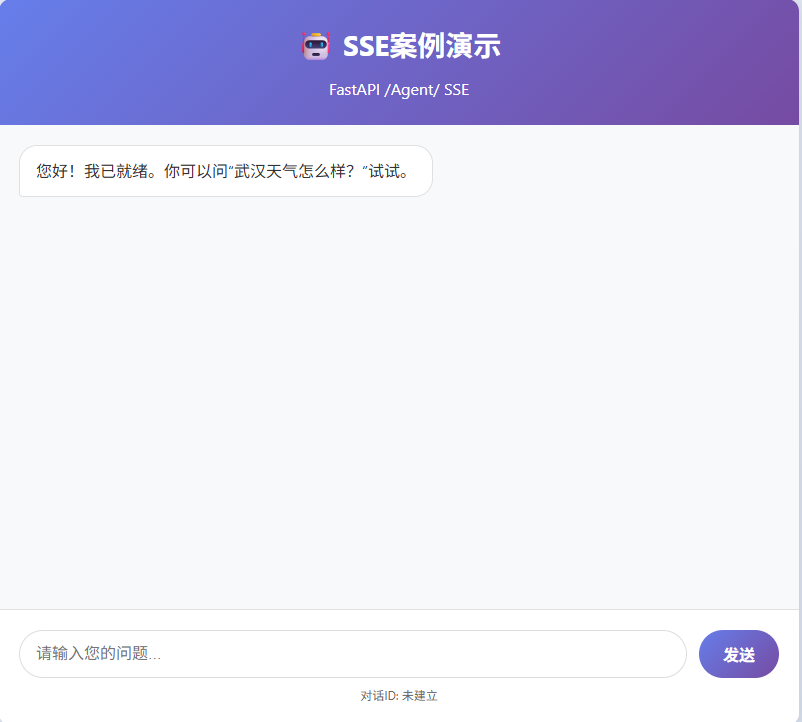

# 01. 多智能体架构设计

##  1、概览

本项目主要围绕 **ITS（Intelligent Technical Service）智能客服系统** 与 **ITS 知识库平台** 两大核心项目展开，涵盖 **两个前端 + 两个后端** 的完整技术栈，构建从需求分析 → 架构设计 → 编码实现 → 全链路能力。

| 项目                 | 类型             | 核心价值                                                     |
| -------------------- | ---------------- | ------------------------------------------------------------ |
| **ITS 智能客服系统** | 多智能体对话系统 | 实现“调度-技术-业务”三层智能体协作，支持服务站导航、技术问答等复杂场景 |
| **ITS 知识库平台**   | RAG 文档问答系统 | 支持私域知识上传、向量化存储、语义检索与生成式问答           |


**四大项目联动关系**




**ITS智能客服效果如下：**


**知识库平台效果如下：**


## 2、ITS 智能客服（多智能体架构）

### 1.1 技术栈全景

| 层级             | 技术选型                               | 说明                           |
| ---------------- | -------------------------------------- | ------------------------------ |
| **语言**         | Python 3.x                             | 主力开发语言                   |
| **Web 框架**     | FastAPI                                | 高性能异步框架                 |
| **服务器**       | Uvicorn                                | 高性能web 服务器               |
| **智能体框架**   | `openai-agents`（基于 Swarm 模式）     | 轻量级多 Agent 编排            |
| **LLM 接入**     | OpenAI SDK（兼容阿里百炼等）           | 统一接口，模型可替换           |
| **外部工具协议** | **MCP (Model Context Protocol)**       | 标准化连接地图、搜索等外部服务 |
| **数据库**       | MySQL + `pymysql` + `dbutils.PooledDB` | 连接池保障高并发稳定性         |
| **数据验证**     | `pydantic`                             | 运行时类型检查与序列化         |
| **HTTP 客户端**  | `httpx`（异步）、`requests`（同步）    | 外部 API 调用                  |
| **日志**         | Python `logging`                       | 结构化日志输出                 |

### 1.2 分层架构设计

系统代码组织在 `backend/app` 下，主要分为以下几层：


1. Presentation Layer (表现层)

  \-  **位置**: `presentation/`

  \-  **职责**: 处理 HTTP 请求与响应，定义 API 路由和数据模型 (Schemas)。

  \-  **关键组件**: `routes.py` (定义 `/api/query` 等接口), `schemas.py` (Pydantic 模型).

  \-  **交互**: 接收前端请求，调用 Application 层逻辑，并通过 SSE (Server-Sent Events) 流式返回结果。


2. Application Layer (应用层)

  \-  **位置**: `application/`

  \-  **职责**: 编排业务流程，管理会话状态，处理智能体执行流。

  \-  **关键组件**:

​    \-  `agent_service.py`: 核心业务入口，负责初始化对话上下文，启动智能体运行器 (Runner)。

​    \-  `session_manager.py`: 管理用户会话历史和上下文记忆。

​    \-  `stream_processor.py`: 处理智能体输出的事件流，将其转换为前端可消费的格式。


3. Core Agents Layer (核心智能体层)

  \- **位置**: `core_agents/`

  \-  **职责**: 定义具体的智能体角色、提示词 (Prompts) 和工具集 (Tools)。

  \-  **关键组件**:

​    \-  `orchestrator.py`: 调度智能体，作为总控入口，负责意图识别和任务分发。

​    \-  `technical_agent.py`: 技术顾问智能体，专注于解答技术维修类问题，拥有知识库查询能力。

​    \-  `comprehensive_service_agent.py`: 全能业务智能体，专注于服务站查询、导航等业务办理。

  \-  设计模式: 采用 Handoff (交接) 模式。调度器根据用户意图将控制权移交给专业智能体，专业智能体完成任务后将结果交还 (Return) 给调度器。


4. Infrastructure Layer (基础设施层)

  \-  **位置**: `infrastructure/`

  \-  **职责**: 提供底层技术支持，与外部系统交互。

  \-  **关键组件**:

​    \-  `database.py`: 数据库连接池封装。

​    \-  `mcp/`: MCP 客户端实现，负责连接和管理 MCP 服务器（如地图服务、搜索服务）。

​    \-  `tools/`: 具体的工具函数实现（如 SQL 查询、HTTP 请求、坐标转换等）。

​    \-  `logger.py`: 统一的日志配置。


### 1.3 关键工作流

1. 请求处理流:

  前端发送请求 -> `routes.py` 接收 -> `AgentService` 初始化上下文 -> `SessionManager` 加载历史 -> 启动 `Runner`。


2. 智能体编排流:

  `Orchestrator` 分析意图 -> (Handoff) -> `TechnicalAgent` / `ComprehensiveAgent` -> 执行工具 (Tools/MCP) -> 返回结果 -> `Orchestrator` 汇总 -> 输出给用户。


3. 流式响应流:

  智能体产生的每个 Token 或事件 (Event) -> `stream_processor.py` 捕获并格式化 -> SSE 响应 -> 前端实时渲染。


### 1.4 关键设计


- 模块化提示词管理: 提示词 (Prompts) 从代码中剥离，存储在 `prompts/` 目录，便于非技术人员维护和迭代。

- 连接池管理: 使用 `PooledDB` 管理数据库连接，避免频繁创建/销毁连接带来的开销。

- MCP 扩展性: 通过 MCP 协议集成外部工具，使得系统可以轻松扩展新的能力（如接入新的搜索源或 API）而不破坏核心逻辑。


##  3、ITS 智能客服前端（Vue 3 ）

### 3.1 技术栈全景

| 类别              | 技术                             | 作用                                 |
| ----------------- | -------------------------------- | ------------------------------------ |
| **框架**          | Vue 3 (Composition API)          | 组件化开发，逻辑复用                 |
| **构建工具**      | Vite                             | 极速冷启动 + HMR                     |
| **UI 库**         | Element Plus                     | 企业级组件（Input, Button, Loading） |
| **Markdown 渲染** | `marked` + `github-markdown.css` | 实时渲染 AI 返回的富文本             |
| **通信**          | `fetch` + `ReadableStream`       | 处理 SSE 流式响应                    |

------

### 3.2 分层架构设计

系统代码组织在 `front/its_front`，遵循标准的 Vue + Vite 项目结构：

\-  `src/`: 源代码目录

  \-  `assets/`: 静态资源（图片、样式文件）。

  \-  `App.vue`: 应用的根组件，通常包含主要的布局和对话窗口逻辑。

  \-  `main.js`: 入口文件，负责初始化 Vue 应用、引入 Element Plus 和全局样式。

  \-  `style.css`: 全局样式定义。


### 3.3 关键工作流

前端主要负责与后端 `AgentService` 进行实时交互，核心流程如下：


1. 消息发送:

  \-  用户在输入框输入问题。

  \-  前端通过 `fetch` 或 `axios` (或其他 HTTP 客户端) 向后端 `/api/query` 接口发送 POST 请求。

  \-  请求体包含：`query` (用户问题), `context` (包含 sessionId, userId 等上下文信息)。


2. 流式接收 (Server-Sent Events):

  \-  由于智能体生成回答需要时间，且需要打字机效果，后端采用流式响应。

  \-  前端利用 `fetch` API 的 `ReadableStream` 或 `EventSource` 监听响应流。

  \-  增量渲染: 每接收到一个数据块 (Chunk)，立即追加到当前对话气泡的消息内容中，并调用 `marked.parse()` 实时更新 HTML。


3. 状态管理:

  \-  虽然项目规模较小可能未引入 Pinia/Vuex，但组件内部利用 Vue 3 的 `ref` 和 `reactive` 管理以下状态：

​    \-  `messages`: 消息列表数组 (用户提问 + AI 回答)。

​    \-  `isLoading`: 加载状态，用于显示 Loading 动画或禁用输入框。

​    \-  `inputText`: 输入框当前内容。


### 3.4 关键设计

- Chat UI 布局：消息列表 + 输入框
- 实时打字机效果
- Markdown 支持：代码块、列表、加粗等自动高亮
- Loading 状态：禁用输入框 + 动画提示


## 4、ITS 知识库平台（RAG 架构）

### 4.1 技术栈全景

| 类别               | 技术                                        | 说明                           |
| ------------------ | ------------------------------------------- | ------------------------------ |
| **框架**           | FastAPI + Uvicorn                           | 同智能客服后端                 |
| **RAG 编排**       | LangChain                                   | 文档加载 → 切分 → 检索 → 生成  |
| **向量数据库**     | ChromaDB                                    | 本地持久化，轻量级             |
| **Embedding 模型** | OpenAI text-embedding-ada-002（或兼容模型） | 文本向量化                     |
| **LLM**            | OpenAI GPT / 通义千问（兼容 OpenAI API）    | 生成答案                       |
| **文档处理**       | `unstructured`, `markdownify`, `jieba`      | PDF/HTML → Markdown → 中文分词 |
| **配置管理**       | `pydantic-settings` + `.env`                | 环境变量驱动                   |


### 4.2 分层架构设计

系统代码组织在 `backend/knowlege` 下，主要分为以下几层：

1. Presentation Layer (表现层)

  \-  位置: `presentation/api/`

  \-  职责: 暴露 RESTful API 接口，处理 HTTP 请求参数验证和响应格式化。

  \-  关键组件:

​    \-  `routes.py`: 定义 `/upload` (文件上传) 和 `/query` (问答) 接口。

​    \-  `schemas.py`: 定义请求和响应的数据模型 (Pydantic Models)。


2. Business Logic Layer (业务逻辑层)

  \-  位置: `business_logic`

  \-  职责: 核心 RAG 流程的编排与实现。

  \-  关键组件:

​    \-  `file_processor.py`: 文档处理服务。负责接收上传的文件，进行清洗、HTML 转 Markdown、文本切分 (Splitting)。

​    \-  `retrieval_service.py`: 检索服务。负责将用户问题转化为向量，在 ChromaDB 中检索最相关的文档片段 (Chunks)。

​    \-  `query_service.py`: 生成服务。负责构建 Prompt（包含检索到的上下文），调用 LLM 生成最终答案。

​    \-  `document_service.py`: 文档管理逻辑。


3. Data Access Layer (数据访问层)

  \-  位置: `data_access/`

  \-  职责: 封装与向量数据库 ChromaDB 的交互细节。

  \- 功能: 文档向量化存储 (Upsert)、相似度搜索 (Similarity Search)。


4. Infrastructure & Utils (基础设施与工具)

  \-  位置: `chroma_kb/`, `utils/`, `config/`

  \-  职责:

​    \-  `chroma_kb/`: 持久化存储 ChromaDB 的 SQLite 数据文件和索引。

​    \-  `utils/text_utils.py`: 提供文本清洗、正则替换等通用工具函数。

​    \-  `config/`: 管理应用配置和环境变量加载。


### 4.3 关键工作流

**知识入库流程 (Upload )**

1. 上传: 用户通过 `/upload` 接口上传文件 (如 HTML, PDF)。

2. 预处理: `FileProcessor` 调用 `TextUtils` 清洗文本，将 HTML 转换为 Markdown。

3. 切分: 使用 LangChain 的 Splitter 将长文档切分为较小的 Chunks。

4. 向量化与存储: 调用 Embedding 模型将 Chunks 转换为向量，并存入 `ChromaDB` (`data_access` 层)。

**知识问答流程 (Retrieval )**

1. 提问: 用户通过 `/query` 接口发送问题。

2. 检索: `RetrievalService` 将问题向量化，在 `ChromaDB` 中查找 Top-K 相关文档片段。

3. 生成: `QueryService` 将“系统指令 + 检索到的上下文 + 用户问题”组装成 Prompt。

4. 回答: 调用 LLM 生成回答，并返回给用户。


### 4.4 关键设计

\-	本地化向量存储:	使用 ChromaDB 本地持久化，无需依赖外部复杂的向量数据库服务，部署轻量。

\-	格式标准化:	 统一将多源文档转换为 Markdown 格式处理，保留了文档的结构信息（标题、列表），有助于提升 LLM 的理解能力。

 \-	模块化:	 RAG将检索 (Retrieval) 和生成 (Generation) 解耦，便于独立优化（例如更换检索算法或更换 LLM 模型）。


##  5、知识库平台前端（Vue 3）

### 4.1 技术栈全景

| 技术                     | 作用                           |
| ------------------------ | ------------------------------ |
| Vue 3 + `<script setup>` | 组合式 API 开发                |
| Vite                     | 构建工具                       |
| Vue Router 4             | 路由管理（/knowledge ↔ /chat） |
| Element Plus             | Upload、Table、Card 等组件     |
| Axios                    | HTTP 请求封装（带拦截器）      |
| marked                   | Markdown 渲染                  |


### 4.2 分层架构设计

项目遵循标准的 Vue 3 + Vite 工程结构，位于 `front/its_knowlege_platform`：

\-  `src/api/`: API 接口封装。

  \-  `request.js`: Axios 实例配置，包含 baseURL (`/api`) 和响应拦截器。

  \-  `knowledge.js`: 定义具体业务接口（如 `uploadFile`）。

\-  `src/assets/`: 静态资源（图片、SVG）。

\-  `src/components/`: 公共组件。

\-  `src/layout/`: 布局组件。

  \-  `index.vue`: 应用的主布局框架（通常包含侧边栏/导航栏和 `RouterView`）。

\-  `src/router/`: 路由配置。

  \-  `index.js`: 定义路由表，包括 `/knowledge` (知识库管理) 和 `/chat` (智能问答) 两个主要页面。

\-  `src/views/`: 页面级组件。

  \-  `Knowledge.vue`: 知识库管理页，提供文件上传和上传记录展示功能。

  \-  `Chat.vue`: 智能问答页，提供对话交互界面。

\-  `src/App.vue`: 根组件。

\-  `src/main.js`: 入口文件，负责初始化 Vue 应用、注册 Element Plus 和 Router。


### 4.3 关键工作流

1. 知识库管理 (****`Knowledge.vue`****)

   文件上传: 使用 Element Plus 的 `el-upload` 组件，支持拖拽上传。

   交互逻辑:

     \-  前端通过 `FormData` 封装文件。

     \-  调用后端 `/api/upload` 接口。

     \-  实时维护 `uploadHistory` 列表，展示文件名、新增切片数 (Chunks) 和上传状态。

2. 智能问答 (****`Chat.vue`****)

   \-  **(根据路由推断)** 提供对话界面，用户输入问题后，调用后端 `/api/query` 接口。

   \-  使用 `marked` 将后端返回的 Markdown 答案渲染为 HTML，并应用 `github-markdown.css` 样式以保证良好的阅读体验。

3. 网络请求封装

   \-  `src/api/request.js` 统一封装了 Axios 实例。

   \-  BaseURL: 设置为 `/api`，配合 Vite 的代理配置 (Proxy) 解决开发环境跨域问题。

   \- 拦截器: 统一处理响应数据（直接返回 `response.data`）和错误捕获。


# 02. 多智能体业务设计与痛点分析


## 1、导言：为什么需要 "业务架构"？

在 AI 应用开发中，**技术架构决定系统能否跑起来，而业务架构决定系统能否用得好**。

ITS（Intelligent Technical Service）不是简单的问答机器人，而是一个面向真实 IT 服务场景下一个具备**自主决策、工具调用、多角色协作**能力的智能体集群。它必须回答两类核心问题：

- <strong style='color:red'>怎么修?</strong> → 技术诊断（接入知识库与通用搜索）
- <strong style='color:red'>去哪修?</strong> → 服务引导（接入地图与数据库）


若无清晰的**业务边界**与**协作规则**，系统极易陷入：

- 路由混乱（“踢皮球”）
- 回答幻觉（编造地址或维修步骤）
- 工具误用（参数错乱、权限越界）

以下将从几个维度，深度解析 ITS 的业务架构设计


## 2、系统全景架构：双引擎驱动架构

ITS App 采用了 **Hub-and-Spoke (中心辐射型)** 多智能体架构也即**中枢 + 记忆**双引擎架构，通过明确的分工和高效的 Handoff (交接) 机制，实现能力解耦与专业聚焦，从而保证复杂业务的闭环处理。

| 引擎             | 模块                | 定位     | 核心职责                                                     |
| ---------------- | ------------------- | -------- | ------------------------------------------------------------ |
| **多智能体中枢** | `backend/app`       | “大脑”   | 负责意图识别、任务拆解、智能体调度、外部工具调用（地图、搜索、数据库） |
| **垂类知识平台** | `backend/knowledge` | “海马体” | 私域知识向量化、语义检索、RAG 生成                           |

**设计哲学**：

- **中枢不存知识，只做决策**
- **知识平台不碰业务，只管问答**


## 3、多智能体协作架构 (ITS App)

### 3.1  架构设计理念


**中心化调度**: 所有的用户请求首先由一个“全知全能”的调度器接收，由它决定分发给哪个专家。

**专才专用**: 每个业务智能体只关注自己领域的 Prompt 和工具，避免 Prompt 污染，提升任务成功率。

**流式响应**: 全链路支持 Server-Sent Events (SSE)，让用户感知到智能体的思考过程 (Thinking Process)。


### 3.2、三大智能体的角色与业务边界

#### 1. 调度智能体（Orchestrator）

代码位置: `core_agents/orchestrator.py`

角色: 门房、总指挥。

核心职责:

1. **意图识别**: 分析用户输入是 "电脑坏了" (技术问题) 还是 "哪有维修店" (服务问题)。**要做什么**

2. **智能路由**: 绝不直接回答技术细节（如“蓝屏怎么修”）将会话控制权 `transfer` 给对应的下游智能体。**不做什么**

3. **流式响应**: 实时将智能体的结果推送给用户。

实现细节:

  \-  使用 `Orchestrator` 类封装，维护全局历史消息。

  \-  Prompt 中明确禁止直答，强制 Handoff


>  **边界守则**：**只决策，不执行**


#### 2. 技术顾问智能体 

代码位置: `core_agents/technical_agent.py`

角色: IT 维修专家。

核心职责: 

1. 基于知识库提供故障诊断与操作指南和以及实时资讯类问题。**要做什么**
2. 不处理地理位置相关问题、如访问 MySQL 或地图服务。**不做什么**

工具链:

  \- 	`query_knowledge`: 调用知识库平台的 API 获取私域专业维修方案。

  \-	 MCP: 通过调用阿里百炼平台MCP`bailian_web_search`工具的 API 获取公域问题。

核心业务流程:

1. 接收用户描述 (e.g., "蓝屏代码 0x000001")。

2. 调用 `knowledge_tools.py` 中的 `query_knowledge` 函数。

3. 结合知识库返回的 Markdown 内容，生成易懂的指导步骤。


核心业务流程图:




> **边界守则**：**只问知识，不碰位置**


#### 3. 全能业务智能体

代码位置: `core_agents/comprehensive_service_agent.py`

角色: 生活服务助手。

核心职责:     

- 提供服务站查询、导航、位置解析。**要做什么**
- 不提供具体维修方法，不调用知识库 API 。**不做什么**

工具链:

 \-	MySQL: 查询本地服务站数据库 (`service_station_tools.py`)。

 \-	MCP : 通过调用百度地图平台的map_uri  进行路径规划。

核心业务流程:

1. 接收用户描述 (e.g., "导航去最近的维修站")。

2. 调用 `service_station_tools.py` 中的 `query_nearest_repair_shops_by_coords` 函数以及MCP工具。

3. 返回数据库中最近的服务站导航地址链接。

亮点:

  \-  实现了 `resolve_user_location_from_text`，支持从自然语言或 IP 地址解析用户经纬度。

  \-  实现了 `query_nearest_repair_shops_by_coords`支持基于 Haversine 公式的经纬度距离计算，推荐最近的服务站。


核心业务流程图:




> **安全边界**：
>
> - 服务站坐标**仅来自数据库**，**禁止**使用外部地图API调用（防止坐标准确性失控）
>
>  **边界守则**：**只查位置，不教维修**


#### 4.关键协作规则：

1. **单步执行**：Orchestrator 只处理第一步（路由），不试图一次性解决
2. **信任回调**：子Agent 完成任务后必须调用 `return_to_orchestrator`
3. **结果整合**：Orchestrator 仅做简短收尾（如“已为您找到解决方案”），**不复述详情**


## 4、多 Agent 开发痛点与解决方案

在构建 ITS 系统的过程中，遇到了多智能体系统开发中常见的典型问题。以下是我的实战经验总结。


#### 1. 痛点一：路由死循环与踢皮球

问题描述: 智能体 A 觉得问题该由 B 处理，B 接手后发现处理不了又扔回给 A，或者调度智能体不断地将同一个问题重复分发。

解决方案:

1. **明确的 Handoff 协议**: 我们定义了 `HandoffOutputItem`，强制要求路由必须有明确的目标 `target_agent`。

2. **Prompt 约束**: 在 协调智能体 的 Prompt 中明确列出哪些问题属于哪个领域，特别是边缘案例（Corner Cases）。

3. **状态感知**: 协调智能体 维护全局历史，如果发现最近一次操作已经是转接，则倾向于强制兜底或请求用户澄清，而不是无限重试。


#### 2. 痛点二：Prompt 污染与上下文混乱

问题描述: 如果所有功能都塞在一个大 Prompt 里，模型很容易混淆指令（例如把地图查询的参数用到了知识库搜索上）。

解决方案:

1. **独立 Prompt 文件**: 将各个智能体提示词分开管理。每个 Agent 运行时只加载属于自己的“世界观”。

2. **Runner 隔离**: 代码层面，每个 Agent 是一个独立的类实例。切换 Agent 时，实际上是切换了底层的 Prompt 上下文，但保留了 Conversation History（对话历史），实现了“记忆共享，逻辑隔离”。

​        

#### 3. 痛点三：工具调用的不确定性

问题描述: 模型经常忘记传递必填参数或者工具一旦有多个可能出现工具调用顺序问题。

解决方案:

1. **Pydantic 强类型定义**: 我们使用 Pydantic 模型严格定义工具的入参结构。

2. **工具描述和Prompt 约束****: 在  Prompt 中使用了 Few-Shot Learning (少样本学习)，明确列出哪些问题该调用哪个工具，以及如何编排这些工具调用。


#### 4. 痛点四：异构服务集成复杂性 

问题描述: 地图服务是 HTTP API，数据库是 SQL，知识库是向量检索。每增加一个外部能力，都要写大量的胶水代码。

解决方案:

1. 引入 MCP (Model Context Protocol): 对于百度地图和搜索这种外部通用服务，我们遵循 MCP 思路进行封装。

2. 统一接口: 无论底层是 SQL 还是 API，对 Agent 来说都是统一的 `function_tool`。Agent 只需要关心 `tool_name` 和 `arguments`，不需要关心底层实现协议。


#### 5. 痛点五：调试与可观测性差 

问题描述: 用户问了一个问题，系统没反应，或者回答得很奇怪。不知道是路由错了，还是工具挂了，还是 LLM 抽风了。

解决方案:

1. 结构化日志: 通过时间监听机制在日志中实现了调用模型详细的日志记录。每一次 `Thinking`，每一次 `Tool Call`，每一次 `Handoff` 都有迹可循。

2. SSE 流式透传: 将后端的“思考过程”通过 SSE 实时推送到前端。用户不仅看到结果，还能看到“正在查询数据库...”、“正在切换专家...”，这极大地提升了用户体验，也方便了开发者调试。


## 5、架构优势总结与扩展

### 5.1 架构优势总结

#### 1. 解耦性

- **业务逻辑**（App）与**知识数据**（Knowledge）完全分离
- 可独立迭代

#### 2. 可扩展性

- 新增能力只需：
  1. 实现新工具（如高德地图 MCP）
  2. 在对应 Agent 的 handoffs 中注册
- 无需修改调度器核心逻辑

#### 3. 可观测性

- 日志覆盖：意图识别 → 智能体切换 → 工具调用 → 结果返回
- 用户可见“系统正在为您查询...”，提升信任感

#### 4. 安全性

- 服务站数据源锁定（MySQL 只读）
- 外部 API 调用标准化（MCP 封装）
- 权限最小化（Agent 仅访问必要工具）

### 5.2 扩展方向

| 方向             | 当前状态      | 规划                                     |
| ---------------- | ------------- | ---------------------------------------- |
| **知识库闭环**   | 只读          | 增加用户反馈打分 → 自动优化知识切片      |
| **路径规划增强** | 直线距离推荐  | 接入 MCP 路径规划 → 返回驾车/步行时间    |
| **多轮澄清**     | 一次性回答    | 对模糊问题主动追问（如“您在哪个城市？”） |
| **Agent 自注册** | 静态 handoffs | 动态发现可用 Agent，支持插件化扩展       |


> 业务架构的本质是“划清责任”**好的 AI 系统，不是让模型无所不能，而是让每个组件各司其职、各安其位。**ITS 的多智能体架构不仅仅是技术的堆砌，更是对**业务边界**的深刻理解。
>
> - **Orchestrator** 负责“分对人”守住了入口，保证了系统的有序性。
> - **Technical Agent** 负责“答对事”守住了专业度，保证了回答的准确性
> - **Comprehensive Agent** 负责“指对路”守住了执行力，连接了外部物理世界。
>
> 通过清晰的边界、严格的协议与透明的协作，我们构建了一个**既智能又可信**的服务系统。

# 03.  知识库构建实战


## 1、任务目标

**1.1 理论知识：**

1. 理解 **RAG (检索增强生成)** 的核心概念
2. 掌握 **向量数据库 (Vector Database)** 的工作原理


**1.2 动手实战**: 基于 Python + LangChain + ChromaDB 搭建一套完整的知识库入库系统。

1. 导入知识库平台前端项目
2. 搭建本地知识库问答系统的整体基础架构
3. 接入FastAPI Web 框架和Pyton中的异步编程
4. 开发 `/upload` 接口，完成私域知识到知识库的编码


## 2、核心概念扫盲 

### 2.1 RAG相关概念

#### 1. 什么是 RAG？

大模型 (LLM) 就像一个“博学的博士”，但他有两个缺点：

1. **知识时效性问题**: 他的知识只更新到训练结束的那一天（比如 2023 年）。

2. **幻觉问题**: 不知道的事他可能会一本正经的胡说八道。

**RAG (Retrieval-Augmented Generation)** 就是给这位博士配了一个“图书馆” (知识库)。当你有问题时：

1. 先去图书馆查阅相关资料 (Retrieval)。

2. 把资料和问题一起交给博士。

3. 博士结合资料回答问题 (Generation)。


#### 2. 机器如何理解文字？

电脑不认识中文“苹果”，它只认识数字。

**Embedding (向量化)** 就是把一段文字变成一组数字（向量）。

\*  `"苹果"` -> `[0.1, 0.8, -0.5, ...]`

\*  `"香蕉"` -> `[0.2, 0.7, -0.4, ...]` (离苹果很近)

\*  `"卡车"` -> `[0.9, -0.1, 0.8, ...]` (离苹果很远)


####  3. 什么是向量数据库？

顾名思义就是存储文本的向量值，和传统的数据库比如MySQL有什么区别？传统的 MySQL 数据库通过关键词匹配 (如 `WHERE content LIKE '%苹果%'`)。

**向量数据库 (ChromaDB)** 通过**相似度计算** (计算向量之间的距离) 来找答案。即使你搜“红富士”，也能找到“苹果”，因为它们在向量空间里靠得很近。


### 2.2 FastAPI概念

#### 1. 什么是 FastAPI？

想象你要开一家“智能客服接待站”，用户通过网页或 App 发送问题（比如上传文件、提问），你的程序需要**快速响应**并返回结果。

**FastAPI** 就是一个帮你搭建这个“接待站”的工具。它是一个用 Python 写的现代 Web 框架，专门用来**创建 API 接口**（也就是程序对外服务的“窗口”）。

它的两大优点特别适合 AI 项目：

1. **快**：性能接近底层 C 语言写的框架，能扛住大量请求。
2. **自动文档**：写完接口，自动生成可视化测试页面（Swagger UI），不用额外写文档。

简单说：**FastAPI = 你程序的“前台接待员”**，负责接收请求、调用内部逻辑、返回答案。


#### 2. 为什么要用 FastAPI？

在我们的知识库项目中，有两个关键操作需要对外提供服务：

- **上传文件** → 供用户把私域知识手册发给系统
- **提问查询** → 供用户找到相关问题比如“蓝屏怎么办？”


#### 3. FastAPI如何使用？

FastAPI 让我们用几行代码就能定义这些“服务窗口”：

```python
@app.post("/upload")          # 定义一个“上传”窗口
async def upload_file(...):   # 当有人访问 /upload，就执行这个函数
    ...                       # 处理文件并存入知识库
```

不过一般要结合uvicorn web服务器使用伪代码如下：

```python
import  os
import uvicorn
from fastapi import FastAPI

app = FastAPI(
    title="Fast API",
    version="1.0.0",
    description="Fast API",
)

@app.post("/upload")          # 定义一个“上传”窗口
async def upload_file(...):   # 当有人访问 /upload，就执行这个函数
    ...                       # 处理文件并存入知识库

def start_server():
    """启动服务器"""
    host = os.getenv("API_HOST", "0.0.0.0")
    port = int(os.getenv("API_PORT", "8001"))

    uvicorn.run(
        "api.main:app",
        host=host,
        port=port
    )

if __name__ == "__main__":
    start_server()

```


这样启动服务后就可以在前端直接访问，而且，启动服务后，打开浏览器访问 `http://localhost:8001/docs`，就能看到一个**自带测试功能的网页**，直接上传文件、查看结果——这对开发和调试都很友好！**FastAPI 就是帮你把 Python 函数变成一个别人能调用的网址接口**。


### 2.3 异步编程概念

#### 1. 什么是异步编程？

想象你在一家咖啡店点单：

- **同步方式（传统）**：你点一杯咖啡，店员必须等这杯做完、递给你之后，才能接待下一位顾客。如果做咖啡要 5 分钟，后面的人都得干等着。
- **异步方式（现代）**：你点完单，店员立刻接下一位的订单，同时咖啡机在后台自动煮你的咖啡。谁都不用干等，效率翻倍！

**Python 的异步编程（async/await）** 就是这种“不干等”的工作模式。它允许程序在**等待慢操作**（比如读文件、调用网络 API）时，先去处理其他任务，等结果 ready 了再回来继续。简单说：**异步 = 让程序“边等边干别的事”，避免卡住**。


#### 2. 为什么要用异步？

在我们的知识库项目中，以下操作都很“慢”

- **上传大文件** → 要从网络读取数据
- **调用 Embedding 模型** → 要发 HTTP 请求到远程服务器（可能几百毫秒）
- **写入向量数据库** → 要把数据持久化到硬盘

而 FastAPI 默认支持异步，配合 `async` / `await`，就能让服务**同时处理多个请求**，用户体验更流畅。


#### 3. 异步如何使用？


普通接口中，我们这样写异步函数：

- 使用 `async def` 定义异步函数
- 使用 `await` 等待异步操作
- 使用 `asyncio.run()` 运行主异步函数

```python
import asyncio

# 定义一个异步函数
async def say_hello():
    print("Hello")
    await asyncio.sleep(1)  # 模拟异步操作
    print("World")

# 运行异步函数
async def main():
    await say_hello()  # 等待异步函数完成

# 启动事件循环
if __name__ == "__main__":
    asyncio.run(main())   # ← 这里是同步世界的入口点 是同步世界通往异步世界的桥梁


```

异步的核心在于`await`时的"让出控制权"，让CPU在等待I/O时可以去处理其他任务，从而实现并发。


**注意**：

- 要使 `await` 工作，它必须位于支持这种异步机制的函数内。因此，只需使用 `async def` 声明它，而不是 `def`
- **`await` 只能在 `async def` 定义的函数内部使用，而 `async def` 函数返回的是协程对象，需要被"驱动"执行。这就产生了一个启动问题：第一个异步函数由谁来调用？**


如果使用异步运行时环境 **FastAPI**，就不需要担心这一点，框架自动处理事件循环，你只需写 `async def` 路径函数

```python
from fastapi import FastAPI
app = FastAPI()
@app.get("/")
async def hello():  # ← FastAPI 负责驱动这个异步函数
    return {"Hello": "World"}
```

- `async def`：表示这是一个“可以暂停”的函数
- `await`：表示“这里要等一下”，但**不是整个程序卡住**，而是让出控制权给其他任务


### 2.4 LangChain的概念

#### 1. 什么是 LangChain？

想象你要组装一台“AI问答机器人”，需要完成一连串复杂操作：
 读取用户上传的 PDF → 把内容切成小段 → 转成向量 → 存进数据库 → 用户提问时再找回来 → 交给大模型生成答案……

如果每一步都自己写代码，就像**徒手造汽车**：要懂轮胎、引擎、电路、座椅……太难了！

**LangChain** 就是这个领域的“乐高积木套装”。它是一个专为大模型应用开发设计的 Python 工具包，把常见任务（读文件、切文本、调模型、连数据库等）都封装成了**简单易用的模块**，你只需要像拼积木一样组合它们。简单说：**LangChain = 开发 AI 应用的“瑞士军刀”**，让你专注业务逻辑，不用重复造轮子。


#### 2. 为什么要用 LangChain？

在我们的知识库项目中，LangChain 帮我们轻松实现了三大核心能力：

- **加载文档**：用 `TextLoader`  一行代码读取 TXT。
- **智能切分**：用 `RecursiveCharacterTextSplitter` 自动按段落、句子切块，保留上下文。
- **对接向量库**：用 `Chroma.from_documents()` 一键把文本存入 ChromaDB，并自动完成向量化。
- **调用大模型** 用llm.invoke(query) 一行代码直接调用大模型，并获取模型返回结果。

如果没有 LangChain，光是处理不同格式的文件、调用 Embedding 接口、管理数据库连接，调用大模型就要写上百行底层代码。


#### 3. LangChain 怎么用？

```python
! pip install  load_dotenv
! pip install  langchain_chroma
! pip install langchain_openai
! pip install langchain
```


```python
#  1.加载环境配置信息
from dotenv import load_dotenv
import os
# 2.加载配置文件
load_dotenv()

# sk-3fNNVrOHy9YbLm87IQZdCe9VZDI9rA5CcCRfe9Nw2w9yyEAT
# https://api.openai-proxy.org/v1
os.environ["OPENAI_API_KEY"] = os.getenv("OPENAI_API_KEY")
os.environ["OPENAI_API_BASE"] = os.getenv("OPENAI_API_BASE")


# ==============================
# 第一步：构建知识库（入库）
# ==============================
from langchain_classic.text_splitter import RecursiveCharacterTextSplitter
from langchain_classic.document_loaders import TextLoader
from langchain_chroma import Chroma
from langchain_openai import OpenAIEmbeddings

# 1. 加载本地知识文件（例如 IT 故障处理指南）
loader = TextLoader("./asset/repair_guide.md", encoding="utf-8")
docs = loader.load()

# 2. 将长文本切分为小块（便于精准检索）
text_splitter = RecursiveCharacterTextSplitter(
    chunk_size=500,
    chunk_overlap=0
)
chunks = text_splitter.split_documents(docs)

# 3. 向量化并存入 Chroma 向量数据库（自动持久化到磁盘）
vector_store = Chroma.from_documents(
    documents=chunks,
    embedding=OpenAIEmbeddings(),
    persist_directory="./chroma"
)
print("✅ 知识库构建完成，已保存到 ./chroma")


# ==============================
# 第二步：基于知识库进行问答（RAG）
# ==============================
from langchain_openai import ChatOpenAI
from langchain_core.prompts import ChatPromptTemplate

# 4. 重新加载已保存的向量库（模拟服务重启后仍可使用）
reloaded_vector_store = Chroma(
    persist_directory="./chroma",
    embedding_function=OpenAIEmbeddings()
)

# 5. 用户提问
question = "如何使用U盘安装Windows 7操作系统？"

# 6. 检索与问题最相关的 2 个知识片段
retriever = reloaded_vector_store.as_retriever(search_kwargs={"k": 2})
relevant_docs = retriever.invoke(question)

# 7. 将检索结果拼接为上下文
context_text = "\n\n".join([doc.page_content for doc in relevant_docs])

# 8. 构造带上下文的提示词（Prompt）
prompt_template = ChatPromptTemplate.from_messages([
    ("system", "你是一个IT技术支持专家，请严格根据以下资料回答问题。如果资料中没有相关信息，请回答“我不知道”。"),
    ("user", "资料：{context}\n\n问题：{question}")
])
prompt = prompt_template.format(context=context_text, question=question)

# 9. 调用大模型生成答案（核心：使用 invoke）
llm = ChatOpenAI(model_name="gpt-4")
answer = llm.invoke(prompt)

# 10. 输出最终回答
print("\n❓ 问题：", question)
print("📚 检索到的相关资料：\n", context_text)
print("\n🤖 回答：", answer.content)
```


## 3、项目环境与结构 

### 3.1准备项目环境

3.1 创建一个新的文件项目目录名为its_project/backend/knowlege，这是 ITS 系统的“大脑皮层”。

3.2 创建一个新的文件项目目录名为its_project/front，这是 ITS 系统的“知识库平台前端”。

3.3 将前端项目its_knowlege_platform_ui复制到its_project/front下。

3.4 在knowlege目录下创建.venv虚拟环境（名字任意），并激活。该步骤用命令或者pycharm开发工具都可以。

3.5 在its_knowlege_platform_ui项目的终端中安装并启动前端项目

```shell
npm  install 
npm run dev 
```

3.6 访问http://localhost:3000/knowledge，页面效果如下图




### 3.2 知识库项目结构搭建

打开 Pycharm工具，找到 `backend/knowledge`：

创建如下目录结构：

```python
knowledge/   这是 ITS 系统的“大脑皮层”。
├── data_access/  #	数据访问层 (对数据管理)
│   ├── __init__.py   #	用于创建Python包
│   ├── file_repository.py 		#	封装本地文件读写操作，统一处理文件 I/O
│   ├── knowledge_api_client.py # 	对接联想官方知识服务 API，用于批量拉取原始故障知识数据
│   └── vector_store_manager.py #	封装 ChromaDB 向量数据库操作，提供向量存储等接口

├── business_logic/  #	业务逻辑层 （真正干活的）
│   ├── __init__.py  #	同样用于创建Python包
│   ├── document_service.py 	#  将从 API 获取的结构化知识数据，转换为标准化的 Markdown 文档格式
│   ├── file_processor.py		#  加载并解析 .md 文件，生成 LangChain 的 Document 对象，为向量化做准备
│   └── retrieval_service.py	#  基于用户问题，从向量库中检索最相关的知识片段
│   ├── query_service.py		#  整合检索结果与用户问题，调用大语言模型（LLM）生成最终回答

├── presentation/	#	表现层 （对外交互窗口）
│   ├── __init__.py #	同样用于创建Python包
│   ├── api/ 		#	提供Web API 接口，供前端或外部系统调用
│   │   ├── __init__.py   		#	同样用于创建Python包
│   │   ├── routes.py			#	定义核心接口，如 /upload（上传并入库文档）、/query（提问并获取答案）构成完整的RAG服务入口
│   │   └── schemas.py			#   使用 Pydantic 定义请求/响应的数据模型，确保接口清晰。
│   │   ├── main.py				#	FstAPI 应用入口，启动 Web 服务
│   └── cli/ # 命令行相关的脚本
│       ├── __init__.py  		#	同样用于创建Python包
│       ├── crawl_cli.py  		#   一键爬取联想官网故障知识，存为结构化数据
│       └── upload_cli.py       #   持从命令行批量上传 Markdown 文件到向量库

├── config/  # 配置相关
│   ├── __init__.py 			#	同样用于创建Python包
│   ├── constants.py			#   定义系统级常量（如默认分块大小、文件路径等）
│   └── settings.py 			#	集中管理运行时配置（如大模型名称、API 密钥等）
├── utils/  # 工具相关
│   ├── __init__.py				#	同样用于创建Python包
│   └── text_utils.py			#	提供文本清洗、格式转换等通用工具函数


├── .env  						# 存储环境变量
├── requirements.txt			# 列出所有 Python 依赖，确保环境一致性
├── README.md					# 项目简介、快速启动指南与开发规范。
└── run_server.py				# 启动 FastAPI 服务的主脚本，开发时直接运行即可。
```

**说明：**整体采用分层架构设计，便于开发、测试与维护。

**提示**：以上目录和模块**无需在项目初期全部创建**。该结构主要帮助大家理解系统整体结构与各模块职责，后续可根据实际开发节奏逐步实现。


### 3.3 关键技术栈

**LangChain**: 开发大模型应用的瑞士军刀。

**ChromaDB**: 轻量级、开源的向量数据库 (无需安装服务器，本地运行)。

**FastAPI**: 现代、快速的 Python Web 框架。

**OpenAI Embeddings**: 用于将文本转化为向量 (本项目兼容 OpenAI 接口协议)。


## 4、构建知识库流水线 

构建知识库的过程，就像**做一道好菜**，需要经过五个关键步骤：

1. **采购（Upload）**：获取原始数据源，如同挑选新鲜食材。
2. **清洗（Clean）**：对数据进行结构化整理，转换为标准 Markdown 格式，去除杂质、保留精华。
3. **备菜（Loading & Splitting）**：将 Markdown 文件加载为文档对象，并按语义合理切分为小块（Chunks），便于后续处理。
4. **烹饪（Embedding）**：通过大模型将文本“烹制”为高维向量，赋予其语义理解能力。
5. **装盘（Indexing）**：将向量存入向量数据库（如 ChromaDB），完成知识的高效组织与就绪，随时上桌服务。


### 4.1 获取原始数据源以及清洗

#### 1. 目标

把外部知识“搬”进我们的系统，作为构建知识库的第一步。

**模块位置**: `presentation/cli/crawl_cli.py`、 `data_access/knowledge_api_client.py`、`utils/text_utils.py`、`data_access/file_repository.py`

#### 2. 需求分析

1.知识来自哪里？

- 来源：**联想官方公开知识库**
  网址：`https://iknow.lenovo.com.cn`
- 内容类型：电脑故障解答、系统安装指南、软件使用说明等
- 特点：每条知识都有唯一编号（如 `knowledgeNo=111`），结构清晰（包含标题、问题、解决方案等）
-  这些内容是**真实、权威、可公开访问**的，适合作为我们的知识来源


2.我们怎么“抓”数据？

所以这里面就要实现一个小工具，编码完成“抓取”工作：

- 给定一个编号范围（比如 1 到 1000）
- 自动向联想服务器发送请求：
  `GET /api/knowledge?knowledgeNo=1`
- 接收返回的结构化数据（JSON 格式）
- 把数据转换成标准 Markdown 文档

 背后调用的模块：

- `knowledge_api_client.py`：负责联网请求
- `document_service.py`：负责转成 Markdown


3.要不要持久化到本地文件？

**要！而且必须保存。**

- **为什么？**

  避免重复请求（节省时间、减少服务器压力）

  即使原网站关闭，我们仍有备份

  后续步骤（切分、向量化）都需要读取这些文件

- **保存在哪？**

  默认保存在本地文件夹，例如：

  ```reStructuredText
  ./data/raw/
  ├── 0001-如何安装Win7.md
  ├── 0002-电脑蓝屏怎么办.md
  └── ...
  ```

- **文件命名规则**：
   `{编号}-{标题}.md`，方便查找和管理。

  这里拼接标题作为文件名很重要，后面可以在检索的时候，优化检索结果的质量，提高文档的召回率。

-  背后调用的模块：

  - `text_utils.py`：负责处理文件名
  - `file_repository.py`：负责转成将 Markdown文件存储到本地


#### 3. 实现流程

当执行爬虫命令（如 `python crawl_cli.py --start 1 --end 1000`）时，系统按以下步骤完成原始知识的获取与清洗：

1. **发起 API 请求**
   - 调用 `KnowledgeApiClient.fetch_knowledge_content(knowledgeNo)`
   - 向联想知识库接口发送 GET 请求，获取 JSON 格式的原始数据
2. **验证并提取有效内容**
   - 检查返回数据是否包含 `content` 字段
   - 若无内容或请求失败，记录日志并跳过该编号
3. **结构化转 Markdown**
   - 调用 `DocumentService.generate_markdown_content(data, number)`
   - 将标题、摘要、分类、关键词、解决方案等字段组织为标准化 Markdown
   - 在文档末尾添加注释行（如 `<!-- 文档主题: ... -->`）以增强分块后语义完整性
4. **生成安全文件名**
   - 使用 `TextUtils.clean_filename(title)` 移除非法字符（如 `/`, `?`, `*` 等）
   - 截断过长标题（≤50 字符），避免操作系统文件名限制问题
   - 按格式 `{编号}-{标题}.md` 命名（如 `0002-电脑蓝屏怎么办.md`）
5. **持久化到本地**
   - 调用 `FileRepository.save_file(md_content, file_path)`
   - 将生成的 Markdown 内容写入 `./data/raw/` 目录
   - 保证后续切分、向量化等环节可离线复用，无需重复请求
6. **控制请求频率**
   - 每次请求后休眠指定时间（默认 0.2 秒）
   - 避免触发服务器限流，保障稳定抓取


#### 4. 代码实现

`knowledge_api_client.py`模块代码如下：

```python
import requests
from config.settings import settings
from services.crawler.parser import HtmlParser
from repositories.file_repository import FileRepository
from typing import Dict,Any

class KnowledgeApiClient:
    """知识库ApiClient"""
    @staticmethod
    def fetch_knowledge_content(knowledgeNo:int)->Dict[str, Any]:
        try:
            """爬取联想知识库知识内容"""
            base_url = settings.KNOWLEDGE_BASE_URL
            # 1.构建url
            url = f"{base_url}/knowledgeapi/api/knowledge/knowledgeDetails"
            # 2.构建请求参数
            params = {"knowledgeNo" :knowledgeNo}
            # 3.发送请求
            response=requests.get(url=url, params=params,timeout=10)
            # 处理响应
            response.raise_for_status()
            return  response.json().get('data')
        except requests.exceptions.RequestException as e:
            raise   requests.exceptions.RequestException(f"HTTP请求失败,原因:{e}")


```

`presentation/cli/crawl_cli.py`模块代码如下：

```python
import argparse
import sys
import os

from services.crawler.client import KnowledgeApiClient
from services.crawler.parser import HtmlParser
from utils.text_utils import TextUtils
from config.settings import settings
from repositories.file_repository import FileRepository


def main():
    parser = argparse.ArgumentParser(description="从联想知识库爬取并生成结构化Markdown文档")
    parser.add_argument("--start", type=int, required=True, help="起始 knowledgeNo")
    parser.add_argument("--end", type=int, required=True, help="结束 knowledgeNo")
    parser.add_argument("--out", type=str, default="./data/raw", help="输出目录")
    parser.add_argument("--delay", type=float, default=0.2, help="请求间隔（秒）")
    
    args = parser.parse_args()
    
    # 确保输出目录存在
    os.makedirs(args.out, exist_ok=True)
    
    success = 0
    failed = 0
    
    for i in range(args.start, args.end + 1):
        print(f"[{i}/1000] 获取KnowledgeNo:{i}")
        
        knowledge_content = KnowledgeApiClient.fetch_content(knowledgeNo=i)
        
        if knowledge_content and knowledge_content['content']:
            
            # 1.创建HTML解析器
            parser = HtmlParser()
            
            # 2.解析HTML为MarkDown
            md_content = parser.parse_html_to_markdown(knowledge_content['content'], i)
            
            # 3.生成语义化文件名 {KnowledgeNo}1-{title}.md
            # 3.1 获取文件名
            md_title = knowledge_content.get('title', "无标题")
            
            # 3.2 清洗文件名（非法字符处理）
            clean_title = TextUtils.clean_filename(md_title)
            
            # 3.3 限制文件名长度
            if len(clean_title) > 50:
                clean_title = clean_title[:50].rstrip("_")
            
            # 4.构建MarkDown文件名
            file_name = f"{i:04d}-{clean_title}.md"
            
            # 5.构建文件路径
            file_path = os.path.join(settings.CRAWL_OUTPUT_DIR, file_name)
            
            # 6.保存文件到指定目录
            FileRepository.save_file(md_content, file_path)
            success += 1
            print(f" {i}-> 保存成功:{file_name} ")
        
        else:
            fail += 1
            print(f" {i}-> 暂无内容,保存失败")
        time.sleep(200)
    
    print(f"\n✅ 爬取完成! 成功: {success}, 失败: {fail}")


if __name__ == "__main__":
    main()

```


`text_utils.py`模块代码如下：

```python
from bs4 import BeautifulSoup,Tag
from markdownify import markdownify as md
import re


class TextUtils:
    @staticmethod
    def html_to_markdown(html_content: str) -> str:
        """
        HTML转Markdown (包含必要的 DOM 清洗)
        """
        if not html_content:
            return ""

        # 1. 使用 BeautifulSoup 进行结构化清洗
        soup = BeautifulSoup(html_content, 'html.parser')

        # 1.1 移除完全无用的标签 (噪音) ---
        # 移除 script, style 标签
        for tag in soup(["script", "style", "noscript"]):
            tag.decompose()

        # 1.2  移除特定广告或无用元素（扩展）
        for ad in soup.select('.mceNonEditable'):
            ad.decompose()

        # 核心逻辑：合并相邻的 strong/b 标签
        # 场景：<strong>A</strong><strong>B</strong> -> <strong>AB</strong>

        # 查找所有的加粗标签
        bold_tags = soup.find_all(['strong', 'b'])
        for tag in bold_tags:
            # 安全检查：如果标签在之前的循环中已经被合并（删除）了，跳过
            if not tag.parent:
                continue
            # 获取下一个兄弟节点
            next_sibling = tag.next_sibling

            # 判断条件：
            # 1. 下一个兄弟存在
            # 2. 下一个兄弟也是 Tag 对象 (不是纯文本换行符)
            # 3. 下一个兄弟的标签名相同 (都是 strong 或 都是 b)
            if next_sibling and isinstance(next_sibling, Tag) and next_sibling.name == tag.name:
                # 【合并动作】
                # 1. 把下一个标签里的内容（文字或子标签）全部追加到当前标签里
                tag.extend(next_sibling.contents)
                # 2. 销毁下一个标签
                next_sibling.decompose()

        # 2. 将清洗后的 HTML 转为字符串
        cleaned_html = str(soup)

        # 3. 使用 markdownify 转换
        markdown_text = md(cleaned_html)
        return markdown_text

    @staticmethod
    def clean_filename(filename: str) -> str:
        """清洗文件名中的非法字符"""
        if not filename:
            return "untitled"
        illegal_chars = r'[\\/:*?"<>|]'
        return re.sub(illegal_chars, '-', filename)
```


`file_repository.py`模块代码如下：【作为工具使用】

```python
import os
import hashlib
from typing import List, Dict, Any

class FileRepository:
    @staticmethod
    def get_file_hash(file_path: str) -> str:
        """计算文件的MD5哈希值"""
        hash_md5 = hashlib.md5()
        with open(file_path, 'rb') as f:
            for chunk in iter(lambda: f.read(4096), b""):
                hash_md5.update(chunk)
        return hash_md5.hexdigest()

    @staticmethod
    def remove_duplicate_files(file_paths: List[str]) -> List[str]:
        """去除重复文件，基于内容哈希"""
        unique_files = {}
        unique_file_paths = []

        for file_path in file_paths:
            try:
                file_hash = FileRepository.get_file_hash(file_path)
                if file_hash not in unique_files:
                    unique_files[file_hash] = file_path
                    unique_file_paths.append(file_path)
                else:
                    print(f"发现重复文件，跳过: {file_path} (与 {unique_files[file_hash]} 内容相同)")
            except Exception as e:
                print(f"计算文件哈希时出错 {file_path}: {str(e)}")
                # 出错时仍保留文件
                unique_file_paths.append(file_path)

        return unique_file_paths

    @staticmethod
    def read_file_content(file_path: str) -> str:
        """
        读取文件内容
        :return: 成功返回文件内容，失败返回空字符串 ""
        """
        if not file_path or not os.path.exists(file_path):
            print(f"文件不存在或路径为空: {file_path}")
            return ""

        try:
            # 尝试以 UTF-8 读取
            with open(file_path, 'r', encoding='utf-8') as f:
                return f.read()

        except UnicodeDecodeError:
            # 常见错误：文件不是 UTF-8 格式（例如是 GBK）
            print(f"文件编码错误(非UTF-8): {file_path}")
            # 可选：这里可以尝试用 'gbk' 重试读取，或者直接返回空
            return ""

        except OSError as e:
            # 捕获权限不足、文件被占用等系统IO错误
            print(f"读取文件IO错误: {file_path}, 原因: {e}")
            return ""

        except Exception as e:
            # 捕获其他未知错误
            print(f"读取未知错误: {file_path}, 原因: {e}")
            return ""

    @staticmethod
    def save_file(content: str, file_path: str):
        """保存内容到文件"""
        try:
            if not content:
                print(f"内容为空，跳过保存: {file_path}")
                return

            directory = os.path.dirname(file_path)
            if directory:
                os.makedirs(directory, exist_ok=True)

            with open(file_path, 'w', encoding='utf-8') as f:
                f.write(content)
        except OSError as e:
            # 专门捕获文件系统错误 (如权限问题)
            print(f"保存文件失败: {file_path},原因：{e}")
        except Exception as e:
            print(f"发生未知错误: {e}")

    @staticmethod
    def list_files(directory: str, extension: str = None) -> List[str]:
        """
        列出目录下的文件
        :param extension: 过滤后缀，例如 '.md' (不区分大小写会更好)
        """
        files = []

        # 1. 基础校验
        if not directory:
            print("目录路径为空")
            return files

        if not os.path.exists(directory):
            print(f"目录不存在: {directory}")
            return files

        # 2. 确保它真的是个目录，而不是文件
        if not os.path.isdir(directory):
            print(f"路径不是一个有效的目录: {directory}")
            return files

        try:
            # os.listdir 可能会因为权限问题报错
            file_names = os.listdir(directory)

            for filename in file_names:
                # 过滤后缀 (建议转小写比较，更加健壮)
                if extension:
                    if not filename.lower().endswith(extension.lower()):
                        continue

                # 拼接完整路径
                full_path = os.path.join(directory, filename)
                files.append(full_path)

            return files

        except PermissionError:
            print(f"权限不足，无法访问目录: {directory}")
            return files
        except OSError as e:
            print(f"遍历目录出错: {directory}, 原因: {e}")
            return files
        except Exception as e:
            print(f"未知错误: {directory}, 原因: {e}")
            return files

```


### 4.2 加载md数据并切分

#### 1. 目标

把已保存的本地 Markdown 文件读入内存，并按语义合理切分成小块（chunks），为后续向量化和检索做准备。

**模块位置**: `presentation/api/routes.py`、`business_logic/file_processor.py`


#### 2. 需求分析

1.**如何获取到 Markdown 文件**？

- 通常有两种方式获取待处理的 `.md` 文件：

1.1 批量本地加载（离线模式）

- 爬虫工具预先从联想知识库抓取并生成大量 `.md` 文件
- 存储于 `./data/raw/` 目录下，如 `0001-如何安装Win7.md`
- 适用于初始化知识库或定期全量更新

1.2 用户上传（在线模式)

- 通过管理平台前端调用 `/upload` 接口上传任意 `.md` 文件
- 后端临时保存后交由 `FileProcessor` 处理
- 适用于私有知识补充（如内部运维手册、项目 FAQ）

无论来源如何，所有文件最终都经过**统一的加载 → 切分 → 向量化**流程，保证处理逻辑一致性。


**2.为什么需要“切分”？**

- 大模型有**上下文长度限制**（例如最多处理 4096 个 token）。
- 如果一篇知识文档很长（如上万字的安装指南），直接作为整体：
  - 可能超出模型输入上限 → 报错或强制截断
  - 在检索时，整篇内容与问题的相关性被稀释 → 降低召回准确率

但**我们的知识库文档普遍较短**（多为 1000~3000 字的故障解答），若强行按小 chunk（如 500 字）切分，反而会导致：

- 单个知识点被割裂
- 向量表示碎片化，影响语义完整性

因此，**切分策略需适配数据特点**,因为获取到的知识库文档内容比较短，中字符数都不会很多，直接将一个文档作为一个 chunk单位,这样就可以避免碎片化导致的语义丢失，进行向量检索时，整篇 embedding 也更准确。


**3.我们怎么切分？**

使用 LangChain 提供的智能文本切分器 `RecursiveCharacterTextSplitter`,**调整参数以适应短文档场景**

- **`chunk_size = 3000`**（约 1500 中文字符）
   覆盖绝大多数知识条目（实测平均长度 < 1000 字），**让整篇文档作为一个 chunk**
- **`chunk_overlap = 200`**
   仅在极少数超长文档中启用重叠，避免关键信息断裂
- **按 `\n\n`、标题、列表等语义边界优先切分**
   确保即使分割，也保持段落完整

>  **策略总结**：
>  **能不切就不切，必须切时按语义切**。
>  这样既避免碎片化，又保留扩展性——未来若引入长手册，无需修改架构即可兼容。


#### 3. 实现流程

当用户上传文件或系统批量处理本地 `.md` 文件时，`FileProcessor` 按以下步骤完成文档加载、切分与入库：

1. **接收并暂存文件**

   - 在 `/upload` 接口中，将上传的文件写入临时路径（如 `/tmp/tmp12345.md`）
   - 保留原始文件扩展名，便于后续识别格式

2. **加载文档内容**

   - 调用 `TextLoader(file_path, encoding="utf-8")` 读取文件
   - 即使内容含 HTML 标签或 Markdown 语法，也能以纯文本形式正确加载
   - 若加载失败（如编码错误、文件损坏），抛出异常并记录日志

3. **智能切分文档**

   - 使用`RecursiveCharacterTextSplitter`对文档进行语义分割
     - `chunk_size = CHUNK_SIZE`（建议设为 3000，适配短知识条目）
     - `chunk_overlap = CHUNK_OVERLAP`（如 200，防止关键信息被切断）
   - 目标：**短文档整篇保留，超长文档可以按段落边界合理切分**

4. **过滤无效块**

   - 调用 `filter_complex_metadata()` 移除嵌套过深或非 JSON 序列化的元数据
   - 剔除 `page_content` 为空或仅含空白字符的 chunk，确保入库质量

5. **持久化到向量数据库**

   - 调用 `VectorStoreManager.add_documents()`
   - 使用 `OpenAIEmbeddings` 对每个 chunk 向量化
   - 通过 `Chroma` 批量写入（默认 batch_size=32）至持久化目录（如 `./data/vectorstore`）
   - 返回成功入库的 chunk 数量

   

#### 4. 代码实现

`routes.py`模块代码如下：

```python
import os
import tempfile
from fastapi import APIRouter, UploadFile, File, HTTPException
from backend.knowledge.presentation.api.schemas import QueryRequest, QueryResponse, UploadResponse
from backend.knowledge.business_logic.file_processor import FileProcessor
from backend.knowledge.business_logic.retrieval_service import RetrievalService
from backend.knowledge.business_logic.query_service import QueryService

router = APIRouter()

# 实例化服务
file_processor = FileProcessor()
retrieval_service = RetrievalService()
query_service = QueryService()

@router.post("/upload", summary="上传文件到知识库", response_model=UploadResponse)
async def upload_file(file: UploadFile = File(...)):
    # 保存上传的文件到临时路径
    suffix = os.path.splitext(file.filename)[1]
    with tempfile.NamedTemporaryFile(delete=False, suffix=suffix) as temp_file:
        content = await file.read()
        temp_file.write(content)
        temp_file_path = temp_file.name

    try:
        # 调用业务逻辑处理文件
        chunks = file_processor.process_and_save_file(temp_file_path)
        return UploadResponse(
            status="success",
            message="文件已成功存入知识库",
            file_name=file.filename,
            chunks_added=chunks
        )
    except Exception as e:
        import traceback
        traceback.print_exc()
        raise HTTPException(status_code=500, detail=f"处理失败: {str(e)}")
    finally:
        # 清理临时文件
        if os.path.exists(temp_file_path):
            os.remove(temp_file_path)

```

`file_processor.py`模块代码如下：

```python
from typing import List, Any,Dict
from langchain_community.document_loaders import UnstructuredMarkdownLoader
from langchain_text_splitters.character import RecursiveCharacterTextSplitter
from langchain_community.vectorstores.utils import filter_complex_metadata
from backend.knowledge.data_access.vector_store_manager import VectorStoreManager
from backend.knowledge.data_access.file_repository import FileRepository
from backend.knowledge.config.constants import CHUNK_SIZE, CHUNK_OVERLAP

class FileProcessor:
    def __init__(self):
        self.vector_manager = VectorStoreManager()
        self.text_splitter = RecursiveCharacterTextSplitter(
            chunk_size=CHUNK_SIZE,
            chunk_overlap=CHUNK_OVERLAP,
            separators=[""],
            keep_separator=False
        )

    def process_and_save_file(self, file_path: str) -> int:
        """处理并保存单个文件到向量库"""
        # 1. 加载
        try:
            # 根据文件扩展名选择加载器
            # if file_path.endswith('.md'):
            #     loader = UnstructuredMarkdownLoader(file_path, encoding="utf-8")
            # else:
                # 默认尝试使用文本加载器（或者你可以引入TextLoader）
            from langchain_community.document_loaders import TextLoader
            loader = TextLoader(file_path, encoding="utf-8")
                
            documents = loader.load()
        except Exception as e:
            print(f"文件加载失败 {file_path}: {str(e)}")
            raise e

        # 2. 分割
        if not documents:
            return 0
        chunks = self.text_splitter.split_documents(documents)

        # 3. 过滤
        filtered_chunks = filter_complex_metadata(chunks)
        filtered_chunks = [doc for doc in filtered_chunks if doc.page_content.strip()]
        
        if not filtered_chunks:
            return 0

        # 4. 保存
        chunks_added = self.vector_manager.add_documents(filtered_chunks)
        return chunks_added
```


### 4.3 向量化存储与向量库管理

#### 1. 目标

将切分后的知识文本块（chunks）转换为高维向量，并持久化存储到本地向量数据库（ChromaDB），为后续语义检索提供高效、准确的底层支持。


**模块位置**: `data_access/vector_store_manager.py`


#### 2. 需求分析

1. **为什么需要向量化？**
   - 传统关键词检索（如 Elasticsearch）无法理解语义，例如“电脑开不了机”和“设备无法启动”会被视为不相关。
   - 向量嵌入（Embedding）能将文本映射到语义空间，使**语义相近的问题和知识自动靠近**，大幅提升召回质量。
2. **为什么选择 ChromaDB？**
   - 轻量级、纯 Python 实现，无需独立服务
   - 支持本地持久化（`persist_directory`），适合单机部署
   - 与 LangChain 深度集成，API 简洁易用
   - 支持元数据过滤、批量插入等生产级功能
3. **如何保证向量一致性与可维护性？**
   - 使用统一的 Embedding 模型（如 `text-embedding-3-small`）
   - 所有 chunk 使用**相同模型、相同参数**生成向量
   - 向量库存储路径固定（如 `./data/vectorstore`），便于备份与迁移
   - 支持增量添加，不影响已有数据
4. **是否支持更换 Embedding 服务商？**
   - 是。通过 `settings.py` 配置 `EMBEDDING_MODEL`、`API_KEY`、`BASE_URL`
   - 当前适配 OpenAI 兼容接口（包括国产大模型如 DeepSeek、Qwen 的 Embedding API）
   - 未来切换仅需修改配置，无需改动业务代码


#### 3. 实现流程

当 `FileProcessor` 完成文档切分后，调用 `VectorStoreManager` 将 chunks 存入向量库，具体步骤如下：

1. **初始化向量库实例**
   - 在 `VectorStoreManager.__init__()` 中创建 `Chroma` 实例
   - 指定持久化目录（`settings.VECTOR_STORE_PATH`）和集合名（`knowledge_base`）
   - 加载或新建本地向量数据库，支持断电恢复
2. **加载 Embedding 模型**
   - 使用 `OpenAIEmbeddings` 初始化嵌入器
   - 从 `settings` 读取模型名、API 密钥、Base URL，支持私有化部署
3. **批量向量化与入库**
   - 调用 `add_documents(documents)` 方法
   - 内部自动对每个 chunk 的 `page_content` 调用 embedding API
   - 按 `batch_size=32` 分批插入，避免 API 限流或内存溢出
4. **自动持久化**
   - Chroma 在每次写入后自动保存到磁盘（无需手动 `persist()`）
   - 下次启动时直接加载已有向量，实现“一次入库，长期可用”
5. **返回入库统计**
   - 返回成功写入的 chunk 数量，用于前端反馈或日志监控

该设计实现了 **“文本 → 向量 → 持久化检索库”** 的闭环，是 RAG 系统中连接“知识”与“查询”的核心桥梁。


#### 4. 代码实现

`vector_store_manager.py` 模块代码如下：

```python
from langchain_openai import OpenAIEmbeddings
from langchain_chroma import Chroma
from backend.knowledge.config.settings import settings


class VectorStoreManager:
    def __init__(self):
        self.embeddings = OpenAIEmbeddings(
                model=settings.EMBEDDING_MODEL,
                api_key=settings.API_KEY,
                base_url=settings.KNOWLEDGE_DOMAIN,
                openai_api_type="open_ai"
        )
        self.vector_store = Chroma(
                persist_directory=settings.VECTOR_STORE_PATH,
                embedding_function=self.embeddings,
                collection_name="knowledge_base"
        )
    
    def add_documents(self, documents, batch_size=32):
        """添加文档到向量库"""
        total = len(documents)
        chunks_added = 0
        
        for i in range(0, total, batch_size):
            batch = documents[i:i + batch_size]
            self.vector_store.add_documents(batch)
            print(f"已存入 {min(i + batch_size, total)}/{total} 条文档")
            chunks_added = min(i + batch_size, total)
        
        return chunks_added
```


## 5、测试

### 1. 启动服务

确保虚拟环境已激活，在 `backend/knowledge` 目录下运行：

```powershell
cd backend/knowledge

python main.py
```

看到 `Uvicorn running on http://127.0.0.1:8001` 表示启动成功。


### 2. 调用接口

1. 打开浏览器访问 : `http://127.0.0.1:8001/`

2. 找到 `/upload` 接口，点击 "click  to  upload"。

3. 上传刚刚生成的. `md`。

### 3. 结果观察

1. 查看接口返回结果，应显示 `status: success` 和 `新增切片` 数量。

2. 观察项目目录 `backend/knowledge/chroma_kb`，你会发现多了一个 `chroma.sqlite3` 文件。这就是我们的向量数据库！

# 04.  知识库查询实战

**主题**:  从检索到生成 —— 构建高精度 RAG 问答系统

**时长**: 1 天  

**讲师**：胡中奎

**版本**：v1.0


## 1、任务目标

**理论知识：**

1. 深入理解 **混合检索 (Hybrid Search)** 策略，解决单一向量检索的痛点。

2. 掌握 **Prompt Engineering (提示词工程)** 在 RAG 中的应用。

3. 理解 **重排序 (Re-ranking)** 的核心作用。


**动手实战**: 基于 Python + LangChain 实现“检索 + 生成”的完整闭环。

1. 实现对知识库文件标题基于 Jieba 分词与字符匹配的**粗排算法**。

2. 实现基于向量余弦相似度的**精排算法**。

3. 编写 **Prompt 模板**，实现上下文注入与防幻觉控制。

4. 开发 `/query` 接口，完成端到端的问答测试。


## 2、核心概念扫盲 

### 2.1 混合检索 (Hybrid Search)

#### 1. 什么是混合检索？

在前面，我们学习了向量检索（Embedding）概念。它很强，能懂“苹果”和“红富士”是一个东西。但是，它也有弱点：

单一的向量检索虽然能理解语义，但存在两个问题：

- **关键词丢失**：用户提问含具体术语（如“U盘启动”），但向量空间中未充分捕捉。
- **长尾覆盖弱**：冷门文档因训练数据少，Embedding 表示不准确。

混合检索 = **关键词/标题召回（广度） + 向量语义排序（精度）**，兼顾召回率与准确率。


#### 2. 为什么要用混合检索？

单纯依赖向量检索，经常会遇到“答非所问”的情况，特别是当用户的问题非常具体（如涉及型号、错误码、专有名词）时。单纯依赖关键词检索，又无法理解用户的自然语言描述（如“电脑总是死机”）。

混合检索结合了两者的优点：**既懂语义，又懂关键词**。


#### 3. 如何实现？

通常的流程是：

1. **多路召回**：同时发起向量检索和关键词检索，分别拿到一批候选文档。

2. **去重合并**：把两边的结果放在一起，去掉重复的。

3. **综合排序**：使用统一的标准对所有结果重新打分。

我们的流程是：

1. **第一路**：Chroma 向量库直接检索 chunk（语义粒度细）
2. **第二路**：基于原始 `.md` 文件**标题**做关键词+分词粗筛 → 再用 Embedding 精排（文档粒度全）
3. 最终将两路结果**合并去重 + 统一重排序**，取 Top-K 返回


**为什么标题很重要？**

联想知识库的标题高度概括（如“电脑蓝屏怎么办”），天然包含核心意图。利用标题做初筛，可快速过滤无关文档，提升整体效率。


### 2.2 提示词工程（Prompt） 

#### 1. 什么是 Prompt Engineering

大模型 (LLM) 就像一个非常有才华但需要明确指令的实习生。**Prompt (提示词)** 就是你发给实习生的工作派单。

**Prompt Engineering** 就是研究“怎么说话”，才能让大模型输出我们想要的结果。


#### 2. 为什么要用它？

在 RAG 系统中，我们不仅仅是把文档丢给模型，还需要约束它的行为：


**明确指令防幻觉**: 明确告诉它“只能用我给你的资料，不要自己瞎编”。

**格式控制**: 要求它输出特定的格式（如禁止使用 `[描述](url)`，改为纯 URL 换行展示，适配前端渲染

**风格统一**: 要求它用“专业的客服语气”回答。


**为什么不用 LangChain 的默认 Prompt？**

默认模板过于通用，无法满足企业级需求（如图片处理、品牌脱敏、格式统一），自定义 Prompt 是 RAG 效果调优的核心手段。


#### 3. 好的 Prompt 长什么样？

一个标准的  Prompt 通常包含：

**角色设定**: "你是一个专业的技术支持..."

**上下文 (Context)**: "这是我查到的资料：..."

**约束条件**: "如果资料里没有，就说不知道..."

**用户问题**: "用户问：...


### 2.3 重排序（Re-ranking）

#### 1. 什么是重排序？

初步检索可能返回 50 个候选，但只有前 3~5 个真正相关，Re-ranking 就是在初筛结果上，用更精细的模型或规则**重新打分排序**。


#### 2. 为什么要进行重排序？

**向量检索存在“语义漂移”问题**

单纯依赖 embedding 相似度时，可能召回语义相近但**事实不相关**的内容（例如“蓝屏” vs “黑屏”），尤其在知识条目短、关键词稀疏时更明显。

**单一检索路径覆盖不全**

- 向量检索擅长语义匹配，但对**标题、关键词等显式信息不敏感**
- 纯文本关键词匹配能抓住关键术语，但**无法理解同义表达**（如“开机失败” vs “无法启动”）
  → 任一路径单独使用都会漏掉部分高质量结果


 **提升 Top-K 结果质量**

RAG 系统通常只将 Top 3~5 的 chunk 输入大模型生成答案。若这些 chunk 包含噪声或次相关信息，会直接导致**答案错误或幻觉**

重排序通过多路信号融合，确保送入生成模型的是**最相关、最完整、最可靠**的知识片段


**混合检索策略落地** 

重排序是融合“向量检索 + 标题关键词匹配”等多路召回结果的关键环节，实现**1+1 > 2**的效果。

重排序不是可选项，而是高精度问答系统的必要环节**——它把“找得到”升级为“找得准”


#### 3. 重排序如何使用？

#### 3. 重排序如何使用？

**向量检索 (Route 1)：**
 Chroma 向量库直接检索 chunk（语义粒度细，适合内容匹配）

**标题匹配 (Route 2)：**

1. 扫描所有 `.md` 文件标题（来自 `./data/raw/`）
2. **粗排**：计算问题与标题的 Jieba 分词重合度 + 字符重合度，取 Top 50 标题
3. **精排**：对粗排 Top 5 的标题，计算其向量与问题向量的余弦相似度
4. 读取精排 Top 5 对应的完整文件内容（作为高置信度候选）

**合并去重：**

- 将 Route 1（向量 chunk）和 Route 2（整篇文档）的结果合并
- 基于 `page_content` 哈希或文本相似度去重，避免重复输入

**最终排序：**

- 对合并后的所有候选文档，统一使用**高精度 embedding 模型**重新计算与问题的相似度
- 返回最终 Top 5 结果，供生成模块使用

> 该策略兼顾**召回广度**（多路检索）与**排序精度**（重排序），显著提升问答准确率，尤其在短文档、专业术语场景下效果突出。


## 3、项目环境与结构（续）

本节延续第一天的架构，新增模块如下：

```python
knowledge/
├── business_logic/
│   ├── retrieval_service.py    # ← 新增：实现混合检索与重排序
│   └── query_service.py        # ← 新增：实现 Prompt 构造与 LLM 调用
├── presentation/
│   └── api/
│       └── routes.py           # ← 新增 /query 接口
└── config/
    └── settings.py             # ← 新增 TOP_ROUGH, TOP_FINAL 等配置
```

- **`retrieval_service.py`**：负责“找资料”，融合向量检索与标题匹配
- **`query_service.py`**：负责“答问题”，构造安全 Prompt 并调用 LLM
  - **`/query` 接口**：对外提供问答服务，输入问题，输出答案


## 4、构建查询流水线

构建搜索服务的过程，就像**组装一条流水线**，数据从用户问题流入，经过层层筛选和加工，最终流出为完美的答案。

我们将分为三个阶段来实现：

1. **检索服务 (Retrieval Service)**：负责“找”，从海量数据中捞出最相关的几条。
2. **问答服务 (Query Service)**：负责“答”，结合找到的资料生成回复。
3.  **接口层 (Presentation)**：负责“接”，暴露 API 供前端调用。


### 4.1 检索服务 (Retrieval Service)

#### 1. 目标

实现一个智能检索器，能够根据用户的问题，从 ChromaDB 和本地 Markdown 文件中，精准地找出最相关的文档片段。


#### 2. 需求分析

**1. 如何平衡速度与精度？**

- 先用**标题粗排**快速缩小范围（从 1000+ 文档 → 20 个）
- 再用**向量精排**提升相关性（20 → 5）

**2. 为何要两路召回？**

- **向量路**：擅长语义匹配（“开不了机” ≈ “无法启动”）
- **标题路**：擅长关键词命中（“U盘安装Win7” → 精准匹配标题）
- 两者互补，避免漏检

**3. 如何防止重复？**

- 使用 `(source路径, 内容前100字)` 作为去重 key
- 确保同一知识不被多次返回

#### 3. 实现流程

当用户提问时，`RetrievalService.retrieve()` 按以下步骤执行：

**1. 第一路：向量库检索**

- 调用 `Chroma.as_retriever().invoke(question)`
- 返回 top-k 个语义最相近的 **chunk**

**2. 第二路：标题匹配召回**

- 扫描 `./data/raw/` 下所有 `.md` 文件
- 提取标题，进行 **粗排（Jieba + 字符匹配）**
- 对粗排结果进行 **精排（Embedding 语义打分）**
- 读取完整文档内容，转为 `Document` 对象

**3. 合并与去重**

- 将两路结果合并为候选集
- 基于 `(source, content[:100])` 去重

**4. 统一重排序**

- 对所有候选计算与问题的 **余弦相似度**
- 按分数降序，返回 top-N（如 5 条）


> 该设计兼顾**语义泛化能力**与**关键词精确匹配**，显著提升实际问答准确率。


#### 4. 代码实现

**模块位置**: `business_logic/retrieval_service.py`

```python
import os
import re
import jieba
from typing import List, Dict, Any
from sklearn.metrics.pairwise import cosine_similarity
from langchain_core.documents import Document

import sys
# 将项目根目录添加到 sys.path
current_dir = os.path.dirname(os.path.abspath(__file__))
project_root = os.path.dirname(os.path.dirname(os.path.dirname(os.path.dirname(current_dir))))
sys.path.append(project_root)
sys.path.append("c:\\Users\\Administrator\\Desktop\\完整三件套\\its_project")

from backend.knowledge.config.settings import settings
from backend.knowledge.data_access.vector_store_manager import VectorStoreManager

class RetrievalService:
    def __init__(self):
        self.vector_manager = VectorStoreManager()

    def collect_md_metadata(self, folder_path: str) -> List[Dict[str, Any]]:
        """收集MD文件元数据（路径+标题）"""
        md_metadata = []
        if not os.path.exists(folder_path):
            return md_metadata

        filename_pattern = re.compile(r'^(.+?)-(.*?)\.md$')

        for filename in os.listdir(folder_path):
            if filename.endswith('.md'):
                match = filename_pattern.match(filename)
                if match:
                    title = match.group(2).strip()
                else:
                    title = os.path.splitext(filename)[0].strip()

                md_metadata.append({
                    "path": os.path.join(folder_path, filename),
                    "title": title
                })
        return md_metadata

    def rough_ranking(self, md_metadata: List[Dict], user_question: str) -> List[Dict]:
        """粗排：基于标题关键词重合度（混合模式）"""
        user_question = user_question.strip()
        if not user_question:
            for item in md_metadata:
                item["rough_score"] = 0
            return sorted(md_metadata, key=lambda x: x["rough_score"], reverse=True)[:settings.TOP_ROUGH]
        
        JIEBA_WEIGHT = 0.7
        
        for item in md_metadata:
            title = item.get("title", "")
            if not title or not title.strip():
                item["rough_score"] = 0
                continue
            
            question_chars = set(user_question)
            title_chars = set(title.strip())
            char_score = len(question_chars & title_chars) / (len(question_chars) + 1e-6) if question_chars else 0
            
            question_words = set(jieba.lcut(user_question))
            title_words = set(jieba.lcut(title.strip()))
            word_score = len(question_words & title_words) / (len(question_words) + 1e-6) if question_words else 0
            
            combined_score = JIEBA_WEIGHT * word_score + (1 - JIEBA_WEIGHT) * char_score
            item["rough_score"] = combined_score
        
        return sorted(md_metadata, key=lambda x: x.get("rough_score", 0), reverse=True)[:settings.TOP_ROUGH]

    def fine_ranking(self, rough_results: List[Dict], user_question: str) -> List[Dict]:
        """精排：结合Embedding语义相似度和粗排分数"""
        if not rough_results:
            return []

        question_embedding = self.vector_manager.embed_query(user_question)
        titles = [item["title"] for item in rough_results]
        title_embeddings = self.vector_manager.embed_documents(titles)
        semantic_similarities = cosine_similarity([question_embedding], title_embeddings).flatten()

        WEIGHT_ROUGH = 0.5
        WEIGHT_SEMANTIC = 0.5
        
        for i, item in enumerate(rough_results):
            semantic_score = max(0, float(semantic_similarities[i]))
            rough_score = item.get("rough_score", 0)
            combined_score = WEIGHT_ROUGH * rough_score + WEIGHT_SEMANTIC * semantic_score
            item["semantic_score"] = semantic_score
            item["combined_score"] = combined_score

        return sorted(rough_results, key=lambda x: x["combined_score"], reverse=True)[:settings.TOP_FINAL]

    def retrieve(self, user_question: str) -> List[Document]:
        all_candidates = []

        # 第一路：向量库检索
        retriever = self.vector_manager.get_retriever()
        vector_docs = retriever.invoke(user_question)
        all_candidates.extend(vector_docs)

        # 第二路：标题匹配召回
        if os.path.exists(settings.MD_FOLDER_PATH):
            metadata = self.collect_md_metadata(settings.MD_FOLDER_PATH)
            rough = self.rough_ranking(metadata, user_question)
            final_title_matches = self.fine_ranking(rough, user_question)

            for item in final_title_matches[:5]:
                try:
                    with open(item["path"], 'r', encoding='utf-8') as f:
                        content = f.read()
                        doc = Document(
                            page_content=content,
                            metadata={"source": item["path"], "title": item["title"]}
                        )
                        all_candidates.append(doc)
                except Exception as e:
                    print(f"读取文件失败 {item['path']}: {e}")

        # 去重
        seen = set()
        unique_candidates = []
        for doc in all_candidates:
            key = (doc.metadata.get("source", ""), doc.page_content[:100])
            if key not in seen:
                seen.add(key)
                unique_candidates.append(doc)

        if not unique_candidates:
            return []

        # 统一重排序
        question_emb = self.vector_manager.embed_query(user_question)
        candidate_texts = [doc.page_content for doc in unique_candidates]
        candidate_embs = self.vector_manager.embed_documents(candidate_texts)
        similarities = cosine_similarity([question_emb], candidate_embs).flatten()

        scored_docs = [(unique_candidates[i], float(similarities[i])) for i in range(len(unique_candidates))]
        scored_docs.sort(key=lambda x: x[1], reverse=True)
        top_docs = [doc for doc, score in scored_docs[:settings.TOP_FINAL]]
        
        return top_docs
```


### 4.2 问答服务 (Query Service)

#### 1. 目标

基于检索结果，生成准确、安全、格式规范的回答，也即将检索到的“死”资料，转化为“活”的回答。

#### 2. 需求分析

**1. 如何防止幻觉？**

- 明确指令：“不能基于资料中未提及的信息”
- 设置兜底话术：“资料中未提及相关信息”

**2. 如何处理图片？**

- 原始 Markdown 图片语法 `` 不适合直接展示
- 后处理替换为纯 URL，每张图独占一行，便于前端解析

**3. 为何设置 temperature=0？**

- 技术支持场景要求**确定性输出**，避免随机性导致答案不一致


#### 3. 实现流程

**1.判空**：如果检索结果为空，直接返回“未找到相关资料”。

**2.拼接上下文**：`context = doc1 + "\n" + doc2 ...`

**3.填充 Prompt**：将 `context` 和 `user_question` 填入模板。

**4.调用 LLM**：使用 `ChatOpenAI.invoke()` 获取回复。

**5.后处理**：正则匹配清洗Markdown 图片语法 ，转为纯 URL


#### 4. 代码实现

**模块位置**: `business_logic/query_service.py`

~~~python
from langchain_openai import ChatOpenAI
from langchain_core.documents import Document
from typing import List
from backend.knowledge.config.settings import settings
import re


def clean_markdown_images(text: str) -> str:
    """将 [描述](url) 替换为纯 url，每张图单独一行"""
    pattern = r'!\$$[^$$]*\]\((https?://[^\s\)]+)\)'
    
    def replace_func(match):
        url = match.group(1)
        return f"\n{url}\n"
    
    cleaned = re.sub(pattern, replace_func, text)
    cleaned = re.sub(r'\n{3,}', '\n\n', cleaned)
    return cleaned.strip()


class QueryService:
    def __init__(self):
        self.llm = ChatOpenAI(
                model=settings.MODEL,
                temperature=0,
                api_key=settings.API_KEY,
                base_url=settings.KNOWLEDGE_DOMAIN
        )
    
    def generate_answer(self, question: str, context_docs: List[Document]) -> str:
        """生成回答"""
        if not context_docs:
            return "未找到相关知识，请上传相关文档后再查询。"
        
        context_text = "\n\n".join([f"资料{i + 1}：{doc.page_content}" for i, doc in enumerate(context_docs)])
        
        prompt = f"""
       请根据以下资料回答用户问题，不能基于资料中未提及的信息。

       【重要格式要求】
        - 资料中的图片链接必须保留，但**不要使用 Markdown 图片语法（如 [描述](链接)）**。
        - 请直接写出**完整的图片 URL**（例如：https://example.com/image.png），每张图占一行。
        - 回答应简洁、步骤清晰，避免冗余信息。
        - 不要提及具体设备型号、品牌或软件版本（如“联想”、“UltraISO”等），除非问题明确要求。
        - 如果当前问题和资料中的信息不相关，直接回复“资料中未提及相关信息”。
        
        资料：```
        {context_text}
        ```
        
        用户问题：```
        {question}
        ```

        回答：
        """
        
        try:
            response = self.llm.invoke(prompt)
            answer = response.content
            cleaned_answer = clean_markdown_images(answer)
            return cleaned_answer
        except Exception as e:
            print(f"LLM调用失败: {e}")
            return "抱歉，生成回答时出现错误。"
~~~


### 4.3  Web 查询接口 (API Interface)

#### 1.目标

将检索与生成能力封装为 RESTful API，供前端调用。


#### 2.需求分析

**1.路径**: `POST /query`

**2.入参:** JSON 格式 `{"question": "..."}`

**3.出参**: JSON 格式 `{"answer": "...", "question": "..."}`


#### 3.实现流程

1.定义 Pydantic 模型 `QueryRequest` 和 `QueryResponse`。

2.在 `routes.py` 中实例化 `RetrievalService` 和 `QueryService`。

3.编写路由函数，串联“检索”和“生成”两个步骤。

4.添加异常处理 (Try-Except)。


#### 4.代码实现

**模块位置**: `presentation/api/routes.py`


```python
import os
import tempfile
from fastapi import APIRouter, UploadFile, File, HTTPException
from backend.knowledge.presentation.api.schemas import QueryRequest, QueryResponse, UploadResponse
from backend.knowledge.business_logic.file_processor import FileProcessor
from backend.knowledge.business_logic.retrieval_service import RetrievalService
from backend.knowledge.business_logic.query_service import QueryService

router = APIRouter()

# 实例化服务
file_processor = FileProcessor()
retrieval_service = RetrievalService()
query_service = QueryService()

@router.post("/upload", summary="上传文件到知识库", response_model=UploadResponse)
async def upload_file(file: UploadFile = File(...)):
    suffix = os.path.splitext(file.filename)[1]
    with tempfile.NamedTemporaryFile(delete=False, suffix=suffix) as temp_file:
        content = await file.read()
        temp_file.write(content)
        temp_file_path = temp_file.name

    try:
        chunks = file_processor.process_and_save_file(temp_file_path)
        return UploadResponse(
            status="success",
            message="文件已成功存入知识库",
            file_name=file.filename,
            chunks_added=chunks
        )
    except Exception as e:
        import traceback
        traceback.print_exc()
        raise HTTPException(status_code=500, detail=f"处理失败: {str(e)}")
    finally:
        if os.path.exists(temp_file_path):
            os.remove(temp_file_path)

@router.post("/query", summary="查询知识库", response_model=QueryResponse)
async def query_knowledge(request: QueryRequest):
    if not request.question.strip():
        raise HTTPException(status_code=400, detail="问题不能为空")
    
    try:
        print("查询问题:", request.question)
        docs = retrieval_service.retrieve(request.question)
        answer = query_service.generate_answer(request.question, docs)
        print("生成的答案:", answer)
        return QueryResponse(question=request.question, answer=answer)
    except Exception as e:
        print(f"查询出错: {e}")
        raise HTTPException(status_code=500, detail=str(e))
```


## 5、测试

### 5.1 启动服务

确保虚拟环境已激活，在 `backend/knowledge` 目录下运行：

```powershell
cd backend/knowledge 
python main.py
```

看到 `Uvicorn running on http://127.0.0.1:8001` 表示启动成功。

### 5.2 调用接口

1. 打开浏览器访问 : `http://127.0.0.1:8001/`
2. 找到 `/query` 接口，输入问题如：“电脑蓝屏怎么办？”

### 5.3 结果观察

1. 查看返回的 `answer` 是否基于知识库内容
2. 检查是否包含有效图片 URL（非 Markdown 语法）
3. 尝试无关问题，验证是否返回“资料中未提及相关信息”


# 05.  接入多Agent框架

**主题**: 零基础入门 OpenAI Agents SDK：Models / Tools / Agents

**时长**: 2天  

**讲师**：胡中奎

**版本**：v1.0 


## 1、课前准备

### 1.1 搭建项目目录结构

```reStructuredText
openai-agents-tutorial/
├── 00_environment/   
├── 01_models/          # 包含与模型相关的代码和示例，比如如何使用OpenAI的不同模型 
├── 02_tools/			# 包含工具的使用示例，OpenAI Agents可以使用工具来执行任务	
├── 03_agents/			# 包含代理（Agents）的示例，展示如何创建和使用代理
├── 04_output_items/    # 包含输出项示例 
├── 05_stream_events/   # 包含流式事件的示例
├── 06_ncp&multi_agent/ # 包含mcp和多代理（Multi-Agent）的示例
├── 07_projects/        # SSE结合FastAPI案例        
│   └── .env/           # 环境变量
```


### 1.2 准备环境

- Python 3.10+ / 虚拟环境
- 安装：`pip install openai-agents`
- 配置：`OPENAI_API_KEY=...


## 2、任务目标

### 2.1 理论知识
1.认识 Agents SDK 的 6 个核心名词（Agent / Runner / Model /Conversation / Tool / Events）  

2.理解“多 Agent 协作”的两种方式：handoff 与 agent-as-tool  

3.理解流式输出：从 SDK events 到 FastAPI SSE


### 2.2 动手实战
1) 创建 1 个 Agent + 1 个 Tool 并跑通 
2) 创建 2 个 Agent（分工）+ 1 个 Triage（路由）并跑通 
3) 接入 一个 后端 `/api/query/sse`（SSE）


## 3、核心架构以及组件讲解

OpenAI内部逻辑比较复杂，但是总体来说是基于这三层架构模型。

```markdown
┌────────────────────────────────────────────┐
│ Capability Plane（能力层）                 │
│                                            │
│  - Tools (Web / File / Code Interpreter)   │
│  - Agents (handoff / tool routing)         │
│                                            │
└────────────────────────────────────────────┘
┌────────────────────────────────────────────┐
│ Execution Plane（执行层）                  │
│                                            │
│  - Run                                     │
│  - Conversation                            │
│  - Streaming / Background / Parallelism    │
│                                            │
└────────────────────────────────────────────┘
┌────────────────────────────────────────────┐
│ Model Plane（模型层）                      │
│                                            │
│  - GPT / Gemini / Qwen / Claude            │
│                                            │
└────────────────────────────────────────────┘


```

**架构说明：**

1.  **模型层**：提供基础大模型能力。
2.  **能力层**：在模型之上构建的核心功能模块。
3.  **执行层**：管理单个会话运行时的状态、输出与事件流


### 3.1、Model Plane（模型层）  

#### 1、什么是model

**模型**是经过大量数据训练的人工智能系统，能够理解和生成自然语言。就像人类大脑，模型通过学习获得了知识和推理能力。也即你熟悉的 `gpt-4o`、`deepseek` 等大模型。

**类比理解**：模型就像一位博览群书的学者，学习了海量知识，能够回答各种问题。


#### 2、为什么要用model

**1.理解能力**：将自然语言转换为结构化理解

**2.推理能力**：进行逻辑推理和问题解决

**3.生成能力**：根据理解生成自然语言回复


#### 3、如何使用model

根据官网，使用模型有两种方式分别是传统的 **Chat Completions API**和新的 **Responses API** 

官网地址:https://github.com/openai/openai-python


传统 **Chat Completions API**使用

```python
from openai import OpenAI
from  dotenv import load_dotenv
import os

# 加载环境变量
load_dotenv()

# 创建客户端 - 需要传入api_key和base_url
client = OpenAI(
    api_key=os.getenv("OPENAI_API_KEY"),
    base_url=os.getenv("OPENAI_BASE_URL"),
)

# API调用（创建响应）
response = client.chat.completions.create(
    model=os.getenv("OPENAI_MODEL_NAME"),
    messages=[
        {"role": "system", "content": "你是一个专业的Python开发人员"},
        {
            "role": "user",
            "content": "如何检查Python对象是否是类的实例？",
        },
    ],
)

print(response.choices[0].message.content)
```


新的**Responses API** 使用

```python
from openai import OpenAI
from  dotenv import load_dotenv
import os

# 加载环境变量
load_dotenv()

# 创建客户端 - 需要传入api_key和base_url
client = OpenAI(
    api_key=os.getenv("OPENAI_API_KEY"),
    base_url=os.getenv("OPENAI_BASE_URL"),
)

# API调用（创建响应）
response = client.responses.create(
    model=os.getenv("OPENAI_MODEL_NAME"),
    input="写一个关于独角兽的睡前小故事"
)
print(response.output_text)
```


二者区别：

| 特性维度       | **Chat Completions API (传统)**                              | **Responses API (新范式)**                                   |
| -------------- | ------------------------------------------------------------ | ------------------------------------------------------------ |
| **设计哲学**   | 模拟**多轮对话**，开发者需要精心编排`messages`列表来管理上下文。 | 面向**完成单一任务**，API本身支持多轮推理和调用工具，更接近“智能体”。 |
| **上下文管理** | 你需要手动维护一个包含`user`, `assistant`, `system`角色的消息数组。 | 大部分情况下，你只需提供当前的`input`和系统级的`instructions`，历史由API管理 |
| **输出结构**   | 返回一个包含`choices`的复杂对象，需解析`message`内容，工具调用需检查`tool_calls`。 | 返回结构更扁平，直接通过`.output_text`获取最终回复，工具执行结果已集成在内。 |
| **文件处理**   | 需要将文件内容编码为文本（如图片描述）放入消息。             | 支持直接上传文件（如图片、PDF），模型可直接读取和分析文件内容。 |
| **对话记忆**   | 无内置记忆，每次请求需携带完整历史。                         | **具备会话记忆**，通过`session_id`参数可让模型记住当前会话中的历史。 |
| **工具调用**   | 需在请求中定义`tools`参数，并手动处理模型的工具调用请求和返回结果，流程复杂。 | **原生、自动化程度高**。直接在请求中提供`tools`，模型可自主决定何时、如何调用，并返回最终结果。 |

简单来说，**Chat Completions API 是“对话模式”，而 Responses API 是“任务模式”**。后者专为构建更智能的AI应用（即智能体）而设计。


#### 4、如何更换其它model？

- 支持任何 OpenAI 兼容接口（包括国产模型如 Qwen、DeepSeek）
- 只需修改 `model` 字段 + 配置 `base_url` 和 `api_key`

```python
from openai import OpenAI
from  dotenv import load_dotenv
import os

# 加载环境变量
load_dotenv()

# 创建客户端 - 需要传入api_key和base_url
client = OpenAI(
    # api_key=os.getenv("SF_API_KEY"),
    # base_url=os.getenv("SF_BASE_URL"),
    api_key=os.getenv("AL_BAILIAN_API_KEY"),
    base_url=os.getenv("AL_BAILIAN_BASE_URL"),
)

# API调用（创建响应）
response = client.chat.completions.create(
    # model=os.getenv("SF_MODEL_NAME"),
    model=os.getenv("AL_BAILIAN_MODEL_NAME"),
    messages=[
        {"role": "system", "content": "你是一个乐于助人的助手"},
        {
            "role": "user",
            "content": "你是谁？",
        },
    ],
)

print(response.choices[0].message.content)
```

**注意**，目前` Responses API`是新范式，国内很多模型厂商还没有适配。所以如果选择国内的模型使用` Responses API`会出错。

以阿里云百炼qwen3-max为例：

官网兼容OpeanAI示例说明：https://bailian.console.aliyun.com/?spm=5176.29597918.J_SEsSjsNv72yRuRFS2VknO.2.684c7b08LQ5qqg&tab=model#/model-market/detail/qwen3-max


### 3.2 、Capability Plane（能力层）    

#### 1、 Tools组件

##### 1、什么是Tool

**Tool（工具）**是智能体可以调用的外部函数，让AI能够执行特定任务，如查询天气、搜索信息、计算数据等。

**关键特征**：

- 有明确的输入参数
- 执行具体功能
- 返回结构化结果
- 可以被多个智能体复用


##### 2、为什么要用Tool

1. **扩展能力**：弥补AI的局限性
2. **获取实时数据**：访问最新信息
3. **执行操作**：调用外部系统API
4. **确保准确性**：减少AI幻觉
5. **标准化流程**：统一业务逻辑


##### 3、如何使用Tool

使用**Responses API** 携带工具

```python
from openai import OpenAI
from  dotenv import load_dotenv
import os

# 加载环境变量
load_dotenv()

# 创建客户端 - 需要传入api_key和base_url
client = OpenAI(
    api_key=os.getenv("OPENAI_API_KEY"),
    base_url=os.getenv("OPENAI_BASE_URL"),
)

# API调用（创建响应）
response = client.responses.create(
    model=os.getenv("OPENAI_MODEL_NAME"),
    tools=[{"type": "web_search"}],
    input="今天有什么积极的新闻吗?"
)
print(response.output_text)
```

这里注意，传统 **Chat Completions API使用不能这样使用**。它的type必须是funcation `“type": "funcation"`不能是工具的名字。

官网链接：https://platform.openai.com/docs/guides/tools?tool-type=function-calling


##### 4、Tool使用场景

| 场景     | 工具示例                              | 说明           |
| :------- | :------------------------------------ | :------------- |
| 数据查询 | `search_product`, `query_order`       | 查询数据库信息 |
| 计算服务 | `calculate_price`, `convert_currency` | 执行数学计算   |
| 外部API  | `send_email`, `create_ticket`         | 调用第三方服务 |
| 文件操作 | `read_file`, `generate_report`        | 处理文档数据   |


#### 2、Agents组件

##### 1、什么是Agent

**Agent（智能体）**是具有特定目标和能力的AI助手，可以：

- 理解用户意图
- 规划任务步骤
- 调用工具执行
- 做出决策
- 与其他智能体协作


##### 2、为什么要用Agent

传统的大模型就像一位聪明的顾问：它能回答问题、给出建议，但**不会自己动手做事**。而Agent是让AI真正"动起来"的组件，**让AI成为"执行者"，而不仅仅是"建议者"**，从而突破大模型的三大局限知识时效性、操作能力和数据访问限制。同时Agent能分解复杂任务、管理多轮对话、记忆历史交互，实现从单次问答到持续协作。


##### 3、如何使用Agent

在 OpenAI Agents SDK 中，使用一个 Agent 并让它真正“动起来”，需要完成两个核心动作：

1. **配置模型客户端**（告诉 Agent 用哪个大模型）
2. **运行 Agent 并获取结果**

>  特别注意：
>  如果你使用的是 **OpenAI 官方 API**，可以直接用 `model="gpt-4o"`；
>  但如果你使用的是 **代理节点**（如阿里通义、智谱、DeepSeek 等兼容 OpenAI 接口的模型），**必须先手动创建模型客户端**！
>
> 官网链接：https://github.com/openai/openai-agents-python


下面我们将从**最通用的场景出发**——使用国内兼容 OpenAI 的模型（如通义千问 Qwen）——来讲解三种主流的 Agent 使用方式。

 **为什么需要“实例化客户端”？**

传统大模型调用：

```
response = openai.chat.completions.create(model="gpt-4o", ...)
```

但在多 Agent 系统中，Agent 需要**自主决定何时调用模型、调用多少次**。因此 SDK 要求你提前提供一个**可复用的模型客户端对象**（`AsyncOpenAI`），而不是每次临时拼参数。

 所有非官方 OpenAI 模型（包括通过代理访问的 gpt-4o）都必须这样做！

官网链接：https://openai.github.io/openai-agents-python/models/


######  1. 三种方式配置模型客户端

（按作用范围排序）

| 方式                                            | 作用范围                    | 适用场景                  |
| ----------------------------------------------- | --------------------------- | ------------------------- |
| **方式一`set_default_openai_client`：全局设置** | 所有 Agent 共享同一个客户端 | 快速原型、单模型项目      |
| **方式二`ModelProvider`：运行时传入**           | 单次 Run 指定客户端         | 多模型混合调度            |
| **方式三`Agent.model`：绑定到单个 Agent**       | 仅该 Agent 使用指定客户端   | 精细控制每个 Agent 的模型 |


 方式一：全局设置

> 适用于整个项目只用一种模型的情况（如全部用 Qwen-Plus）

```python
import asyncio
import os

from openai import AsyncOpenAI

from agents import (
    Agent,
    Runner,
    set_default_openai_api,
    set_default_openai_client,
    set_tracing_disabled,
)

BASE_URL ="https://dashscope.aliyuncs.com/compatible-mode/v1"
API_KEY = "sk-26d57c968c364e7bb14f1fc350d4bff0"
MODEL_NAME = "qwen-plus"

# 1. 创建异步客户端（必须是 AsyncOpenAI！）
client = AsyncOpenAI(
    base_url=BASE_URL,
    api_key=API_KEY
)
# 2. 全局注册客户端（所有 Agent 都会用它）
set_default_openai_client(client=client)   
set_default_openai_api("chat_completions")   # 必须指定为 chat_completions
set_tracing_disabled(disabled=True)  # 避免因 tracing 导致 401 错误


async def main():
    # 3. 创建 Agent（只需指定 model 名称）
    agent = Agent(
        name="Assistant", # Agent的名字
        instructions="你只会用七言绝句回应", # 给Agent的指令
        model=MODEL_NAME,  # 这里只是字符串
    )
    # 3.运行Aagent
    result = await Runner.run(agent, "给我写一首关于春天的七言绝句") # 运行Agent
    
    # 4.得到Agent结果
    print(result.final_output)  # 得到Agent结果

if __name__ == "__main__":
    asyncio.run(main())

```

> 注意事项：
>
> - 必须调用 `set_default_openai_api("chat_completions")`，否则报 400
> - 必须调用 `set_tracing_disabled(True)`，否则可能因 tracing 服务不可用报 401
> - 客户端必须是 `AsyncOpenAI`（即使你后面用同步调用）


方式二：运行时传入（灵活调度多模型）

> 适用于一次请求中动态切换模型，或测试不同模型效果

```python
from __future__ import annotations

import asyncio

from openai import AsyncOpenAI

from agents import (
    Agent,
    Model,
    ModelProvider,
    OpenAIChatCompletionsModel,
    RunConfig,
    Runner,
    function_tool,
    set_tracing_disabled,
)

BASE_URL =  "https://dashscope.aliyuncs.com/compatible-mode/v1"
API_KEY =  "sk-26d57c968c364e7bb14f1fc350d4bff0"
MODEL_NAME =  "qwen-plus"

client = AsyncOpenAI(base_url=BASE_URL, api_key=API_KEY)
set_tracing_disabled(disabled=True)

# 1. 自定义ModelProvider类，实现ModelProvider接口的get_model方法
class CustomModelProvider(ModelProvider):

     # 实现ModelProvider接口的get_model方法
    def get_model(self, model_name: str) -> Model:

        return OpenAIChatCompletionsModel(model= model_name, openai_client=client) # 直接返回OpenAIChatCompletionsModel  不用在调用set_default_openai_api("chat_completions")设置默认api为chat_completions


# 2. 创建CustomModelProvider实例
CUSTOM_MODEL_PROVIDER = CustomModelProvider()

async def main():
    # 3. 使用CustomModelProvider实例创建Agent
    agent = Agent(name="Assistant", instructions="你只会用七言绝句回应.",model=MODEL_NAME) # 字符串，由 provider 解析

    # 4. 运行Agent
    result = await Runner.run(
        agent,
        input="给我写一首关于春天的七言绝句",
        run_config=RunConfig(model_provider=CUSTOM_MODEL_PROVIDER), # 在 run 时传入自定义 provider

    )
    # 5. 获取Agent运行结果
    print(result.final_output)

if __name__ == "__main__":
    asyncio.run(main())
```

> 优点：无需全局污染，每个 Run 可独立配置模型来源


方式三：绑定到单个 Agent（最精细控制）

> 适用于不同 Agent 使用不同模型（如客服用 Qwen，分析用 DeepSeek）

```python
import asyncio


from openai import AsyncOpenAI

from agents import Agent, OpenAIChatCompletionsModel, Runner, function_tool, set_tracing_disabled

BASE_URL = "https://dashscope.aliyuncs.com/compatible-mode/v1"
API_KEY =  "sk-26d57c968c364e7bb14f1fc350d4bff0"
MODEL_NAME = "qwen-plus"

# 1. 创建AsyncOpenAI客户端实例
client = AsyncOpenAI(base_url=BASE_URL, api_key=API_KEY)
set_tracing_disabled(disabled=True)

async def main():
    # 2. 创建Agent实例
    agent = Agent(
        name="Assistant",
        instructions="你只会用七言绝句回应.",
        model=OpenAIChatCompletionsModel(model=MODEL_NAME, openai_client=client), # 3.直接传入模型对象（不再是字符串！）OpenAIChatCompletionsModel
    )

    # 4. 运行Agent
    result = await Runner.run(agent, "给我写一首关于春天的七言绝句")

    # 5. 获取Agent运行结果
    print(result.final_output)


if __name__ == "__main__":
    asyncio.run(main())
```

> 优点：Agent 自包含，不依赖外部配置


###### 2. 三种调用方式

无论用哪种模型配置方式，Agent 都支持以下三种调用模式：

官网链接：https://openai.github.io/openai-agents-python/running_agents/

| 调用方式     | 方法                    | 返回类型             | 适用场景           |
| ------------ | ----------------------- | -------------------- | ------------------ |
| **同步调用** | `Runner.run_sync()`     | `RunResult`          | 脚本、简单后端     |
| **异步调用** | `await Runner.run()`    | `RunResult`          | FastAPI、高并发    |
| **流式调用** | `Runner.run_streamed()` | `RunResultStreaming` | 实时对话、SSE 接口 |

示例：同步调用（最简单）

```python
result = Runner.run_sync(agent, "问题")
print(result.final_output)
```

示例：异步调用（推荐 Web 后端）

```python
result = await Runner.run(agent, "问题")
```

示例：流式调用（实现“打字机效果”）

```python
streaming_result = Runner.run_streamed(agent, "问题")

async for event in streaming_result.stream_events():
    if event.type == "raw_response_event":
        delta = event.data.delta  # 增量文本
        print(delta, end="", flush=True)

# 最终完整结果仍可通过 final_output 获取
print("\n完整答案：", streaming_result.final_output)
```

>  流式事件类型说明（）：
>
> - `"tool_call"`：Agent 准备调用工具
> - `"tool_output"`：工具返回结果
> - `"raw_response_event"`：模型生成的文本增量（含思考过程）
> - `"final_answer"`：最终回答完成


###### 3.tool集成Agent

```python
import asyncio


from openai import AsyncOpenAI

from agents import Agent, OpenAIChatCompletionsModel, Runner, function_tool, set_tracing_disabled

BASE_URL = "https://dashscope.aliyuncs.com/compatible-mode/v1"
API_KEY =  "sk-26d57c968c364e7bb14f1fc350d4bff0"
MODEL_NAME = "qwen-plus"

client = AsyncOpenAI(base_url=BASE_URL, api_key=API_KEY)
set_tracing_disabled(disabled=True)


@function_tool
def get_weather(city: str) -> str:
    """获取指定城市的天气信息"""
    return f"天气信息: {city} 是晴天"

async def main():
    agent = Agent(
        name="天气助手",
        instructions="你是一个天气助手，你只能回答关于天气的问题。",
        model=OpenAIChatCompletionsModel(model=MODEL_NAME, openai_client=client),
        tools=[get_weather],

    )
    result = await Runner.run(agent, "武汉的天气")
    print(result.final_output)


if __name__ == "__main__":
    asyncio.run(main())
```

> 注意事项：
>
> - 函数上使用@function_tool注解
> - tools必须是列表


###### 4.Agent输出结构化对象

```python
import asyncio
import json
from openai import AsyncOpenAI
from agents import Agent, OpenAIChatCompletionsModel, Runner, function_tool, set_tracing_disabled
from pydantic import BaseModel

BASE_URL = "https://dashscope.aliyuncs.com/compatible-mode/v1"
API_KEY =  "sk-26d57c968c364e7bb14f1fc350d4bff0"
MODEL_NAME = "qwen-plus"

client = AsyncOpenAI(base_url=BASE_URL, api_key=API_KEY)
set_tracing_disabled(disabled=True)

class WeatherResult(BaseModel):
    city: str
    condition: str
    source: str
    message: str

@function_tool
def get_weather(city: str) -> str:
    return json.dumps(
        {"city": city, "condition": "晴", "source": "tool", "message": f"{city}天气晴朗"},
        ensure_ascii=False,
    )

async def main():
    agent = Agent(
        name="天气助手",
        instructions=(
            "你是天气助手，只回答天气问题。"
            "当用户问天气时必须调用 get_weather。"
        ),
        model=OpenAIChatCompletionsModel(model=MODEL_NAME, openai_client=client),
        tools=[get_weather],
        output_type=WeatherResult,
    )

    result = await Runner.run(agent, "武汉的天气")
    # result.final_output 不再是 str，而是 WeatherResult（或可当作 dict 使用）
    print("final_output:", result.final_output)

    # 如果你想转 dict

    print("as dict:", result.final_output.model_dump())

asyncio.run(main())

```


##### 4、Agent使用场景

| 场景     | Agent类型 | 职责                   |
| :------- | :-------- | :--------------------- |
| 客服系统 | 客服专员  | 解答常见问题           |
| 技术支持 | 技术专家  | 解决技术问题           |
| 销售咨询 | 销售顾问  | 产品推荐和报价         |
| 订单处理 | 订单专员  | 处理订单相关事务       |
| 路由分发 | 路由助手  | 将问题分发给合适的专家 |


### 3.3 、Execution Plane（执行层）  

Run是一次执行的生命周期，里面包含各个核心状态结构、例如历史消息（Conversation）、Tool 调用状态、Streaming 状态、Handoff / Agent 路由轨迹

Background / 并发状态等。这里面我们以两个核心状态为例。Streaming 状态、历史消息（Conversation）

以下是一个执行层架构示意图：

```markdown


┌──────────────────────────────────────────────┐
│ Execution Plane（执行层 / Run Lifecycle）    │
│                                              │
│  ┌────────────────────────────────────────┐ │
│  │ Run                                    │ │
│  │                                        │ │
│  │  Conversation State                    │ │
│  │  ------------------------------------  │ │
│  │  • message history                     │ │
│  │  • tool call state                     │ │
│  │  • agent routing state                 │ │
│  │                                        │ │
│  │  Output Items                          │ │
│  │  ------------------------------------  │ │
│  │  • ResponseTextItem                    │ │
│  │  • ResponseReasoningItem               │ │
│  │  • ToolCallItem                        │ │
│  │  • ToolCallOutputItem                  │ │
│  │  • HandoffOutputItem                   │ │
│  │                                        │ │
│  │  Event Stream                          │ │
│  │  ------------------------------------  │ │
│  │  • ResponseTextDeltaEvent              │ │
│  │  • ResponseReasoningSummaryTextDelta   │ │
│  │  • run_item_stream_event               │ │
│  │  • agent_updated_stream_event          │ │
│  │                                        │ │
│  └────────────────────────────────────────┘ │
└──────────────────────────────────────────────┘
```


#### 1、流式（Streaming） 

##### 1、什么是Streaming 

**Streaming（流式）**是实时逐字或逐段输出内容的技术，而不是等待全部生成完成再一次性返回。

**类比理解**：就像看直播和看录播的区别

- 流式：实时直播，边生成边观看
- 非流式：录制完成，一次性观看


##### 2、为什么要用Streaming 

1. **提升用户体验**：减少等待时间，立即看到响应
2. **显示处理进度**：用户知道系统正在工作
3. **节省内存**：不需要缓存完整响应
4. **实时交互**：可以中途打断或调整


##### 3、如何使用Streaming 	

**核心代码骨架：**

```python
result = Runner.run_streamed(agent, "问题")

async for event in result.stream_events():
```


##### 4、Streaming 使用场景

| 场景     | 使用方式 | 优势           |
| :------- | :------- | :------------- |
| 聊天对话 | 逐字输出 | 自然对话体验   |
| 长文生成 | 分段输出 | 避免长时间等待 |
| 代码生成 | 实时显示 | 即时调试和修改 |
| 实时翻译 | 流式翻译 | 减少延迟       |
| 语音合成 | 流式音频 | 实时播放       |


#### 2、输出项（Output Items）

##### 1、什么是Output Items

输出项是Run 在执行过程中产生的**结构化事实对象**”，注意它：

- 不是模型输出本身
- 不是 Agent 的决策逻辑
- 不是 Tool 的执行逻辑

而是Run 对“执行过程”的结构化记录。

例如：

| 类型               | 含义                   |
| ------------------ | ---------------------- |
| ResponseOutputItem | 模型生成了文本         |
| ToolCallItem       | Agent 决定调用某个工具 |
| ToolCallOutputItem | 工具执行完成           |
| HandoffOutputItem  | Agent 发生了交接       |

> Output Items = Run 内部发生的每一个“事件事实”的不可变快照。


##### 2、为什么要用Output Items

如果你只有 `final_output`，你会失去对 Agent **内部决策过程的全部洞察**。具体来说：

| 你想知道                                   | 没有 Output Items 的世界 |
| ------------------------------------------ | ------------------------ |
| Agent 有没有调用工具？                     | 不知道                   |
| 调用过哪些工具？                           | 不知道                   |
| 每次调用参数是什么？                       | 不知道                   |
| 为什么给出这个答案？                       | 不知道                   |
| 是模型直接回答，还是基于工具结果推理得出？ | 不知道                   |
| 整个任务被分解成了哪几步？每一步如何推理？ | 不知道                   |

而 **Output Items 正是 Agent 执行过程的“黑匣子记录仪”** —— 它以结构化的方式保存了每一步思考（Thought）、每一次行动（Action）、每一个观察（Observation），让你不仅能拿到答案，还能**理解答案是如何产生的**，从而实现调试、审计、和可信 AI。

> Output Items 解决的是：让 Agent 的“黑箱”变成“白盒执行流水线”


##### 3、如何使用Output Items

**核心代码骨架：**

```python
result = await Runner.run(agent, "武汉的天气")

for item in result.new_items:
    print(type(item), item.raw_item)

```

你会看到

```scss
ToolCallItem(...)
ToolCallOutputItem(...)
ResponseOutputItem(...)

```

**完整代码**

```python
import asyncio
from openai import AsyncOpenAI
from agents import Agent, OpenAIChatCompletionsModel, Runner, function_tool, set_tracing_disabled

BASE_URL = "https://dashscope.aliyuncs.com/compatible-mode/v1"
API_KEY =  "sk-26d57c968c364e7bb14f1fc350d4bff0"
MODEL_NAME = "qwen-plus"

client = AsyncOpenAI(base_url=BASE_URL, api_key=API_KEY)
set_tracing_disabled(disabled=True)


@function_tool
def get_weather(city: str) -> str:
    """获取指定城市的天气信息"""
    return f"天气信息: {city} 是晴天"

async def main():
    agent = Agent(
        name="天气助手",
        instructions="你是一个天气助手，你只能回答关于天气的问题。",
        model=OpenAIChatCompletionsModel(model=MODEL_NAME, openai_client=client),
        tools=[get_weather],

    )
    result = await Runner.run(agent, "武汉的天气")

    for item in result.new_items:
        print(f"Agent运行期间输出项类型: {type(item)}, 输出项对象: {item.raw_item}")

    print(f"Agent最终输出: {result.final_output}")


if __name__ == "__main__":
    asyncio.run(main())
```

观测Agent执行过程：

```sql
User
 ↓
Agent 思考
 ↓
ToolCallItem        ← 记录“决定调用工具”
 ↓
ToolCallOutputItem  ← 记录“工具返回”
 ↓
MessageOutputItem  ← 记录“模型输出”
```


##### 4、Output Items使用场景

官网链接：https://openai.github.io/openai-agents-python/ref/items/


**Agents SDK 最常用 Output Items五剑客**

Output Items 是 **Run 的执行事实记录**，不是模型回复，而是对 Agent 行为的结构化审计日志。

| 分类     | 类型名称   | 类名                                      | 业务含义                                                     |
| -------- | ---------- | ----------------------------------------- | ------------------------------------------------------------ |
| 会话输出 | 模型消息   | `MessageOutputItem`                       | **最终对话内容**，承载 `role=assistant/user/system`，是 Conversation Plane 的唯一出口 |
| 决策行为 | 工具调用   | `ToolCallItem`                            | Agent 决定调用某个工具（函数名 + 参数 JSON）                 |
| 行为结果 | 工具返回   | `ToolCallOutputItem`                      | 工具执行后的真实返回值                                       |
| 流程控制 | Agent 交接 | `HandoffOutputItem`                       | 当前 Agent 主动切换控制权给其他 Agent                        |
| 执行推理 | 推理摘要   | `ReasoningItem` / `ResponseReasoningItem` | 模型在每一步决策前后的**执行级思考记录**（Execution Plane 专用） |

> Agent 不是直接“说话”，而是在执行。
>  MessageOutputItem 是执行世界翻译成对话世界的唯一出口。


**Agents SDK 最容易混淆的Output Items**

第一组：MessageOutputItem / ResponseOutputItem / ResponseOutputMessage/ResponseOutputText

第二组：ReasoningItem / ResponseReasoningItem


**1、先记住三条铁律**

| 层                 | Plane          | 你现在看到的                    |
| ------------------ | -------------- | ------------------------------- |
| Conversation Plane | 模型说了什么   | `final_output` / assistant 消息 |
| Execution Plane    | Run 发生了什么 | Output Items / Event Stream     |
| Transport Plane    | 厂商协议       | ResponseXXX / OpenAI SDK        |


**2、解释说明**

**2.1 MessageOutputItem**（Execution Plane 标准接口）

表示：**Run 产生了一条“对话消息”这个事实**


**2.2 ResponseOutputMessage**（Transport Plane 具体实现）

这是OpenAI `responses.create()` API 的原生输出结构，SDK 做了适配：ResponseOutputMessage  ⟶  MessageOutputItem

所以：

| SDK 对外类型      | 实际实例              |
| ----------------- | --------------------- |
| MessageOutputItem | ResponseOutputMessage |


 **2.3 ResponseOutputItem**又是什么？（Transport Plane 具体实现）

这是一个**厂商响应协议的父类**：它不是“消息”，而是：OpenAI Responses API 所有输出项的基础类，包括

| 子类                       |
| -------------------------- |
| ResponseOutputMessage      |
| ResponseReasoningItem      |
| ResponseFunctionToolCall   |
| ResponseFunctionToolOutput |


**三者关系**：

> ResponseOutputItem  (协议基类)
>     ├── ResponseOutputMessage（SDK实际输出项类型）  ───▶ MessageOutputItem（对外）
>     ├── ResponseReasoningItem（SDK实际输出项类型） ───▶ ReasoningItem（对外）
>     └── ResponseFunctionToolCall（SDK实际输出项类型）─▶ ToolCallItem（对外）


2.4 **ResponseOutputText又是什么？**

它是模型一条消息内部的最小“文本分片单元”模型一句话的原子粒子。为什么要拆成 ResponseOutputText？这是为了支持

多模态：同一条消息可混合 text / image / audio

流式推送：每个 token 以 `ResponseTextDeltaEvent` 增量推送


**2.5 ReasoningItem**（Execution Plane  标准接口）

表示：**Run 过程中模型发生了一次推理行为**这个事实，不属于对话内容。


**2.6 ResponseReasoningItem**（Transport Plane 具体实现）

这是 OpenAI Responses API 的的原生输出结构{ "type": "reasoning", "summary": [...] }，SDK 做了适配：ResponseReasoningItem⟶  ReasoningItem


**3.一句话杀死**

**ResponseXXX 是厂商协议，XXXOutputItem 是 Agent 执行事实。**


思考：为什么 final_output 只有 MessageOutputItem？

> final_output 是 **Conversation Plane 的投影结果**，不是 Execution Plane 的日志。


#### 3、事件流（Stream Event ）

现在我们知道：Run 会产生 Output Items —— 但它们是**执行完后才一次性给你的**。

##### 1、什么是Stream Event 

Stream Event 是：Run 在执行过程中，**把每一个 Output Item 变成实时事件发出来**，不是结果，是**过程直播**。

从本质看，事件流是 Run 对自身执行过程的“实时可观测接口（Observability API）”它是Execution Plane 的实时遥测系统（telemetry bus）,换句话说是Run 在执行时，实时“播报”Output Items 的方式。


##### 2、为什么要用Stream Event 

| 业务诉求         | 没有 Event Stream |
| ---------------- | ----------------- |
| 实时进度条       | 做不了            |
| Agent 多阶段提示 | 做不了            |
| Tool 执行状态 UI | 做不了            |


##### 3、如何使用Stream Event 

从官网看Agents SDK 的 `stream_events()` 返回的 `StreamEvent` 其实只有 **三类事件**

官网链接：https://openai.github.io/openai-agents-python/ref/stream_events/#agents.stream_events.RawResponsesStreamEvent

**1.RawResponsesStreamEvent**（`type="raw_response_event"`）

**2.RunItemStreamEvent**（`type="run_item_stream_event"`）

**3.AgentUpdatedStreamEvent**（`type="agent_updated_stream_event"`） 

虽然说是三种，本质就是：**用哪一类事件来驱动你的业务 UI/日志/调试**

> 注意：**RawResponsesStreamEvent / RunItemStreamEvent / AgentUpdatedStreamEvent
>  只在 `run_streamed()` 模式下产生。**
>  普通 `run()` / `run_async()` 永远拿不到这些事件。
>
> 因为 `run` / `run_async`，因为它们的语义是：“我不关心你中间怎么做，只给我最终结果。”，所有中间过程，都会被**直接吞掉**，不会对外广播。
>
> 而`run_streamed()` 的语义是：“我需要你**边执行边汇报执行过程**。”

记住：`run()` 是结果 API，`run_streamed()` 是执行遥测 API


###### 1.RawResponsesStreamEvent

`RawResponsesStreamEvent` 是“直接从 LLM 透传出来的 raw streaming event”，属于**模型底层流式事件的总包装器**，主要是用来拿“模型原始增量",非常适合做“打字机效果”/实时输出，关心的是 **模型流式 token**，不关心工具/交接的细节，而真正有用的是它里面的 `event.data` 的类型。

最常用的两个具体实现类原始推理增量类`ResponseReasoningDeltaEvent`、原始文本增量类`ResponseTextDeltaEvent`


`ResponseReasoningDeltaEvent`是模型在“思考阶段”实时吐出的 reasoning 片段，本质上不是给用户看的内容，是模型内部 Chain-of-Thought 的增量片段，而SDK 会把它们汇总成最终的 `ResponseReasoningItem`

**核心代码骨架：**

```python
if isinstance(event.data, ResponseReasoningDeltaEvent):
    print("推理中:", event.data.delta)
```


`ResponseTextDeltaEvent`是模型正在给用户“吐字”的每一个文本分片，就是我们熟悉的流式输出内容，而SDK最终会合成为 `MessageOutputItem → ResponseOutputMessage`。

**核心代码骨架：**

```python
if isinstance(event.data, ResponseTextDeltaEvent):
    print("输出:", event.data.delta, end="")
```


###### 2.RunItemStreamEvent

`RunItemStreamEvent是`**“Run 新增了一个 OutputItem”时的事件**,它不是Token,本质上**Execution Plane 的结构化状态节点广播器**，相反非常关心工具/交接的细节，不关心**模型流式 token**。

最常用的两个具体实现类工具被调用（ToolCallItem）工具执行完成（ToolCallOutputItem）


`ToolCallItem` 表示Agent 已经决定 我要调用某个工具了（函数名 + 参数已确定）。事件名：tool_called，对应 Output Item 类ToolCallItem

```python
if event.type == "run_item_stream_event" and event.name == "tool_called":
    tool_call_item = event.item.raw_item
    print("调用工具:", tool_call_item.name, tool_call_item.arguments)

```


`ToolCallOutputItem` 表示Agent 已经调用完工具了，工具已经跑完，工具结果回来了。事件名：tool_output，对应 Output Item 类ToolCallOutputItem

```python
if event.type == "run_item_stream_event" and event.name == "tool_output":
    output_item = event.item
    print("工具结果:", output_item.output)

```


###### 3.AgentUpdatedStreamEvent

`AgentUpdatedStreamEvent`是指“现在有一个新的 agent 在运行，适合多 Agent 场景下做 UI：显示“当前正在由哪个 agent 处理”，或者想在日志里标记：**从 orchestrator → 某个子 agent 的运行切换**，字段是 `new_agent`


**核心代码骨架：**

```python
async for event in result.stream_events():
    if event.type == "agent_updated_stream_event":
        print("当前Agent:", event.new_agent.name)

```


###### 4.三者结合使用

```python
import asyncio

from openai import AsyncOpenAI
from openai.types.responses import ResponseTextDeltaEvent, ResponseReasoningSummaryTextDeltaEvent

from agents import (
    Agent,
    OpenAIChatCompletionsModel,
    Runner,
    function_tool,
    set_tracing_disabled,
    ModelSettings,
)

from agents.items import ToolCallItem, ToolCallOutputItem, MessageOutputItem, ReasoningItem, HandoffOutputItem


#（分别演示）
# BASE_URL = "https://api.siliconflow.cn/v1"
# API_KEY =  "sk-vnxijjgodhcjisacoilnebjzzlqmrwyuluqdxcpwauocgqjm"
# MODEL_NAME = "Qwen/Qwen3-32B"

BASE_URL = "https://dashscope.aliyuncs.com/compatible-mode/v1"
API_KEY =  "sk-26d57c968c364e7bb14f1fc350d4bff0"
MODEL_NAME = "qwen3-max"

client = AsyncOpenAI(base_url=BASE_URL, api_key=API_KEY)
set_tracing_disabled(True)


@function_tool
def get_weather(city: str) -> str:
    return f"天气信息: {city} 是晴天"


async def main():
    agent = Agent(
        name="天气助手",
        instructions="你是一个天气助手，用户问天气必须调用 get_weather，禁止编造。",
        model=OpenAIChatCompletionsModel(model=MODEL_NAME, openai_client=client),
        tools=[get_weather],
        # 让模型更倾向一定要走工具
        model_settings=ModelSettings(tool_choice="required"),
    )

    #  关键：使用 run_streamed 才会有三类 StreamEvent
    result = Runner.run_streamed(agent, "武汉的天气怎么样？")

    async for event in result.stream_events():
        # ---------------------------------------------------------------------
        # 1) RawResponsesStreamEvent：模型“原始流”事件（token/片段增量）
        # ---------------------------------------------------------------------
        if event.type == "raw_response_event":
            # 1.1 文本增量（最常见）
            if isinstance(event.data, ResponseTextDeltaEvent):
                print(event.data.delta, end="", flush=True)

            # 1.2 推理摘要增量（部分模型/后端会支持；不支持就不会出现）
            elif isinstance(event.data, ResponseReasoningSummaryTextDeltaEvent):
                # 你也可以选择打印到单独区域
                print("\n[reasoning_summary_delta]", event.data.delta, end="", flush=True)

        # ---------------------------------------------------------------------
        # 2) RunItemStreamEvent：执行过程结构化节点（工具/消息/推理/交接等）
        # ---------------------------------------------------------------------
        elif event.type == "run_item_stream_event":
            name = getattr(event, "name", None)

            # 2.1 工具调用
            if name == "tool_called" and isinstance(event.item, ToolCallItem):
                tool_name = event.item.raw_item.name
                tool_args = event.item.raw_item.arguments
                print(f"\n\n 调用工具: {tool_name} args={tool_args}")

            # 2.2 工具输出
            elif name == "tool_output" and isinstance(event.item, ToolCallOutputItem):
                print(f"\n 工具输出: {event.item.output}")

            # 2.3 生成了一条对话消息（最终给用户看的那种）
            elif name == "message_output_created" and isinstance(event.item, MessageOutputItem):
                # 注意：不同版本的字段可能略有差异，这里给最通用的打印方式
                try:
                    msg = event.item.raw_item
                    print(f"\n message_output_created: role={getattr(msg, 'role', None)}")
                except Exception:
                    print("\n message_output_created")

            # 2.4 生成了一条推理项（Execution Plane 的“事实记录”）
            elif name == "reasoning_item_created" and isinstance(event.item, ReasoningItem):
                try:
                    summary = event.item.raw_item.summary
                    if summary:
                        print("\n reasoning_item_created:", summary[0].text[:200], "...")
                    else:
                        print("\n reasoning_item_created (no summary)")
                except Exception:
                    print("\n reasoning_item_created")

            # 2.5 多 Agent 交接（如果你只有单 Agent，通常不会触发）
            elif name in ("handoff_occured", "handoff_requested") and isinstance(event.item, HandoffOutputItem):
                try:
                    src = event.item.raw_item.source_agent.name
                    tgt = event.item.raw_item.target_agent.name
                    print(f"\n {name}: {src} -> {tgt}")
                except Exception:
                    print(f"\n {name}")

            else:
                # 你想看全量事件名时可打开
                # print("\n[run_item_stream_event]", name, type(event.item))
                pass

        # ---------------------------------------------------------------------
        # 3) AgentUpdatedStreamEvent：当前运行 Agent 更新（多 Agent 编排更明显）
        # ---------------------------------------------------------------------
        elif event.type == "agent_updated_stream_event":
            print(f"\n\n👤 agent_updated_stream_event: {event.new_agent.name}")

    print("\n\nfinal_output:", result.final_output)


if __name__ == "__main__":
    asyncio.run(main())

```


##### 4、 Stream Event使用场景

| 场景             | 用 Stream Event |
| ---------------- | --------------- |
| Web 前端流式输出 | ✔               |
| Agent 工作进度条 | ✔               |
| 实时日志         | ✔               |
| Agent 监控面板   | ✔               |
| 可视化执行流水线 | ✔               |

> 一句话总结：
>
> **RawResponsesStreamEvent** 给你“模型在吐字”；**RunItemStreamEvent** 给你“系统在执行什么”； **AgentUpdatedStreamEvent** 给你“现在是谁在处理”。
>
> 一句话在总结Output Items 是 Run 的“事实记录”，Stream Event 是 Run 的“时间播放”，它们共同构成 Execution Plane 的核心可观测接口。


#### 4、 历史对话（Conversation）

##### 1.什么是Conversation 

在 OpenAI Agents SDK 中：

官网链接：https://openai.github.io/openai-agents-python/sessions/

> **Conversation = 一次 Run 的完整记忆时间线（Memory Timeline）**

它不是一段文本，而是一个**结构化执行日志集合**，内部包含：

| 顺序 | 产生者 | 内容                               |
| ---- | ------ | ---------------------------------- |
| 1    | 用户   | 用户输入问题                       |
| 2    | Agent  | 模型推理（ReasoningItem）          |
| 3    | Agent  | 决定调用工具（ToolCallItem）       |
| 4    | Tool   | 工具执行结果（ToolCallOutputItem） |
| 5    | Agent  | 生成最终回复（MessageOutputItem）  |

它本质是：**Output Items** 的时间有序集合


##### 2.为什么要用Conversation

1. **保持上下文**：记住之前的对话内容
2. **连贯性**：确保回复逻辑一致
3. **分析调试**：便于问题排查和优化

如果没有 Conversation：

- 每一轮都是“失忆 Agent”
- 工具调用、历史输入全部丢失
- 多轮对话无法成立

使用 Conversation 后，Agent 拥有了：

| 能力     | 说明                       |
| -------- | -------------------------- |
| 记忆能力 | 自动携带历史输入           |
| 多轮对话 | Run 自动拼接上下文         |
| 可回溯   | 所有 Tool / 消息都可查询   |
| 可调试   | 支持事后审计、行为回放     |
| 可持久化 | 写入 SQLite / JSON / Redis |


##### 3.如何使用Conversation

OpenAI Agents SDK 通过 **Session 对象** 管理 Conversation。

**1. 核心代码骨架**

```python
from agents import SQLiteSession
session = SQLiteSession("user_001_weather_chat", "conversations.db")
result = Runner.run_streamed(
    agent,
    "武汉的天气怎么样？",
    session=session
)
```

SDK 会自动将"用户输入" "Agent 输出" "工具调用" "工具返回结果"全部写入 `conversations.db`


 **2. Conversation 的自动续写机制**

同一个 `session_id`，Conversation 会自动续写。你**不需要自己拼 history**，SDK 内部已经做了。历史消息 + 新用户输入 → 新一轮推理

```python
result2 = await Runner.run(
    agent,
    "我刚刚问了你什么问题？",
    session=session,
)
```


 **3.如何读取历史对话**

```python
items = await session.get_items()

for it in items:
    print(it)
```

你会看到这些类型的数据：

| type                   | 含义              |
| ---------------------- | ----------------- |
| `message`              | 用户 / Agent 消息 |
| `function_call`        | 工具调用          |
| `function_call_output` | 工具返回结果      |
| `reasoning`            | 推理摘要          |

**也即它是Run 执行全过程的结构化日志仓库**


##### 4.Conversation使用场景

| 场景           | 用 Conversation |
| -------------- | --------------- |
| 多轮聊天       | ✔               |
| Agent 长期记忆 | ✔               |
| 工具链调试     | ✔               |
| 线上日志审计   | ✔               |
| 用户行为分析   | ✔               |


## 4、Agent进阶

本节将深入探讨Agent的高级特性和设计模式，帮助你构建更强大、更灵活的AI应用系统。


### 4.1 Agent集成MCP

#### 1、什么是MCP

**MCP**（Model Context Protocol，模型上下文协议）是一个**标准化的"工具注册与发现协议"**，核心目标是让Agent在运行时从外部MCP Server动态加载工具，而不是将工具硬编码在代码中。

对比传统方式：

| 方式                          | 特点                                            | 问题                                  |
| :---------------------------- | :---------------------------------------------- | :------------------------------------ |
| **传统方式（function_tool）** | 工具必须在代码中注册和定义                      | 代码臃肿，难以维护，更新需要重新部署  |
| **MCP方式**                   | 工具由**外部服务动态提供**，Agent启动时自动发现 | 解耦工具和Agent，支持热更新和动态扩展 |

**核心概念：**

- **MCP Server**：提供工具的外部服务
- **MCP Client**：Agent中连接MCP Server的组件
- **工具动态发现**：Agent运行时自动获取可用工具列表


#### 2、为什么要用MCP

**现实系统面临的挑战：**

1. **工具数量众多**：企业可能有几十甚至上百个工具
2. **工具来源分散**：不同部门提供不同类型的工具
3. **工具频繁变更**：业务需求变化导致工具需要不断更新


**传统方式的问题：**

- 每增加一个工具就要修改Agent代码并重新部署
- Agent与具体业务系统强耦合，难以复用
- 多Agent系统无法共享统一的工具生态
- 权限控制和安全管理变得复杂

**MCP的核心价值：**

- **解耦设计**：将工具从Agent中分离，变成独立的"插件"
- **动态扩展**：新工具上线无需修改Agent代码
- **统一管理**：集中管控工具权限和版本
- **生态共享**：多Agent可以共享同一套工具生态


MCP 的价值就是一句话：**工具从 Agent 中解耦，变成“插件生态”**。


#### 3、Agent如何集成MCP

官网链接：https://openai.github.io/openai-agents-python/mcp/

##### 3.1 基本集成步骤

**步骤1：启动MCP Server**
首先需要一个提供工具的MCP服务器：

```python
# 示例：简单的MCP Server
from agents.mcp import MCPServer
import uvicorn
from fastapi import FastAPI

app = FastAPI()

# 注册工具
@tool
def get_weather(city: str) -> str:
    """获取指定城市的天气"""
    # 实现天气查询逻辑
    return f"{city}的天气是晴天，25℃"

@tool  
def query_order(order_id: str) -> dict:
    """查询订单状态"""
    # 实现订单查询逻辑
    return {"status": "已发货", "tracking": "123456"}

# 创建MCP Server
mcp_server = MCPServer(
    name="企业工具服务",
    description="提供企业内部各种业务工具",
    tools=[get_weather, query_order]
)

# 将MCP Server挂载到FastAPI应用
app.mount("/mcp", mcp_server)

if __name__ == "__main__":
    uvicorn.run(app, host="0.0.0.0", port=3333)
```


**步骤2：Agent通过MCP Client连接**

```python
from agents import Agent
from agents.mcp import MCPClient

# 创建MCP Client连接MCP Server
mcp_client = MCPClient(
    server_url="http://localhost:3333/mcp",
    name="企业工具客户端"
)

# 创建使用MCP工具的Agent
agent = Agent(
    name="企业助手",
    instructions="你可以使用企业系统提供的各种工具来帮助用户解决问题。",
    mcp_servers=[mcp_client]  # 关键：通过mcp_servers参数连接
)

# 运行Agent - 会自动发现并加载MCP Server提供的所有工具
from agents import Runner

result = Runner.run_sync(agent, "帮我查一下订单123456的状态")
print(result.final_output)
```


##### 3.2 通过SSE集成MCP

**1. 概念**：SSE（Server-Sent Events）是一种用于服务器向浏览器推送实时更新的标准技术。它通过 HTTP 协议建立一个单向的持久连接，允许服务器将数据推送到客户端。


**2.为什么要使用SSE来集成MCP？**

在 **Agent 与 MCP 集成** 的场景下，SSE 提供了一种实时流式的方式来接收来自模型的工具调用结果、推理过程、以及最终输出等信息。

- **实时数据流**：SSE 使得后端系统能够实时推送数据到前端，适用于实时应用程序，特别是在需要模型调用外部工具并即时返回结果的场景中。

- **简洁高效**：与 WebSocket 相比，SSE 更加简单，不需要双向通信，仅支持从服务器到客户端的单向流数据，适用于大多数实时数据场景。

- **易于实现**：SSE 通过标准的 HTTP 协议工作，不需要复杂的配置或依赖，因此实现起来较为直接

  

**3.Agent如何使用SSE集成MCP？**

```python
from agents import Agent, Runner
from agents.model_settings import ModelSettings
from agents.mcp import MCPServerSse

async def main():
    workspace_id = "demo-workspace"
    
    # 创建SSE连接的MCP Server
    async with MCPServerSse(
        name="SSE Python Server",
        params={
            "url": "http://localhost:8000/sse",
            "headers": {"X-Workspace": workspace_id},
        },
        cache_tools_list=True,  # 缓存工具列表提升性能
    ) as server:
        
        # 创建使用MCP的Agent
        agent = Agent(
            name="智能助手",
            mcp_servers=[server],
            model_settings=ModelSettings(
                model="gpt-4o",
                tool_choice="required"  # 要求必须使用工具
            ),
            instructions="使用提供的工具回答用户问题。"
        )
        
        # 运行Agent
        result = await Runner.run(
            agent, 
            "东京现在的天气怎么样？"
        )
        print(result.final_output)

# 运行
import asyncio
asyncio.run(main())
```


##### 3.3 多MCP Server集成

一个Agent可以同时连接多个MCP Server：

```python
from agents import Agent
from agents.mcp import MCPClient

# 连接多个MCP Server
weather_mcp = MCPClient(
    server_url="http://weather-service:3333/mcp",
    name="天气服务"
)

order_mcp = MCPClient(
    server_url="http://order-service:3334/mcp", 
    name="订单服务"
)

finance_mcp = MCPClient(
    server_url="http://finance-service:3335/mcp",
    name="财务服务"
)

# 集成多个MCP Server的Agent
super_agent = Agent(
    name="全能助手",
    instructions="你可以使用公司的所有系统工具来解决问题。",
    mcp_servers=[weather_mcp, order_mcp, finance_mcp]
)
```


#### 4、MCP使用场景

| 场景           | 需求                                | MCP解决方案                                 |
| :------------- | :---------------------------------- | :------------------------------------------ |
| **企业级应用** | 集成多个部门系统（CRM、ERP、OA）    | 每个系统提供独立的MCP Server，Agent统一接入 |
| **微服务架构** | 工具分散在不同微服务中              | 每个微服务暴露MCP接口，Agent动态发现        |
| **第三方集成** | 需要接入外部API（天气、支付、地图） | 通过MCP包装第三方API，统一管理              |
| **权限控制**   | 不同用户/角色可用工具不同           | MCP Server根据权限动态返回工具列表          |
| **A/B测试**    | 需要测试不同版本的工具              | MCP Server根据实验分组返回不同工具          |


### 4.2 多Agent 设计模式

#### 1、什么是多Agent

**多Agent系统**是由多个专业化Agent组成的"专家团队"，每个Agent负责特定领域的任务，通过协作完成复杂工作。

**单Agent vs 多Agent对比：**

| 维度       | 单Agent系统            | 多Agent系统                 |
| :--------- | :--------------------- | :-------------------------- |
| **架构**   | 单体式，所有功能集中   | 分布式，功能分散到多个Agent |
| **复杂度** | 指令冗长，逻辑复杂     | 每个Agent职责单一，逻辑清晰 |
| **维护**   | 修改影响整个系统       | 模块化，局部修改不影响其他  |
| **扩展**   | 困难，需要重写大量代码 | 容易，添加新Agent即可       |

多 Agent 架构：一个 Agent 只干一件事，像**微服务**一样协作。

**典型多Agent结构：**

| Agent角色     | 职责                     | 类比     |
| :------------ | :----------------------- | :------- |
| **路由Agent** | 接收请求，分发给合适专家 | 前台接待 |
| **查询Agent** | 处理信息查询类问题       | 信息台   |
| **执行Agent** | 执行具体操作和任务       | 操作员   |
| **审核Agent** | 校验结果和安全性         | 质检员   |
| **报告Agent** | 生成最终输出和报告       | 报告员   |


#### 2、为什么要用多Agent

**单Agent系统的局限性：**

1. **指令过载**：单一Agent需要理解所有领域的知识
2. **性能瓶颈**：复杂任务导致响应时间变长
3. **错误传播**：一个功能出错可能影响整个系统
4. **难以维护**：代码庞大，修改风险高
5. **难以扩展**：添加新功能需要重构整个Agent

**多Agent系统的优势：**

1. **专业分工**：每个Agent专注特定领域，效果更好
2. **并行处理**：多个Agent可以同时工作，提升效率
3. **错误隔离**：一个Agent出错不影响其他Agent
4. **易于维护**：模块化设计，可以独立更新每个Agent
5. **灵活扩展**：需要新功能时添加新Agent即可

**设计原则：**

- **单一职责**：每个Agent只做一件事，并做到最好
- **松耦合**：Agent之间通过标准接口通信
- **可替换**：每个Agent都可以被同类型的其他Agent替换


#### 3、如何使用多Agent

OpenAI Agents SDK支持两种主要的多Agent设计模式：**Manager模式（Agents as Tools）**和**Handoff模式（交接接管）**。


##### 1.中心化(Agents as Tools)

> **Manager**经理模式（中心化）

**概念**：一个"经理Agent"作为总控制器，将其他专业Agent当作"工具"来调用。经理负责所有用户交互和最终决策。


**工作流程：**

1. 用户与经理Agent对话
2. 经理分析需求，决定调用哪个专家Agent
3. 经理调用专家Agent（作为工具）
4. 专家返回结果给经理
5. 经理整合结果，回复用户

**控制权**：始终在经理Agent手中（中心化）


**核心代码骨架：**

```python
from agents import Agent

booking_agent = Agent(...)
refund_agent = Agent(...)

customer_facing_agent = Agent(
    name="Customer-facing agent",
    instructions=(
        "处理所有与用户的直接沟通。"
        "当需要专门知识时，调用相关工具。"
    ),
    tools=[
        booking_agent.as_tool(
            tool_name="订票专家",
            tool_description="处理所有预定请求.",
        ),
        refund_agent.as_tool(
            tool_name="退款专家",
            tool_description="处理所有退款请求.",
        )
    ],
)
```

**Manager模式适用场景：**

- 需要统一话术和品牌形象
- 需要集中权限控制和审计
- 专家输出需要二次加工和美化
- 希望用户感知为单一客服

**优点：**

- 统一的用户体验和话术风格
- 集中控制，易于管理和监控
- 专家Agent可以专注于技术实现
- 可以隐藏系统的复杂性

**缺点：**

- 经理Agent可能成为瓶颈
- 增加了一层调用开销
- 专家输出的细微信息可能丢失


##### 2.去中心化（Handoffs）

**概念**：一个路由Agent分析用户需求，然后将整个对话"交接"给最合适的专家Agent。专家Agent接管后负责后续所有对话。


**工作流程：**

1. 用户与路由Agent对话
2. 路由Agent判断问题类型
3. 路由Agent触发handoff，将会话转移给专家Agent
4. 专家Agent接管，直接与用户对话
5. 专家Agent完成任务或再次handoff给其他专家

**控制权**：在Agent间转移（去中心化）


**核心代码骨架：**

```python
from agents import Agent

booking_agent = Agent(
    name="Booking agent",
    instructions="你负责订票：需要用户提供日期、人数、舱位。"
)

refund_agent = Agent(
    name="Refund agent",
    instructions="你负责退款：需要用户提供订单号、原因，并解释规则。"
)

triage_agent = Agent(
    name="Triage agent",
    instructions=(
        "你负责分流。"
        "如果用户问订票 -> 交接给 booking_agent。"
        "如果用户问退款 -> 交接给 refund_agent。"
    ),
    handoffs=[booking_agent, refund_agent],
)

```


**Handoff模式适用场景：**

- 需要深度专业知识的多轮对话
- 专家需要完整上下文沉浸
- 问题类型明确，可以清晰路由
- 希望模拟真实部门的转接体验

**优点：**

- 专家可以深度处理问题
- 减少中间层，响应更直接
- 每个Agent职责清晰
- 更接近人类协作模式

**缺点：**

- 用户可能感知到"换人"
- 需要处理交接时的上下文传递
- 专家之间的输出风格可能不一致


#### 4、多Agent使用场景

| 场景         | Agent架构                                         | 实现方式                  |
| :----------- | :------------------------------------------------ | :------------------------ |
| **电商客服** | 路由Agent → 售前/售后/物流Agent                   | Handoff模式，模拟部门转接 |
| **数据分析** | 需求分析Agent → SQL生成Agent → 可视化Agent        | Manager模式，流水线处理   |
| **内容创作** | 大纲Agent → 写作Agent → 润色Agent → 审核Agent     | 混合模式，分工协作        |
| **智能家居** | 语音识别Agent → 意图理解Agent → 设备控制Agent     | Handoff模式，实时响应     |
| **企业办公** | 邮件分类Agent → 日程安排Agent → 会议记录Agent     | Manager模式，自动化流程   |
| **教育辅导** | 水平评估Agent → 知识点讲解Agent → 练习题生成Agent | 混合模式，个性化教学      |

**多Agent系统设计最佳实践：**

1. **明确职责边界**：每个Agent应有清晰的输入、处理、输出定义
2. **标准化接口**：Agent之间通过标准化消息格式通信
3. **错误处理**：设计降级策略，当某个Agent失败时如何应对
4. **性能监控**：监控每个Agent的响应时间和成功率
5. **版本管理**：每个Agent应有版本号，支持灰度发布
6. **测试策略**：单元测试每个Agent，集成测试整个工作流

通过合理设计多Agent系统，你可以构建出既能处理简单查询，又能应对复杂任务的可扩展AI应用。


## 5、综合案例实战

### 5.1. 案例实战目标

通过前面学习的基础知识，我们将构建一个交互系统：

1. **后端服务**：FastAPI + Agents SDK
2. **流式通信**：Server-Sent Events (SSE)
3. **前端界面**：实时聊天界面
4. **完整流程**：从用户输入到AI响应的端到端实现


```
┌─────────────┐    HTTP/SSE    ┌─────────────┐    OpenAI API    ┌─────────────┐
│   前端      │───────────────▶│   FastAPI   │─────────────────▶│   Agent     │
│  (浏览器)   │◀───────────────│   后端      │◀─────────────────│   SDK       │
└─────────────┘  实时流式响应   └─────────────┘  异步流式调用    └─────────────┘
```

### 5.2 后端接口设计

#### 5.2.1 接口契约设计

**设计原则：**

1. **简单性**：接口设计要直观易用
2. **实时性**：支持流式响应，提升用户体验

#### 5.2.2 核心接口定义

GET /api/chat/sse（流式聊天接口）


**请求参数：**

```python
query: str             # 用户输入的问题
```


**响应格式：**

- 媒体类型：`text/event-stream`

- 事件类型：`text_delta`、`tool_started`、`tool_completed`、`run_completed`、`error`

  

**事件说明：**

| 事件类型         | 数据格式                                         | 说明                |
| :--------------- | :----------------------------------------------- | :------------------ |
| `text_delta`     | `{"text": "增量文本"}`                           | Agent回复的文本增量 |
| `tool_started`   | `{"tool_name": "工具名", "call_id": "调用ID"}`   | 开始调用工具        |
| `tool_completed` | `{"tool_name": "工具名", "tool_result": "结果"}` | 工具调用完成        |
| `run_completed`  | `{"final_output": "完整回复"}`                   | 运行完成            |
| `error`          | `{"message": "错误信息"}`                        | 发生错误            |


### 5.3 后端实现详解

#### 5.3.1 环境准备与配置

```python
# 1. 安装依赖
# requirements.txt
fastapi
uvicorn
openai-agents
python-dotenv

# 2. 环境配置
# .env 文件
OPENAI_API_KEY=your_api_key_here
OPENAI_BASE_URL=https://api.openai.com/v1
MODEL_NAME=“”
```

#### 5.3.2 关键点解析

**1. StreamingResponse的核心作用**

```python
# StreamingResponse是FastAPI中处理流式响应的关键类
# 它允许我们逐段发送数据，而不是一次性发送所有内容
StreamingResponse(
    generate_sse(),           # 异步生成器，逐段产生数据
    media_type="text/event-stream",  # 指定SSE媒体类型
    headers={...}             # 头信息
)
```

 **2.Agent运行模式的对比**

```python
# 同步运行（一次性获取所有结果）
result = Runner.run_sync(agent, query)
# 返回：RunResult（包含最终输出）

# 异步运行（一次性获取所有结果）
result = await Runner.run(agent, query)
# 返回：RunResult（包含最终输出）

# 流式运行（边执行边获取结果）
result = Runner.run_streamed(agent, query)
# 返回：RunResultStreaming（支持异步迭代事件）
```

**3.SSE事件映射关系**

```python
# Agents SDK的事件类型 -> SSE事件名称
# 这种映射关系是我们自己定义的，不是SDK内置的

# 文本增量事件
ResponseTextDeltaEvent -> "text_delta"

# 工具调用事件
ToolCallItem -> "tool_started"

# 工具结果事件
ToolCallOutputItem -> "tool_completed"

# 运行完成事件
run_completed -> "run_completed"
```


### 5.4 启动步骤

#### 步骤1：准备后端环境

```python
# 1. 进入后端目录
cd backend

# 2. 创建虚拟环境（可选但推荐）
python -m venv venv
source venv/bin/activate  # Linux/Mac
# 或
venv\Scripts\activate     # Windows

# 3. 安装依赖
pip install -r requirements.txt

# 4. 配置环境变量
# 创建 .env 文件，填入你的API密钥
echo "OPENAI_API_KEY=your_api_key_here" > .env
echo "BASE_URL=https://api.siliconflow.cn/v1" >> .env
echo "MODEL_NAME=Qwen/Qwen3-32B" >> .env

# 5. 启动后端服务
python app.py
# 或使用uvicorn直接启动
uvicorn app:app --host 0.0.0.0 --port 8200 --reload
```

#### 步骤2：准备前端环境

```bash
# 1. 进入前端目录
cd frontend

# 2. 由于前端是纯HTML/JS文件，可以直接用浏览器打开
```

#### 步骤3：访问系统

1. 打开浏览器，访问 `http://localhost:8080`（前端）
2. 在前端界面中输入消息
3. 观察前端界面更新




# 06. 多智能体开发实战（上）

**主题**: 基于 OpenAI Agents SDK 构建企业级多智能体基础设施层搭建

**时长**: 1 天

**讲师**：胡中奎

**版本**：v1.0 


## 1、任务目标


**1.1 理论知识**

**1.理解 Multi-Agent (多智能体) 架构**:

**Orchestrator (调度员)**: 系统的核心大脑，负责意图识别和任务分发。

 **Sub-Agents (子智能体)**: 专注于特定领域的专家（如技术顾问、业务办理员）。

 **Handoff (交接)**: 智能体之间如同接力赛一般的任务移交机制。

**2.掌握 OpenAI Agents SDK 核心组件**:

​    `Agent`: 智能体的定义（指令、工具、模型）。

​    `Runner`: 智能体的运行引擎，负责管理对话循环。

   `Function Tool`: 让智能体具备执行代码的能力。

**3.理解 MCP (Model Context Protocol)**:

   一种标准化的协议，让大模型能像插拔 USB 设备一样连接外部数据源（如百度地图、阿里百炼通用搜索）。


**1.2 动手实战**

1. **搭建基础设施**: 配置模型客户端、编写自定义工具函数（知识库、服务站）、接入 MCP 服务器（地图、搜索）。
2. **编写核心智能体**: 实现调度智能体、技术顾问智能体、综合服务智能体。
3. **搭建 FastAPI 后端**: 集成 SDK，实现流式接口。


##  2、项目环境与结构

### 2.1 准备项目环境

1.在项目根目录创建 `backend/app` 作为后端代码主目录

2.创建虚拟环境并激活：

```shell
python -m venv .venv
.venv\Scripts\activate     # Windows
```

3.安装依赖：

```shell
pip install -r  requirements.txt
```


### 2.2 项目结构搭建

项目采用分层架构，核心模块划分如下：

```sql
backend/app/
├── core_agents/                    # 核心智能体定义
│   ├── __init__.py
│   ├── orchestrator.py             # 调度智能体
│   ├── technical_agent.py          # 技术顾问智能体
│   └── comprehensive_service_agent.py # 全能业务智能体
├── infrastructure/                 # 基础设施层
│   ├── clients/                    # 模型客户端
│   │   └── client_utils.py
│   ├── database/                   # 数据库连接池
│   │   └── database.py
│   ├── logger/                     # 日志系统
│   │   └── logger.py
│   ├── mcp/                        # MCP 服务器管理
│   │   ├── manager.py
│   │   └── servers.py
│   ├── prompt_loader/              # 提示词加载器
│   │   └── prompt_loader.py
│   ├── tools/                      # 工具集
│   │   ├── knowledge_tools.py
│   │   ├── map_tools.py
│   │   └── service_station_tools.py
│   └── __init__.py
├── application/                    # 应用逻辑层
│   ├── agent_service.py            # 智能体服务入口
│   ├── session_manager.py          # 会话与记忆管理
│   ├── stream_processor.py         # 流式响应处理
│   └── __init__.py
├── presentation/                   # 表现层
│   ├── response_utils.py           # 响应构造工具
│   ├── schemas.py                  # 数据模型定义
│   ├── routes.py                   # API 路由
│   └── __init__.py
├── config/                         # 配置管理
│   ├── env_loader.py
│   ├── settings.py
│   └── __init__.py
├── prompts/                        # 提示词库（Markdown 文件）
│   ├── orchestrator.md
│   ├── technical_agent.md
│   └── comprehensive_service_agent.md
├── main.py                         # FastAPI 应用入口
└── __init__.py
```

**说明**：该结构清晰分离了智能体定义、工具集成、会话管理与 API 层，便于扩展和维护。


## 3、关键技术栈

- **OpenAI Agents SDK**：官方智能体框架，支持 Agent、Tool、Handoff、Streaming
- **FastAPI**：现代异步 Web 框架，支持 SSE 流式响应
- **MySQL + Connection Pool**：用户会话与记忆持久化
- **MCP (Model Context Protocol)**：连接外部工具与数据源（搜索、地图等）
- **多模型支持**：通过 `client_utils.py` 可灵活切换不同模型服务商


## 4、构建多智能体协作流水线

智能体协作流程可类比 **医院分诊与专家会诊**：

1. **分诊台（调度智能体）**：初步判断用户意图，决定转交哪个科室
2. **专科医生（子智能体）**：深度处理某一类问题（技术/业务）
3. **返回分诊台**：子智能体完成处理后，将结果与控制权交回分诊台
4. **最终总结**：分诊台整合各科室结果，向用户做简洁确认


### 4.1 创建核心智能体

#### 1.创建调度智能体

##### 1. 目标

创建系统的"大脑"——调度智能体，负责分析用户请求、拆解复杂任务，并协调各子智能体协同工作，确保多步骤任务有序执行。

**模块位置**: `backend/app/core_agents/orchestrator.py`


##### 2. 需求分析

1. **智能体的核心职责是什么？**
   - **任务调度**：分析用户请求，判断问题类型（技术问题/业务问题）
   - **智能分发**：将任务转交给合适的子智能体处理
   - **流程控制**：管理任务执行顺序，确保多步骤任务按序完成
   - **结果整合**：在各子智能体完成任务后，进行最终总结
2. **如何实现智能的调度决策？**
   - **意图识别**：分析用户输入，判断问题类型
   - **历史感知**：检查对话历史，避免重复执行已完成的步骤
   - **流程编排**：对于多步骤任务，按顺序调用不同子智能体
   - **异常处理**：处理无法识别或超出范围的问题类型
3. **与其他智能体的关系如何管理？**
   - **交接机制**：通过`handoff`定义明确的交接关系
   - **控制权流转**：子智能体完成任务后必须返回控制权
   - **工具标准化**：为交接动作设置统一的工具名和描述
   - **边界清晰**：确保调度智能体不越界处理专业问题

##### 3. 实现流程

1. **智能体初始化**
   - 加载调度智能体专属提示词（`orchestrator.md`）
   - 配置轻量级模型（sub_model）降低调度成本
   - 设置合适的温度参数（0.3）确保调度稳定性
2. **定义交接关系**
   - 为技术顾问智能体创建交接：`transfer_to_technical_agent`
   - 为全能业务智能体创建交接：`transfer_to_comprehensive_service_agent`
   - 为每个交接设置清晰的功能描述
3. **注入返回机制**
   - 为两个子智能体注入`return_to_orchestrator`交接工具
   - 确保子智能体完成任务后能将控制权交回
4. **流程执行逻辑**
   - 用户提问 → 调度智能体判断意图 → 调用相应交接工具
   - 子智能体处理 → 调用`return_to_orchestrator` → 控制权返回
   - 调度智能体检查任务完成情况 → 给出最终总结或继续下一步

##### 4. 代码实现

```python
from agents import Agent, handoff, ModelSettings
from backend.app.core_agents.technical_agent import technical_agent
from backend.app.core_agents.comprehensive_service_agent import comprehensive_service_agent
from backend.app.infrastructure.clients.client_utils import sub_model
from backend.app.infrastructure.prompt_loader import load_prompt

# 创建调度智能体
orchestrator_agent = Agent(
        name="调度智能体",
        instructions=load_prompt("orchestrator"),  # 从prompts/orchestrator.md加载
        model=sub_model,  # 使用轻量模型降低调度成本
        model_settings=ModelSettings(temperature=0.3),  # 较低温度确保调度稳定性
        handoffs=[
            handoff(
                    agent=technical_agent,
                    tool_name_override="transfer_to_technical_agent",
                    tool_description_override="处理技术问题（涉及设备故障、操作步骤、原理说明、维修建议等）以及实时资讯类问题（如股票价格、天气、新闻等）。",
            ),
            handoff(
                    agent=comprehensive_service_agent,
                    tool_name_override="transfer_to_comprehensive_service_agent",
                    tool_description_override="处理业务问题（服务站查询与导航）。",
            ),
        ]
)

# 为子智能体注入返回调度智能体的交接机制
# 确保子智能体完成任务后能正确返回控制权
if not any(h.tool_name_list == "return_to_orchestrator" for h in comprehensive_service_agent.handoffs):
    comprehensive_service_agent.handoffs.append(
            handoff(
                    agent=orchestrator_agent,
                    tool_name_override="return_to_orchestrator",
                    tool_description_override="完成业务办理后，必须返回调度智能体进行结果整合",
            )
    )

# 为technical_agent注入返回机制
if not any(h.tool_name_list == "return_to_orchestrator" for h in technical_agent.handoffs):
    technical_agent.handoffs.append(
            handoff(
                    agent=orchestrator_agent,
                    tool_name_override="return_to_orchestrator",
                    tool_description_override="完成技术咨询后，必须返回调度智能体进行结果整合",
            )
    )
```


#### 2.创建技术顾问智能体

##### 1.目标

创建"技术专家"——技术顾问智能体，专门处理技术维修类和实时资讯类问题，确保技术问题的准确性和时效性。

**模块位置**: `backend/app/core_agents/technical_agent.py`

##### 2.需求分析

1. **技术顾问智能体的核心职责是什么？**

   - **技术问题解答**：解决设备故障、操作步骤、原理说明、维修建议等私域和公域技术问题
   - **实时资讯查询**：提供股票价格、天气、新闻、版本号等实时信息
   - **智能分流**：自动判断问题类型并采用相应处理流程
   - **来源声明**：明确区分知识库答案和网络搜索结果

2. **如何处理不同类型的问题？**

   - **技术维修类**：优先查询私域知识库，无结果时再联网搜索
   - **实时资讯类**：直接使用联网搜索，跳过知识库查询
   - **流程隔离**：两类问题采用完全不同的处理流程，防止混淆

3. **如何保证回答的准确性和权威性？**

   - **知识库优先**：技术问题优先从权威知识库获取答案
   - **来源标注**：网络搜索结果必须标注信息来源
   - **边界明确**：严格限制处理范围，拒绝非技术/非实时问题

   

##### 3.实现流程

1. **智能体初始化**

   - 加载技术顾问智能体专属提示词（`technical_agent.md`）
   - 配置主力模型（main_model）确保回答质量
   - 设置适中温度参数（0.5）平衡准确性和创造性

2. **工具集成**

   - 集成私域知识库查询工具：`query_knowledge`
   - 接入搜索MCP服务器：`search_mcp`（提供`bailian_web_search`工具）

3. **执行流程设计**

   - **第一步：问题类型判断**

     - 实时资讯类：涉及当前时间点之后的数据
     - 技术维修类：涉及设备故障、操作步骤等通用技术知识

   - **第二步：按类型执行**

     - 实时资讯 → 直接调用`bailian_web_search`
     - 技术问题 → 先调用`query_knowledge` → 无结果再调用`bailian_web_search`

   - **第三步：返回控制权**

     - 完成回答后必须调用`return_to_orchestrator`

     

##### 4.代码实现

```python
from agents import Agent, ModelSettings
from backend.app.infrastructure.clients.client_utils import main_model
from backend.app.infrastructure.tools.knowledge_tools import query_knowledge
from backend.app.infrastructure.mcp.servers import search_mcp
from backend.app.infrastructure.prompt_loader import load_prompt

technical_agent = Agent(
    name="技术顾问智能体",
    instructions=load_prompt("technical_agent"),  # 从prompts/technical_agent.md加载
    model=main_model,  # 使用主力模型确保回答质量
    model_settings=ModelSettings(
        temperature=0.5,  # 适中温度平衡准确性与创造性
        max_tokens=2048,  # 限制最大输出长度
    ),
    tools=[query_knowledge],  # 私域知识库查询工具
    mcp_servers=[search_mcp],  # 搜索MCP服务器（提供bailian_web_search工具）
)
```


#### 3.创建全能业务智能体 

##### 1. 目标

创建"业务专员"——全能业务智能体，专门处理服务站查询与普通地点导航，确保地理位置信息的准确性和业务逻辑的正确性。

**模块位置**: `backend/app/core_agents/comprehensive_service_agent.py`

##### 2. 需求分析

1. **智能体的核心职责是什么？**
   - **服务站查询**：查找官方授权服务站、维修点、售后中心
   - **普通地点导航**：为景点、学校、商场等非服务类POI提供导航
   - **位置解析**：智能识别用户当前位置或指定起点
   - **导航生成**：为推荐的地点生成可点击的导航链接
2. **如何处理服务站查询与普通导航的区别？**
   - **服务站查询**：必须使用数据库坐标，确保数据一致性
   - **普通导航**：可以使用地理编码工具解析地址
   - **流程隔离**：两类场景使用不同的工具链，防止数据污染
   - **坐标标准**：所有坐标必须统一为BD09LL（百度系）
3. **如何保证业务逻辑的正确性？**
   - **意图判断**：通过关键词识别用户真实意图
   - **数据验证**：确保服务站坐标来自权威数据库
   - **结果呈现**：提供完整的服务站信息（名称、地址、电话、距离）

##### 3. 实现流程

1. **智能体初始化**
   - 加载全能业务智能体专属提示词（`comprehensive_service_agent.md`）
   - 配置主力模型（main_model）确保业务处理能力
   - 设置适中温度参数（0.6）平衡准确性和用户体验
2. **工具集成**
   - **位置相关工具**：
     - `resolve_user_location_from_text`：解析用户当前位置
     - `geocode_address`：将地址转换为坐标（仅用于非服务站）
   - **服务站相关工具**：
     - `query_nearest_repair_shops_by_coords`：查询最近的服务站
   - **MCP服务器**：
     - `baidu_map_mcp`：提供地图相关功能（搜索、导航等）
3. **执行流程设计**
   - **第一步：意图判断**
     - 服务站意图：包含维修、售后、品牌+服务相关词
     - 普通POI意图：非服务类地点名称
   - **第二步：按类型执行**
     - 服务站流程：位置解析 → 数据库查询  → 导航生成
     - 普通POI流程：位置解析 → 地址编码 → 导航生成
   - **第三步：返回控制权**
     - 完成业务后必须调用`return_to_orchestrator`

##### 4.代码实现

```python
from agents import Agent, ModelSettings
from backend.app.infrastructure.clients.client_utils import main_model
from backend.app.infrastructure.tools.service_station_tools import (
    resolve_user_location_from_text,
    query_nearest_repair_shops_by_coords
)
from backend.app.infrastructure.tools.map_tools import geocode_address
from backend.app.infrastructure.mcp.servers import baidu_map_mcp
from backend.app.infrastructure.prompt_loader import load_prompt

comprehensive_service_agent = Agent(
    name="全能业务智能体",
    instructions=load_prompt("comprehensive_service_agent"),  # 从prompts/comprehensive_service_agent.md加载
    model=main_model,  # 使用主力模型确保业务处理能力
    model_settings=ModelSettings(
        temperature=0.6,  # 适中温度平衡准确性与用户体验
        max_tokens=2048,  # 限制最大输出长度
    ),
    tools=[
        resolve_user_location_from_text,  # 解析用户当前位置
        query_nearest_repair_shops_by_coords,  # 查询最近服务站
        geocode_address  # 地址转坐标（仅用于非服务站）
    ],
    mcp_servers=[baidu_map_mcp],  # 百度地图MCP服务器
)
```


### 4.2 核心智能体协作总结

| 智能体             | 角色定位 | 核心职责                     | 关键工具                    | 模型配置        |
| :----------------- | :------- | :--------------------------- | :-------------------------- | :-------------- |
| **调度智能体**     | 系统总控 | 任务分析、智能分发、流程控制 | handoff交接工具             | 轻量模型(t=0.3) |
| **技术顾问智能体** | 技术专家 | 技术问题解答、实时资讯查询   | query_knowledge、search_mcp | 主力模型(t=0.5) |
| **全能业务智能体** | 业务专员 | 服务站查询、地点导航         | 位置工具、地图mcp           | 主力模型(t=0.6) |

**协作流程示例**：

> 用户："电脑蓝屏了怎么办？然后帮我找附近的小米服务站"
>
> 1. 调度智能体分析：包含两个独立任务
> 2. 调用transfer_to_technical_agent → 技术顾问智能体
> 3. 技术顾问智能体：query_knowledge → 返回解决方案 → return_to_orchestrator
> 4. 调度智能体：调用transfer_to_comprehensive_service_agent → 全能业务智能体
> 5. 全能业务智能体：位置解析 → 服务站查询 → 导航生成 → return_to_orchestrator
> 6. 调度智能体：总结两个任务的处理结果

这种三层智能体架构实现了**职责分离、专业分工、流程可控**的设计目标，既能处理单一专业问题，也能协作完成复杂多步骤任务。


## 5、构建基础设施

有了Agent作为躯体，接下来我们需准备好"大脑"（Model）、"双手"（Tools）和"感官"（MCP）。这些基础设施是智能体系统能够正常运转的关键支撑。

#### 5.1 配置管理与环境隔离

良好的配置管理是系统可维护性的关键，我们通过分层配置和环境变量实现灵活的配置管理。

##### 1. 目标

创建统一的配置管理系统，支持多环境部署，确保敏感信息的安全性。

**模块位置**:

- `backend/app/config/env_loader.py`
- `backend/app/config/settings.py`

##### 2. 需求分析

1. **配置来源**
   - 环境变量：存储敏感信息和环境相关配置
   - 配置文件：存储应用级别的默认配置
   - 代码常量：存储不常更改的业务常量
2. **配置分类**
   - **模型配置**：API密钥、Base URL、模型名称
   - **数据库配置**：连接参数、连接池设置
   - **外部服务**：知识库URL、地图API密钥等
   - **应用配置**：日志级别、超时时间等
3. **环境隔离**
   - 开发环境：使用开发专用的API端点
   - 测试环境：隔离的测试数据
   - 生产环境：生产级别的安全和性能配置

##### 3. 实现流程

1. **环境变量加载**
   - 使用`python-dotenv`加载`.env`文件
   - 提供明确的加载路径，避免环境变量丢失
2. **配置类定义**
   - 创建`SettingConfig`类，封装所有配置项
   - 为每个配置项提供适当的默认值
3. **配置验证**
   - 在应用启动时验证关键配置是否存在
   - 记录配置加载状态，便于排查问题

##### 4. 代码实现

环境变量加载：

```python
import os
from dotenv import load_dotenv

def load_env():
    # 明确指定.env文件路径
    base_dir = os.path.dirname(os.path.dirname(os.path.abspath(__file__)))
    env_path = os.path.join(base_dir, ".env")

    if os.path.exists(env_path):
        load_dotenv(env_path)
        print(f"Loaded configuration from {env_path}")
    else:
        # 回退到默认行为（向上搜索）
        load_dotenv()
        print("Warning: .env not found in app, loaded from default search path.")
```

配置类定义：

```python
import os
from .env_loader import load_env

load_env()

class SettingConfig(object):
    # API Keys & URLs
    SF_API_KEY = os.getenv("SF_API_KEY")
    SF_BASE_URL = os.getenv("SF_BASE_URL")
    OPENAI_API_KEY = os.getenv("OPENAI_API_KEY")
    OPENAI_BASE_URL = os.getenv("OPENAI_BASE_URL")
    AL_BAILIAN_API_KEY = os.getenv("AL_BAILIAN_API_KEY")
    AL_BAILIAN_BASE_URL = os.getenv("AL_BAILIAN_BASE_URL")

    # Model Names
    OPENAI_MODEL_NAME = os.getenv("OPENAI_MODEL_NAME")
    SF_MODEL_NAME = os.getenv("SF_MODEL_NAME")
    MAIN_MODEL_NAME = os.getenv("MAIN_MODEL_NAME")
    SUB_MODEL_NAME = os.getenv("SUB_MODEL_NAME")
    
    MAIN_MODEL_NAME_LIST = os.getenv("MAIN_MODEL_NAME_LIST", "").split(",")
    SUB_MODEL_NAME_LIST = os.getenv("SUB_MODEL_NAME_LIST", "").split(",")

    # Database
    MYSQL_HOST = os.getenv("MYSQL_HOST")
    MYSQL_PORT = int(os.getenv("MYSQL_PORT", 3306))
    MYSQL_USER = os.getenv("MYSQL_USER")
    MYSQL_PASSWORD = os.getenv("MYSQL_PASSWORD")
    MYSQL_DATABASE = os.getenv("MYSQL_DATABASE")
    MYSQL_CHARSET = os.getenv("MYSQL_CHARSET", "utf8mb4")
    MYSQL_CONNECT_TIMEOUT = int(os.getenv("MYSQL_CONNECT_TIMEOUT", 10))
    MYSQL_MAX_CONNECTIONS = int(os.getenv("MYSQL_MAX_CONNECTIONS", 5))


setting_config = SettingConfig()
```


#### 5.2 数据库连接池

数据库是存储用户会话和记忆的关键组件，我们使用连接池管理数据库连接，提高性能和可靠性。

##### 1. 目标

创建高效的数据库连接池，支持用户会话和记忆的持久化存储，确保系统在高并发下的稳定性。

**模块位置**: `backend/app/infrastructure/database.py`

##### 2. 需求分析

1. **连接池的必要性**
   - **性能**：避免每次查询都建立新连接
   - **可靠性**：管理连接生命周期，防止连接泄漏
   - **可配置性**：支持最大连接数、超时时间等参数调整
2. **数据库设计考虑**
   - **会话存储**：存储用户的多轮对话历史
   - **记忆管理**：支持按会话ID隔离不同对话的记忆
   - **性能优化**：合理的索引设计和查询优化
3. **错误处理**
   - 连接失败时的重试机制
   - 查询超时时的优雅降级
   - 连接泄漏的预防和检测

##### 3. 实现流程

1. **连接池初始化**
   - 读取数据库配置参数
   - 创建`PooledDB`连接池实例
2. **连接管理**
   - 提供统一的连接获取接口
   - 确保使用后连接正确归还到连接池
3. **查询封装**
   - 封装常用的数据库操作
   - 提供参数化查询，防止SQL注入

##### 4. 代码实现

```python
import pymysql
from dbutils.pooled_db import PooledDB
from backend.app.config.settings import setting_config

class DatabasePool:
    _pool = None

    @classmethod
    def get_pool(cls):
        if cls._pool is None:
            cls._pool = PooledDB(
                creator=pymysql,
                maxconnections=setting_config.MYSQL_MAX_CONNECTIONS,
                host=setting_config.MYSQL_HOST,
                user=setting_config.MYSQL_USER,
                password=setting_config.MYSQL_PASSWORD,
                port=setting_config.MYSQL_PORT,
                database=setting_config.MYSQL_DATABASE,
                charset=setting_config.MYSQL_CHARSET,
                connect_timeout=setting_config.MYSQL_CONNECT_TIMEOUT
            )
        return cls._pool

    @classmethod
    def get_connection(cls):
        return cls.get_pool().connection()

# Initialize pool on import if needed, or just provide access
pool = DatabasePool.get_pool()
```


####  5.3 构建模型大脑

Model Client模型客户端是智能体躯干的"大脑"，负责提供思维和推理能力。我们设计为支持多模型服务商，以便根据需求灵活切换。

**模块位置**: `backend/app/infrastructure/clients/client_utils.py`

##### 1.目标

创建可配置、可扩展的模型客户端，支持多个模型服务商（如阿里云百炼、硅基流动、OpenAI等），并为不同智能体分配适合的模型。

##### 2.需求分析

1. **为什么要支持多模型？**

   - **成本控制**：调度智能体使用轻量模型，降低推理成本
   - **性能优化**：技术/业务智能体使用主力模型，保证回答质量
   - **灵活切换**：可根据场景选择不同服务商的模型，避免单点故障
   - **功能适配**：不同模型在推理、代码生成、中文理解等方面各有所长

2. **如何管理多个模型的配置？**

   - **环境变量管理**：通过.env文件集中管理API密钥和Base URL
   - **统一客户端**：使用标准化的AsyncOpenAI客户端，兼容OpenAI API标准
   - **配置集中化**：将模型配置统一到`settings.py`，便于维护和更新
   - **多模型列表**：支持配置多个主力模型和轻量模型，实现负载均衡

3. **模型分配策略**

   - **主力模型（main_model）**：处理复杂的技术问题和业务逻辑，需要较强的推理能力
   - **轻量模型（sub_model）**：用于调度智能体的意图判断和任务分发，响应快且成本低
   - **模型列表**：可配置多个模型实例，实现简单的故障转移

   

##### 3.实现流程

当系统启动时，模型客户端的构建流程如下：

1. **环境配置加载**

   - 调用`load_env()`函数从.env文件加载环境变量
   - 通过`SettingConfig`类读取所有模型相关配置
   - 验证关键配置项是否存在（如API密钥、Base URL）

2. **客户端实例化**

   - 为主力模型创建`AsyncOpenAI`客户端，连接到阿里云百炼或其他主力模型服务
   - 为轻量模型创建`AsyncOpenAI`客户端，连接到硅基流动或其他轻量模型服务
   - 配置超时、重试等连接参数

3. **模型包装**

   - 使用`OpenAIChatCompletionsModel`将客户端包装为Agent SDK可用的模型格式
   - 为主力模型和轻量模型分别创建模型实例
   - 配置默认的模型参数（如temperature、max_tokens等）

4. **模型注册与使用**

   - 在智能体定义时，通过`model`参数指定使用的模型实例
   - 调度智能体使用`sub_model`，子智能体使用`main_model`
   - 支持动态切换模型（通过配置不同的模型名称）

   

##### 4.代码实现

```python
import os
from dotenv import load_dotenv
from agents import OpenAIChatCompletionsModel
from openai import AsyncOpenAI
from backend.app.config.settings import setting_config

# 加载配置项
OPENAI_API_KEY = setting_config.OPENAI_API_KEY
OPENAI_BASE_URL = setting_config.OPENAI_BASE_URL

SF_API_KEY = setting_config.SF_API_KEY
SF_BASE_URL = setting_config.SF_BASE_URL
SUB_MODEL_NAME = setting_config.SUB_MODEL_NAME

AL_BAILIAN_API_KEY = setting_config.AL_BAILIAN_API_KEY
AL_BAILIAN_BASE_URL = setting_config.AL_BAILIAN_BASE_URL
MAIN_MODEL_NAME = setting_config.MAIN_MODEL_NAME

# 创建模型客户端

# 主模型客户端 - 连接到阿里云百炼（Qwen）
main_model_client = AsyncOpenAI(
    base_url=AL_BAILIAN_BASE_URL, 
    api_key=AL_BAILIAN_API_KEY
)

# 子模型客户端 - 连接到硅基流动（DeepSeek）
sub_model_client = AsyncOpenAI(
    base_url=SF_BASE_URL,  # 硅基流动base url
    api_key=SF_API_KEY     # 硅基流动api key
)

# 创建主调度模型
main_model = OpenAIChatCompletionsModel(
    model=MAIN_MODEL_NAME,
    openai_client=main_model_client)

sub_model = OpenAIChatCompletionsModel(
    model=SUB_MODEL_NAME,
    openai_client=sub_model_client)
```


#### 5.3  构建模型双手

智能体本身无法直接查询数据库或调用外部API，我们需要编写Python函数并用`@function_tool`装饰器封装，使其成为Agent可调用的工具。这些工具就像智能体的"双手"，能够执行具体的操作。

##### 1. 目标

创建一系列功能工具，使智能体能够与外部系统交互，包括知识库查询、地理位置解析、服务站查询等，扩展智能体的实际能力边界。

**模块位置**:

- `backend/app/infrastructure/tools/knowledge_tools.py`
- `backend/app/infrastructure/tools/map_tools.py`
- `backend/app/infrastructure/tools/service_station_tools.py`


##### 2.需求分析

1. **工具的分类与职责**

   - **知识库工具**：查询私域知识库，获取技术问题的标准答案
   - **地图工具**：地理编码、坐标转换等基础地图功能
   - **服务站工具**：查询附近的维修服务站、解析用户位置等业务功能
   - **工具分层**：基础工具提供原子操作，业务工具组合基础工具完成复杂任务

2. **工具设计原则**

   - **单一职责原则**：每个工具只完成一个明确的功能
   - **友好错误处理**：捕获异常并返回结构化的错误信息，避免智能体困惑
   - **类型安全**：使用Python类型注解明确参数和返回类型，提供清晰的接口
   - **异步支持**：所有工具函数都是异步的，避免阻塞主线程
   - **文档完整**：每个工具都有详细的docstring，说明功能、参数和返回值

3. **工具调用规范**

   - **参数验证**：在函数内部验证输入参数的合法性，提供友好的错误提示
   - **结果标准化**：返回统一格式的JSON数据，便于智能体解析和后续处理
   - **日志记录**：记录工具调用的关键信息，便于调试和监控
   - **超时控制**：为外部API调用设置合理的超时时间，避免长时间等待

   

##### 3.实现流程

工具的开发和使用遵循以下流程：

1. **工具函数定义**
   - 编写普通Python异步函数，实现具体的功能逻辑
   - 使用`@function_tool`装饰器标记函数为Agent工具
   - 添加详细的文档字符串，说明工具的功能、参数、返回值和使用示例
2. **工具集成到智能体**
   - 在智能体定义时通过`tools`参数注册工具列表
   - 确保工具的函数签名与智能体的调用方式匹配
   - 工具按照使用频率和关联性进行合理分组
3. **工具测试与验证**
   - 编写独立的测试用例验证工具功能
   - 模拟异常情况（网络超时、参数错误、服务不可用等）
   - 确保错误处理机制正常工作，返回结构化的错误信息
4. **工具优化与维护**
   - 监控工具的使用频率和性能指标
   - 根据实际使用情况优化工具的实现
   - 定期更新工具以适应外部API的变化


##### 4.代码实现

以知识库查询工具为例：

```python
import httpx
from typing import Optional
from agents import function_tool
from backend.app.config.settings import setting_config
KNOWLEDGE_BASE_URL = setting_config.KNOWLEDGE_BASE_URL
from backend.app.infrastructure.logger import logger

@function_tool
async def query_knowledge(
        question: Optional[str] = None
) -> dict:
    """
    查询电脑问题知识库服务
    
    该工具用于查询私域知识库中的技术问题解决方案。当用户询问技术问题时，
    智能体应优先使用此工具获取权威答案。
    
    参数:
    - question: 用户的技术问题，如"电脑蓝屏怎么办"
    
    返回:
    - 包含查询结果的字典，结构为：
      {
        "answer": "具体解答内容",  # 知识库返回的答案
        "source": "知识库",        # 答案来源标识
        "confidence": 0.95         # 答案置信度（可选）
      }
      或错误时返回：
      {
        "error": "错误描述",
        "fallback": "建议用户重新提问或联系人工客服"
      }
    
    示例:
    >>> await query_knowledge("如何安装Windows系统")
    {
        "answer": "安装Windows系统的步骤包括：1. 准备安装U盘...",
        "source": "知识库",
        "confidence": 0.98
    }
    """
    async with httpx.AsyncClient() as client:
        try:
            # 发送请求到知识库服务
            response = await client.post(
                f"{KNOWLEDGE_BASE_URL}/query",
                json={"question": question},
                timeout=120.0  # 设置2分钟超时
            )
            response.raise_for_status()  # 检查HTTP状态码
            
            # 解析并返回结果
            result = response.json()
            return {
                "answer": result.get("content", ""),
                "source": "知识库",
                "confidence": result.get("confidence", 0.9)
            }
            
        except httpx.HTTPError as e:
            # HTTP错误处理
            logger.error(f"知识库工具HTTP错误: {str(e)}")
            return {
                "error": f"知识库服务暂时不可用: {str(e)}",
                "fallback": "请尝试重新提问或联系人工客服"
            }
        except Exception as e:
            # 其他异常处理
            logger.error(f"知识库工具未知错误: {str(e)}")
            return {
                "error": f"知识库查询失败: {str(e)}",
                "fallback": "请尝试重新提问或联系人工客服"
            }
```


服务站查询工具示例：

**逻辑分析：**

1. 从连接池获取数据库连接。

2. 执行 SQL 查询（使用 Haversine 公式计算距离）。

3. 返回包含服务站信息的 JSON 数据。

```python
@function_tool
def query_nearest_repair_shops_by_coords(lat: float, lng: float, limit: int = 5) -> str:
    """
    根据给定的经纬度坐标，查询数据库中最近的维修站/服务站。
    
    注意：此工具仅用于查询官方授权服务站，不得用于普通POI查询。
    
    Args:
        lat (float): 纬度 (BD09LL坐标系)
        lng (float): 经度 (BD09LL坐标系)
        limit (int): 返回结果数量限制，默认为5
        
    Returns:
        str: JSON格式的查询结果，包含最近的维修站列表。
        成功时返回：
        {
            "ok": true,
            "count": 3,
            "data": [
                {
                    "service_station_name": "小米之家(光谷店)",
                    "address": "武汉市洪山区光谷广场",
                    "phone": "027-88888888",
                    "distance_km": 1.5,
                    "latitude": 30.505,
                    "longitude": 114.404
                }
            ]
        }
        失败时返回：
        {
            "ok": false,
            "error": "错误描述"
        }
    """
    connection = None
    cursor = None
    try:
        # 获取数据库连接
        connection = pool.connection()
        cursor = connection.cursor(DictCursor)

        # 使用Haversine公式计算距离
        sql = """
        SELECT
            service_station_name,
            address,
            phone,
            latitude,
            longitude,
            (
                6371 * acos(
                    cos(radians(%s)) *
                    cos(radians(latitude)) *
                    cos(radians(longitude) - radians(%s)) +
                    sin(radians(%s)) *
                    sin(radians(latitude))
                )
            ) AS distance_km
        FROM repair_shops
        WHERE 
            latitude IS NOT NULL 
            AND longitude IS NOT NULL
        ORDER BY distance_km ASC
        LIMIT %s
        """
        cursor.execute(sql, (lat, lng, lat, limit))
        rows = cursor.fetchall()

        logger.info(f"[NearestShops] 找到 {len(rows)} 个服务站，坐标 ({lat}, {lng})")

        return json.dumps({
            "ok": True,
            "count": len(rows),
            "data": rows,
            "query": {"lat": lat, "lng": lng, "limit": limit}
        }, ensure_ascii=False, default=str)

    except Exception as e:
        logger.error(f"[NearestShops] 数据库查询失败: {e}", exc_info=True)
        return json.dumps({
            "ok": False,
            "error": f"数据库查询失败: {str(e)}",
            "query": {"lat": lat, "lng": lng, "limit": limit}
        }, ensure_ascii=False)
    finally:
        # 确保资源释放
        if cursor:
            cursor.close()
        if connection:
            connection.close()
```


  **逻辑分析：**

1. 尝试调用百度地图 MCP 的 Geocode API 解析地址。

2. 如果失败，尝试使用 IP 定位。

3. 如果都失败，返回默认坐标（兜底策略）。

4. 最终返回标准化的 JSON 字符串。

```python
@function_tool
async def resolve_user_location_from_text(
    user_input: str,
    user_ip: str = "192.168.1.4"
) -> str:
    """
    智能解析用户当前位置（起点），用于导航或服务站查询。

    ✅ 适用场景：
    - 用户说“我在武汉”、“从当前位置出发”等；
    - 无明确位置时，通过 user_ip 地址兜底定位。
    ⚠️ 注意：
    - 返回坐标为 BD09LL（百度经纬度）；
    - 仅用于获取**起点**，不可作为终点使用。
    
    - 最终兜底返回北京坐标 (39.9042, 116.4074)。

    Args:
        user_input (str): 用户输入的位置描述（可选）
        user_ip (str): 用户 IP 地址（用于兜底定位）
    
    返回 JSON 字符串：
    {
        "ok": bool,
        "lat": float,
        "lng": float,
        "source": "geocode" | "ip" | "fallback",
        "original_input": str,
        "error": str?  # 仅当 ok=False 时存在
    }
    """
    original_input = user_input
    user_input = user_input.strip() if user_input else ""

    # === Step 1: 尝试 Geocode ===
    if user_input:
        try:
            logger.debug(f"[Location] Trying geocode for: '{user_input}'")
            geo_result = await baidu_map_mcp.call_tool(tool_name="map_geocode", arguments={"address": user_input})
            text = geo_result.content[0].text
            text=json.loads(text)
            result=text['result']
            if isinstance(result, dict) and "lat" in result['location'] and "lng" in result['location']:
                lat = float(result['location']['lat'])
                lng = float(result['location']['lng'])
                logger.info(f"[Location] Geocode success: '{user_input}' → ({lat}, {lng})")
                return json.dumps({
                    "ok": True,
                    "lat": lat,
                    "lng": lng,
                    "source": "geocode",
                    "original_input": original_input
                }, ensure_ascii=False)
            else:
                logger.warning(f"[Location] Geocode returned invalid result: {geo_result}")
        except Exception as e:
            logger.warning(f"[Location] Geocode failed for '{user_input}': {e}")

    # === Step 2: 尝试 IP 定位 ===
    if user_ip and user_ip not in ("127.0.0.1", "localhost", "::1"):
        try:
            logger.debug(f"[Location] Trying IP location for: {user_ip}")
            ip_result = await baidu_map_mcp.call_tool("map_ip_location", {"ip": user_ip})
        
            # 解析 MCP 返回的 TextContent
            text = ip_result.content[0].text
            data = json.loads(text)
        
            # 检查状态
            if data.get("status") != 0:
                logger.warning(f"[Location] IP location API error: {data.get('message', 'unknown')}")
                raise ValueError("IP location API returned non-zero status")
        
            point = data.get("content", {}).get("point", {})
            x_str = point.get("x")
            y_str = point.get("y")
        
            if not x_str or not y_str:
                logger.warning(f"[Location] Missing x/y in IP location result: {data}")
                raise ValueError("Missing x/y coordinates")
        
            # 转换墨卡托 → 经纬度
            x = float(x_str)
            y = float(y_str)
            lng, lat = bd09mc_to_bd09(x, y)  # 注意顺序：返回 (lng, lat)
            
            logger.info(f"[Location] IP location success: {user_ip} → ({lat:.6f}, {lng:.6f})")
            return json.dumps({
            "ok": True,
            "lat": lat,
            "lng": lng,
            "source": "ip",
            "original_input": original_input
        }, ensure_ascii=False)
        
        except Exception as e:
            logger.warning(f"[Location] IP location failed for {user_ip}: {e}")    
    

    # === Step 3: 兜底 ===
    fallback_lat, fallback_lng = 39.9042, 116.4074
    logger.info("[Location] Using fallback coordinates (Beijing)")
    return json.dumps({
        "ok": False,
        "error": "无法解析用户位置，使用默认坐标",
        "lat": fallback_lat,
        "lng": fallback_lng,
        "source": "fallback",
        "original_input": original_input
    }, ensure_ascii=False)


```


#### 5.5  连接模型感官

MCP（Model Context Protocol）允许智能体连接外部数据源和工具，扩展其感知能力。我们通过MCP服务器集成搜索和地图服务，就像为智能体添加了"眼睛"和"耳朵"。


##### 1.目标

通过MCP协议为智能体提供外部能力，包括联网搜索和百度地图服务，使其能够获取实时信息和地理位置数据，突破大语言模型的知识和时间限制。

**模块位置**:

- `backend/app/infrastructure/mcp/servers.py`
- `backend/app/infrastructure/mcp/manager.py`


##### 2.需求分析

1. **MCP服务器的选择与设计**

   - **搜索MCP**：提供联网搜索能力，获取实时信息（新闻、股价、天气等）以及公域技术问题
   - **地图MCP**：提供地图相关功能，如地点搜索、路径规划、周边查询等
   - **协议兼容**：选择支持SSE（Server-Sent Events）的MCP服务器，实现实时数据流
   - **服务稳定**：选择可靠的第三方服务商，确保服务的高可用性

2. **MCP连接管理与优化**

   - **连接池管理**：管理MCP服务器的连接，避免频繁建立连接的开销
   - **错误处理与重试**：处理连接失败、超时等异常情况，可以选择优雅降级
   - **资源生命周期管理**：在应用启动和关闭时正确初始化和清理连接
   - **超时控制**：为不同操作设置合理的超时时间，避免长时间阻塞

3. **MCP工具发现与使用**

   - **工具自动发现**：MCP服务器启动时自动发现可用的工具列表
   - **工具缓存机制**：缓存MCP服务器的工具列表，提高系统性能
   - **工具映射与别名**：将MCP工具名映射为中文或更友好的名称，便于前端展示
   - **工具权限控制**：根据需要控制智能体对MCP工具的访问权限

   

##### 3.实现流程

MCP服务器的集成和使用遵循以下流程：

1. **MCP服务器配置**

   - 从环境变量读取MCP服务器的URL和认证信息
   - 根据服务商要求配置请求头、超时时间等参数
   - 创建`MCPServerSse`实例，配置连接参数和缓存策略

2. **MCP连接管理**

   - 在应用启动时（`lifespan`）建立MCP连接
   - 在智能体运行期间保持连接活跃，定期发送心跳包
   - 在应用关闭时正确清理连接，释放资源
   - 监控连接状态，实现自动重连机制

3. **MCP工具集成与使用**

   - 将MCP服务器添加到智能体的`mcp_servers`列表中
   - 智能体运行时自动发现和调用MCP提供的工具
   - 在流式处理器中处理MCP工具调用事件，提供用户友好的展示

4. **MCP工具映射与优化**

   - 创建工具名称映射表，将技术性工具名映射为业务术语
   - 在前端展示时使用友好的中文名称
   - 根据使用频率优化工具调用顺序

   

##### 4.代码实现

MCP服务器配置（`servers.py`）：

```python
from agents.mcp import MCPServerSse
from backend.app.config.settings import setting_config

# 1. 通用网络资源检索 MCP - 连接到达摩院DashScope
search_url = setting_config.DASHSCOPE_BASE_URL
search_api_key = setting_config.DASHSCOPE_API_KEY

search_mcp = MCPServerSse(
    name="general_web_search_mcp",
    params={
        "url": search_url,
        "headers": {"Authorization": f"Bearer {search_api_key}"},
        "timeout": 60,  # 连接超时时间
        "sse_read_timeout": 300,  # SSE读取超时时间
    },
    client_session_timeout_seconds=60,  # 客户端会话超时
    cache_tools_list=True,  # 缓存工具列表，提高性能
)

# 2. 百度地图 MCP - 连接百度地图开放平台
baidu_ak = setting_config.BAIDUMAP_AK
baidu_map_mcp = MCPServerSse(
    name="baidu_map_mcp",
    params={
        "url": f"https://mcp.map.baidu.com/sse?ak={baidu_ak}",
        "timeout": 60,
        "sse_read_timeout": 300
    },
    client_session_timeout_seconds=60,
    cache_tools_list=True,
)

# 导出所有MCP服务器列表
all_mcp_servers = [
    search_mcp,
    baidu_map_mcp
]
```

MCP连接管理器（`manager.py`）：

```python
from backend.app.infrastructure.logger import logger
from backend.app.infrastructure.mcp.servers import (
    baidu_map_mcp,
    search_mcp,
)


async def mcp_connect():
    """
    建立所有MCP服务器的连接
    
    在FastAPI应用启动时调用，初始化所有MCP连接。
    每个MCP连接独立处理，一个连接失败不影响其他连接。
    """
    logger.info("开始建立MCP服务器连接...")
    
    # 建立百度地图MCP连接
    try:
        await baidu_map_mcp.connection()
        logger.info(" 百度地图MCP连接成功")
    except Exception as e:
        logger.error(f"百度地图MCP连接失败: {str(e)}")
        # 记录详细异常信息，但不中断应用启动
        logger.debug(f"百度地图MCP连接异常详情: {traceback.format_exc()}")
    
    # 建立搜索MCP连接
    try:
        await search_mcp.connection()
        logger.info("搜索MCP连接成功")
    except Exception as e:
        logger.error(f" 搜索MCP连接失败: {str(e)}")
        logger.debug(f"搜索MCP连接异常详情: {traceback.format_exc()}")
    
    logger.info("MCP服务器连接建立完成")


async def mcp_cleanup():
    """
    清理所有MCP服务器的连接
    
    在FastAPI应用关闭时调用，优雅地关闭所有MCP连接。
    即使某个连接关闭失败，也不影响其他连接的关闭。
    """
    logger.info("开始清理MCP服务器连接...")
    
    # 清理百度地图MCP连接
    try:
        await baidu_map_mcp.cleanup()
        logger.info(" 百度地图MCP连接清理成功")
    except Exception as e:
        logger.warning(f"百度地图MCP连接清理异常: {str(e)}")
    
    # 清理搜索MCP连接
    try:
        await search_mcp.cleanup()
        logger.info(" 搜索MCP连接清理成功")
    except Exception as e:
        logger.warning(f"搜索MCP连接清理异常: {str(e)}")
    
    logger.info("MCP服务器连接清理完成")
```

FastAPI生命周期管理（`main.py`）：

```python
@asynccontextmanager
async def lifespan(app: FastAPI):
    """
    FastAPI应用生命周期管理
    
    在应用启动时建立MCP连接，在应用关闭时清理连接。
    确保资源正确初始化和释放。
    """
    # 应用启动时执行
    logger.info("应用启动，建立MCP连接...")
    try:
        await mcp_connect()
        logger.info("MCP连接建立完成")
    except Exception as e:
        logger.error(f"MCP连接建立失败: {str(e)}")
    
    yield  # 应用运行期间
    
    # 应用关闭时执行
    logger.info("应用关闭，清理MCP连接...")
    try:
        await mcp_cleanup()
        logger.info("MCP连接清理完成")
    except Exception as e:
        logger.error(f"MCP连接清理失败: {str(e)}")
```


#### 5.6 构建基础设施总结

通过基础设施构建，我们为智能体系统搭建了完整的支持体系：

1. **模型大脑**：多模型客户端支持，灵活分配推理能力
2. **工具双手**：丰富的功能工具集，扩展智能体能力边界
3. **MCP感官**：连接外部数据源，获取实时信息和地理位置
4. **配置管理**：统一的环境配置，支持多环境部署
5. **数据持久化**：高效的数据库连接池

这些基础设施共同构成了智能体系统的坚实基座，使得上层的智能体能够专注于任务处理，而不必关心底层的技术细节。在后续章节中，我们将基于这些基础设施实现智能体的协同工作和流式响应。


# 07. 多智能体开发实战 (下)

**主题**: 基于 OpenAI Agents SDK 构建企业级多智能体客服系统（记忆会话与流式通信）

**时长**: 1-2 天

**讲师**：胡中奎

**版本**：v1.0 

## 1、任务目标

在完成了智能体核心逻辑（大脑）和基础设施（手脚）的构建后，本篇我们将重点关注系统的**记忆能力**与**交互能力**。我们将实现一个能够记住用户历史对话，并能以流式（打字机效果）实时响应用户请求的 Web 服务。


**1.1 理论知识**

**1. 理解会话管理 (Session Management)**:

  \- **持久化**: 如何将用户的对话历史保存到磁盘，确保重启服务后记忆不丢失。

  \- **上下文窗口**: 为什么需要截断过长的历史记录（Token 限制与成本控制）。

**2. 掌握 Server-Sent Events (SSE)**:

  \- 一种轻量级的服务器向客户端推送消息的技术。

  \- 相比 WebSocket 更简单，非常适合大模型流式输出场景。

**3. 理解 Pydantic 数据验证**:

  \- 如何定义请求和响应的数据结构，确保前后端交互的数据类型安全。


**1.2 动手实战**

1. **构建记忆系统**: 实现 `SessionManager`，管理用户会话文件的增删改查。

2. **实现流式处理**: 编写 `StreamProcessor`，将 Agents SDK 的复杂事件转换为前端易读的格式。

3. **开发 API 接口**: 使用 FastAPI 暴露 HTTP 接口，联调整个系统。


##  2、关键技术栈

\-  **FastAPI**: 高性能 Web 框架，用于构建 API。

\-  **Pydantic**: 数据验证库，定义 API 的输入输出模型。

\-  **Async Generator (异步生成器)**: Python 的 `yield` 语法，用于实现流式数据传输。

\-  **JSON File Storage**: 使用本地文件系统存储 JSON 格式的会话历史（生产环境可替换为 Redis/MySQL）。


## 3、构建记忆与会话系统

记忆系统是多智能体对话的基础，它使智能体能够理解上下文、记住用户偏好和历史问题，实现真正连贯的多轮对话体验。

### 1. 目标

创建"记忆管家"——智能记忆系统，负责安全、可靠地存储和管理用户对话历史，为智能体提供准确的上下文记忆支持。

**模块位置**: `backend/app/application/session_manager.py`

### 2. 需求分析

1. **记忆系统的核心职责是什么？**
   - **历史对话存储**：完整保存用户与智能体的对话记录，包括用户输入和智能体响应
   - **上下文管理**：为智能体提供准确的对话上下文，确保多轮对话的连贯性
   - **记忆优化**：智能管理历史记忆，平衡上下文长度与系统性能
   - **数据安全**：确保用户数据的安全存储和访问控制
2. **如何设计高效的数据存储结构？**
   - **分层存储**：用户级 → 会话级 → 消息级三级存储结构
   - **文件系统存储**：使用JSON文件格式，便于读写和维护
   - **目录结构**：按用户ID组织，会话文件独立存储
   - **元数据管理**：每条消息包含角色、内容、时间戳、来源等完整信息
3. **如何保证记忆的准确性和智能性？**
   - **内容清理**：自动清理幻觉数据和异常格式
   - **智能截断**：保留关键对话，去除冗余信息
   - **异常恢复**：文件损坏时自动恢复并重建
   - **性能优化**：异步保存，避免阻塞主线程

### 3. 实现流程

1. **初始化会话管理器**：
   - 确定记忆存储的根目录（如`user_memories`）
   - 创建目录结构，按用户ID组织子目录
2. **用户会话文件管理**：
   - 为每个用户创建独立的存储目录
   - 每个会话对应一个独立的JSON文件
   - 提供灵活的文件路径获取方法
3. **记忆加载与初始化**：
   - 根据用户ID和会话ID加载历史记录
   - 如果文件不存在，创建带系统消息的初始化记忆
   - 处理文件损坏等异常情况
4. **记忆保存与持久化**：
   - 将对话历史保存到JSON文件
   - 支持格式化输出，便于阅读和调试
   - 确保中文内容正确编码
5. **智能记忆优化**：
   - 分离系统消息和对话内容
   - 清洗幻觉数据（如`end_conversation`标记）
   - 智能截断，保留最近N轮对话
   - 平衡上下文长度与信息完整性
6. **会话管理与查询**：
   - 获取用户的所有会话列表
   - 按创建时间排序，最新会话优先
   - 提供会话摘要信息（消息数量、创建时间等）


### 4. 代码实现

#### 1. 关键代码解析

**1. 初始化与目录管理**：

```python
def __init__(self):
    # 确定基础目录和记忆存储目录
    self.BASE_DIR = os.path.dirname(os.path.dirname(os.path.abspath(__file__)))
    self.MEMORY_DIR = os.path.join(self.BASE_DIR, "user_memories")

    # 确保记忆目录存在
    if not os.path.exists(self.MEMORY_DIR):
        os.makedirs(self.MEMORY_DIR)
```

**2. 用户会话文件路径管理**：

```python
def _get_user_directory(self, user_id: str) -> str:
    """获取用户专属的记忆存储目录"""
    user_dir = os.path.join(self.MEMORY_DIR, user_id)
    if not os.path.exists(user_dir):
        os.makedirs(user_dir)
    return user_dir

def _get_user_memory_file(self, user_id: str, session_id: Optional[str] = None) -> str:
    """获取用户特定会话的记忆文件路径"""
    user_dir = self._get_user_directory(user_id)
    if session_id is None:
        session_id = "default"
    return os.path.join(user_dir, f"{session_id}.json")
```

**3. 记忆加载与初始化**：

```python
def load_history(self, user_id: str, session_id: Optional[str] = None) -> List[Dict]:
    """加载用户的对话历史记录"""
    file_path = self._get_user_memory_file(user_id, session_id)

    # 如果文件不存在，创建带系统消息的初始化记忆
    if not os.path.exists(file_path):
        session_info = f"（会话ID: {session_id}）" if session_id else "（默认会话）"
        return [
            {"role": "system", "content": f"你是一个有记忆的助手，会基于历史对话解决用户问题。{session_info}"}
        ]

    try:
        # 正常加载JSON格式的记忆文件
        with open(file_path, "r", encoding="utf-8") as f:
            return json.load(f)
    except json.JSONDecodeError:
        # 文件损坏时的优雅处理
        session_name = session_id or "默认"
        logger.warning(f"用户 {user_id} 的{session_name}会话记忆文件损坏，已重置")
        return [{"role": "system", "content": "记忆文件损坏，已重置"}]
```

**4. 智能记忆截断与清洗:**

```python
def _truncate_memory(self, chat_history: List[Dict], max_rounds: int = 10) -> List[Dict]:
    """智能截断记忆，保留最近的关键对话"""
    # 分离系统消息（始终保留）和内容消息
    system_msg = [msg for msg in chat_history if msg["role"] == "system"]
    content_msgs = [msg for msg in chat_history if msg["role"] != "system"]

    # 清洗幻觉数据和异常格式
    import re
    cleaned_content_msgs = []
    for msg in content_msgs:
        content = msg.get("content", "")
        if isinstance(content, str) and "end_conversation" in content:
            # 提取有效消息内容，清理幻觉标记
            match = re.search(r'[\'"]message[\'"]:\s*[\'"](.*?)[\'"]', content)
            if match:
                clean_text = match.group(1)
                clean_text = clean_text.replace('\\"', '"').replace("\\'", "'")
                msg["content"] = clean_text
            else:
                # 无法提取有效内容，直接替换
                if "{" in content and "}" in content:
                    msg["content"] = "对话已结束。"
        cleaned_content_msgs.append(msg)
    
    content_msgs = cleaned_content_msgs

    # 保留最近max_rounds*2条内容消息（每轮对话2条）
    truncated_content = content_msgs[-2 * max_rounds:] if len(content_msgs) > 2 * max_rounds else content_msgs
    return system_msg + truncated_content
```


#### 2. 完整代码实现

```python
import json
import os
from typing import List, Dict, Optional
from datetime import datetime
from backend.app.infrastructure.logger import logger

class SessionManager:
    """
    智能记忆系统 - 记忆管家
    负责安全、可靠地存储和管理用户对话历史，为智能体提供准确的上下文记忆支持
    """
    
    def __init__(self):
        """
        初始化记忆系统
        创建记忆存储目录，确保数据持久化基础
        """
        # 确定基础目录：假设本文件在backend/app/application/session_manager.py
        self.BASE_DIR = os.path.dirname(os.path.dirname(os.path.abspath(__file__)))
        # 记忆存储目录：backend/app/user_memories
        self.MEMORY_DIR = os.path.join(self.BASE_DIR, "user_memories")
        
        # 确保记忆目录存在
        if not os.path.exists(self.MEMORY_DIR):
            os.makedirs(self.MEMORY_DIR)
            logger.info(f"创建记忆存储目录: {self.MEMORY_DIR}")

    def _get_user_directory(self, user_id: str) -> str:
        """
        [内部方法] 获取用户专属的记忆存储目录
        
        参数:
            user_id: 用户唯一标识符
            
        返回:
            str: 用户目录路径
        """
        user_dir = os.path.join(self.MEMORY_DIR, user_id)
        # 确保用户目录存在
        if not os.path.exists(user_dir):
            os.makedirs(user_dir)
            logger.debug(f"创建用户目录: {user_dir}")
        return user_dir

    def _get_user_memory_file(self, user_id: str, session_id: Optional[str] = None) -> str:
        """
        [内部方法] 获取用户特定会话的记忆文件路径
        
        参数:
            user_id: 用户唯一标识符
            session_id: 会话标识符，None时使用"default"
            
        返回:
            str: 记忆文件完整路径
        """
        user_dir = self._get_user_directory(user_id)
        if session_id is None:
            session_id = "default"
        # 确保文件扩展名为.json
        return os.path.join(user_dir, f"{session_id}.json")

    def load_history(self, user_id: str, session_id: Optional[str] = None) -> List[Dict]:
        """
        加载用户的对话历史记录
        
        参数:
            user_id: 用户唯一标识符
            session_id: 会话标识符
            
        返回:
            List[Dict]: 对话历史记录列表，包含系统消息、用户消息和助手消息
            
        异常处理:
            - 文件不存在：创建初始化记忆
            - JSON解析失败：重置记忆文件
        """
        file_path = self._get_user_memory_file(user_id, session_id)

        # 如果文件不存在，创建初始化记忆
        if not os.path.exists(file_path):
            session_info = f"（会话ID: {session_id}）" if session_id else "（默认会话）"
            logger.info(f"创建新会话: 用户 {user_id}, 会话 {session_info}")
            return [
                {"role": "system", "content": f"你是一个有记忆的助手，会基于历史对话解决用户问题。{session_info}"}
            ]

        try:
            # 正常加载JSON格式的记忆文件
            with open(file_path, "r", encoding="utf-8") as f:
                history = json.load(f)
                logger.debug(f"加载用户 {user_id} 的会话记忆，共 {len(history)} 条记录")
                return history
                
        except json.JSONDecodeError as e:
            # 文件损坏时的优雅处理
            session_name = session_id or "默认"
            logger.warning(f"用户 {user_id} 的{session_name}会话记忆文件损坏，已重置。错误: {str(e)}")
            return [{"role": "system", "content": "记忆文件损坏，已重置"}]
            
        except Exception as e:
            logger.error(f"加载用户 {user_id} 记忆时发生未知错误: {str(e)}")
            return [{"role": "system", "content": "记忆加载失败，请重新开始对话"}]

    def save_history(self, user_id: str, chat_history: List[Dict], session_id: Optional[str] = None) -> None:
        """
        保存用户的对话历史记录到本地文件
        
        参数:
            user_id: 用户唯一标识符
            chat_history: 最新的对话历史记录列表
            session_id: 会话标识符
            
        说明:
            - 使用JSON格式保存，便于阅读和调试
            - 确保中文字符正确编码
            - 格式化输出，便于人工检查
        """
        file_path = self._get_user_memory_file(user_id, session_id)
        
        try:
            with open(file_path, "w", encoding="utf-8") as f:
                json.dump(chat_history, f, ensure_ascii=False, indent=2)
            logger.debug(f"保存用户 {user_id} 的会话记忆到: {file_path}")
            
        except Exception as e:
            logger.error(f"保存用户 {user_id} 记忆时发生错误: {str(e)}")
            raise

    def _truncate_memory(self, chat_history: List[Dict], max_rounds: int = 10) -> List[Dict]:
        """
        [内部方法] 智能截断记忆：保留最近的关键对话
        
        参数:
            chat_history: 原始对话历史
            max_rounds: 最大保留轮数（1轮 = 用户消息 + 助手消息）
            
        返回:
            List[Dict]: 截断后的对话历史
            
        处理逻辑:
            1. 分离系统消息（始终保留）
            2. 清洗幻觉数据和异常格式
            3. 保留最近max_rounds轮对话
        """
        # 分离系统消息（始终保留）和内容消息
        system_msg = [msg for msg in chat_history if msg["role"] == "system"]
        content_msgs = [msg for msg in chat_history if msg["role"] != "system"]

        # --- 数据清洗：修复智能体幻觉产生的无效数据 ---
        import re
        cleaned_content_msgs = []
        for msg in content_msgs:
            content = msg.get("content", "")
            if isinstance(content, str) and "end_conversation" in content:
                # 尝试提取有效的消息内容
                # 匹配模式： "message": "..." 或 'message': '...'
                match = re.search(r'[\'"]message[\'"]:\s*[\'"](.*?)[\'"]', content)
                if match:
                    clean_text = match.group(1)
                    # 清理转义字符
                    clean_text = clean_text.replace('\\"', '"').replace("\\'", "'")
                    msg["content"] = clean_text
                else:
                    # 如果匹配失败但包含end_conversation，说明是无效数据
                    if "{" in content and "}" in content:  # 看起来像JSON但格式错误
                        msg["content"] = "对话已结束。"
            cleaned_content_msgs.append(msg)
        
        content_msgs = cleaned_content_msgs
        # ------------------------------------------------

        # 保留最近 max_rounds*2 条内容消息（每轮对话2条）
        if len(content_msgs) > 2 * max_rounds:
            truncated_content = content_msgs[-2 * max_rounds:]
            logger.debug(f"记忆截断: 从 {len(content_msgs)} 条消息截断到 {len(truncated_content)} 条")
        else:
            truncated_content = content_msgs
            
        return system_msg + truncated_content

    def get_all_sessions_memory(self, user_id: str) -> List[Dict]:
        """
        获取用户的所有会话记忆数据
        
        参数:
            user_id: 用户唯一标识符
            
        返回:
            List[Dict]: 包含所有会话信息的列表，格式:
                [
                    {
                        "session_id": "会话ID",
                        "create_time": "创建时间",
                        "memory": [...],  # 会话内容（不含系统消息）
                        "total_messages": 消息数量
                    },
                    ...
                ]
        """
        user_dir = self._get_user_directory(user_id)
        all_sessions = []
        
        try:
            # 遍历用户目录下的所有JSON文件
            for filename in os.listdir(user_dir):
                if filename.endswith(".json"):
                    session_id = filename[:-5]  # 移除.json扩展名
                    file_path = os.path.join(user_dir, filename)

                    # 获取文件创建时间
                    try:
                        create_time = datetime.fromtimestamp(
                            os.path.getctime(file_path)
                        ).strftime("%Y-%m-%d %H:%M:%S")
                    except:
                        create_time = "未知时间"

                    # 读取会话记忆
                    try:
                        with open(file_path, "r", encoding="utf-8") as f:
                            memory = json.load(f)
                            # 过滤掉系统消息，只保留对话内容
                            conversation_memory = [
                                msg for msg in memory if msg["role"] != "system"
                            ]

                            all_sessions.append({
                                "session_id": session_id,
                                "create_time": create_time,
                                "memory": conversation_memory,
                                "total_messages": len(conversation_memory)
                            })
                    except Exception as e:
                        logger.warning(f"读取用户 {user_id} 的会话 {session_id} 时出错: {str(e)}")
                        all_sessions.append({
                            "session_id": session_id,
                            "create_time": create_time,
                            "memory": [],
                            "error": str(e),
                            "total_messages": 0
                        })

            # 按创建时间倒序排序（最新的在前面）
            all_sessions.sort(key=lambda x: x["create_time"], reverse=True)
            logger.info(f"获取用户 {user_id} 的 {len(all_sessions)} 个会话")

        except FileNotFoundError:
            logger.info(f"用户 {user_id} 还没有任何会话记录")
        except Exception as e:
            logger.error(f"获取用户 {user_id} 的所有会话时出错: {str(e)}")

        return all_sessions

    def prepare_history(self, user_id: str, session_id: str, user_input: str, max_rounds: int = 3) -> List[Dict]:
        """
        准备聊天历史记录：加载、添加新输入、智能截断
        
        参数:
            user_id: 用户ID
            session_id: 会话ID
            user_input: 用户当前输入
            max_rounds: 保留的最大对话轮数
            
        返回:
            List[Dict]: 处理后的聊天历史列表
            
        处理流程:
            1. 加载用户历史聊天记录
            2. 添加当前用户输入
            3. 智能截断，保留最近的关键对话
        """
        # 加载用户历史聊天记录
        chat_history = self.load_history(user_id, session_id)

        # 将当前用户输入添加到聊天历史中
        chat_history.append({"role": "user", "content": user_input})

        # 智能截断聊天历史
        chat_history = self._truncate_memory(chat_history, max_rounds=max_rounds)

        # 记录处理后的聊天历史长度
        logger.debug(f"用户 {user_id} 会话 {session_id}: 加载并截断后的聊天历史长度: {len(chat_history)}")

        return chat_history

# 全局实例，供整个应用使用
session_manager = SessionManager()
```


## 4、构建流式API与前端SSE通信

为了提供更好的用户体验，我们需要将智能体的思考过程和答案以流式（Streaming）的方式返回给前端。本章将构建基于FastAPI的流式API，并通过Server-Sent Events（SSE）协议与前端通信，实现实时、动态的智能体对话展示。

### 1. 目标

创建"流式通信引擎"——实时消息传递系统，负责将智能体的思考过程、工具调用和最终答案以流式方式推送到前端，实现多智能体协同的实时可视化。

**模块位置**:

- `backend/app/application/agent_service.py`
- `backend/app/application/stream_processor.py`
- `backend/app/presentation/routes.py`
- `backend/app/presentation/response_utils.py`

### 2. 需求分析

1. **流式通信系统的核心职责是什么？**
   - **实时事件推送**：将智能体的思考过程、工具调用、交接事件实时推送到前端
   - **消息分类处理**：区分思考过程、处理事件和最终答案，实现差异化展示
   - **流式传输优化**：确保SSE连接的稳定性和低延迟
   - **错误处理与重试**：处理网络中断、超时等异常情况，提供重试机制
2. **如何设计高效的事件处理管道？**
   - **事件源接入**：连接OpenAI Agents SDK的事件流
   - **事件分类器**：识别不同类型的事件（文本生成、推理、工具调用、交接等）
   - **消息转换器**：将原始事件转换为前端友好的SSE消息格式
   - **流控制器**：管理子智能体响应的缓存和释放时机
3. **如何保证流式通信的稳定性和兼容性？**
   - **连接管理**：处理SSE连接的生命周期，包括建立、维持和关闭
   - **兼容性处理**：适配不同版本的OpenAI SDK事件类型
   - **缓冲区管理**：智能缓存子智能体响应，避免中断思考过程
   - **兜底机制**：确保所有内容最终都能正确推送到前端


### 3. 实现流程

1. **设计SSE消息格式**：

   我们定义三种消息类型：THINKING（思考过程）、PROCESS（处理过程，如工具调用、交接）、ANSWER（最终答案）。每种消息类型都有对应的前端展示区域。

2. **构建流式响应处理管道**：

   - 使用OpenAI Agents SDK的`Runner.run_streamed`方法获取事件流
   - 编写`process_stream_response_events`函数，将原始事件转换为SSE消息

3. **事件分类处理**：

   - 文本生成事件（ResponseTextDeltaEvent）：根据当前智能体类型决定消息类型（调度智能体→ANSWER，子智能体→缓存后统一发送）
   - 推理事件（ResponseReasoningTextDeltaEvent）：转换为THINKING类型
   - 智能体交接事件（handoff_occured）：转换为PROCESS类型
   - 工具调用事件（tool_called）：转换为PROCESS类型，并显示工具名称
   - 智能体状态更新事件（agent_updated_stream_event）：转换为PROCESS类型

4. **构建FastAPI流式端点**：

   - 使用FastAPI的`StreamingResponse`返回SSE流
   - 在端点中调用`AgentService.process_query`方法，并将其返回的异步生成器传递给`StreamingResponse`

5. **前端SSE连接与事件处理**：

   - 前端使用`EventSource`连接SSE端点
   - 根据消息类型将内容渲染到不同的UI组件中


### 4. 代码实现

#### 1.关键代码解析

**1. SSE消息格式定义（schemas.py）**：

```python
class TypeEnum(str, Enum):
    """
    内容语义分类：用于前端决定渲染到主答案区域还是思考过程区域。
    """
    THINKING = 'THINKING'  # 子智能体的自然语言输出或推理中间步骤，显示在"思考过程"可折叠区块中
    PROCESS = 'PROCESS'    # 系统级流程事件（如智能体交接、工具调用），也归入"思考过程"区域展示
    ANSWER = 'ANSWER'      # 调度智能体生成的最终用户可见回答，显示在主聊天区域（assistant 消息）

class MessageResponse(BaseModel):
    """
    标准化的 SSE 流式响应消息结构，前端通过解析此结构进行渲染和状态管理。
    """
    id: str                                               # 消息唯一 ID（UUID），用于去重或追踪
    content: AllMessagesType | List[AllMessagesType]      # 消息主体内容
    status: StatusEnum                                    # 传输状态：IN_PROGRESS（流中）或 FINISHED（结束）
    metadata: Metadata                                    # 元信息，包含时间、结束原因等
```

**2. 流式事件处理器核心逻辑（stream_processor.py）**

```python
async def process_stream_response_events(result):
    """
    处理智能体流式响应事件的核心处理器
    
    处理逻辑：
    1. 文本与推理事件：根据当前智能体类型决定消息类型
    2. 交接与工具事件：转换为PROCESS类型消息
    3. 智能体状态更新：更新当前智能体跟踪
    4. 缓存管理：智能管理子智能体响应缓存
    """
    current_agent_name = "调度智能体"
    sub_agent_response_buffer = []  # 子智能体响应缓存

    async for event in result.stream_events():
        
        # 处理文本与推理生成事件
        if event.type == "raw_response_event":
            await handle_raw_response_event(event, current_agent_name, sub_agent_response_buffer)
        
        # 处理智能体交接与工具调用事件
        elif event.type == "run_item_stream_event":
            await handle_run_item_event(event, current_agent_name, sub_agent_response_buffer)
        
        # 处理智能体状态更新事件
        elif event.type == "agent_updated_stream_event":
            current_agent_name = event.new_agent.name
    
    # 流结束前的兜底处理
    await flush_sub_agent_buffer(sub_agent_response_buffer)
```

**3. 智能体服务流式处理（agent_service.py）**

```python
class AgentService:
    @staticmethod
    async def process_query(context, user_input, flag=True) -> AsyncGenerator:
        """
        智能体查询处理的流式入口
        
        处理流程：
        1. 加载用户历史记忆
        2. 启动智能体流式运行
        3. 处理并转发事件流
        4. 保存最终结果到记忆系统
        5. 异常处理和重试机制
        """
        try:
            # 加载对话历史
            chat_history = session_manager.prepare_history(user_id, session_id, user_input)
            
            # 启动智能体流式运行
            result = Runner.run_streamed(
                max_turns=15,
                starting_agent=orchestrator_agent,
                input=chat_history,
                context=context,
                run_config=RunConfig(tracing_disabled=True)
            )
            
            # 处理并转发事件流
            async for chunk in process_stream_response_events(result):
                yield chunk
            
            # 保存最终结果
            if result.final_output:
                self._save_conversation_result(user_id, session_id, chat_history, result.final_output)
                
        except Exception as e:
            # 异常处理和重试
            yield from self._handle_processing_error(e, context, user_input, flag)
```

**4. FastAPI流式端点（routes.py）**：

@router.post("/api/query", summary="智能体对话接口")
async def query(request: TextMessageRequest):
    """
    智能体对话的流式API端点
    

```python
技术特点：
1. 使用StreamingResponse实现SSE流
2. 媒体类型设置为text/event-stream
3. 集成完整的错误处理
4. 支持对话上下文传递
"""
return StreamingResponse(
    AgentService.process_query(request.context, request.query),
    media_type="text/event-stream"
)
```
#### 2.完整代码实现

**1. 响应工具类（response_utils.py）**

```python
import uuid
import re
from datetime import datetime
from backend.app.presentation.schemas import MessageResponse, TextMessageBody, FinishMessageBody, StatusEnum, Metadata

def create_text_response(text, can_handle) -> MessageResponse:
    """
    创建文本类型的SSE响应消息
    
    参数:
        text: 消息文本内容
        can_handle: 消息类型（THINKING/PROCESS/ANSWER）
        
    返回:
        MessageResponse: 标准化SSE响应对象
    """
    message = TextMessageBody(text=text, type=can_handle)
    return MessageResponse(id=str(uuid.uuid4()),
                           content=message,
                           status=StatusEnum.IN_PROGRESS,
                           metadata=Metadata(createTime=str(datetime.now())))

def message_end_response(message_id: str = str(uuid.uuid4())):
    """
    创建流式传输结束信号
    
    返回:
        MessageResponse: 包含结束信号的响应对象
    """
    return MessageResponse(id=message_id,
                           content=FinishMessageBody(),
                           status=StatusEnum.FINISHED,
                           metadata=Metadata(createTime=str(datetime.now())))
```

**2. 流式事件处理器（stream_processor.py）**：

```python
from backend.app.infrastructure.logger import logger
from backend.app.presentation.schemas import TypeEnum
from backend.app.presentation.response_utils import create_text_response, message_end_response

# 兼容不同版本的OpenAI SDK
try:
    from openai.types.responses.response_stream_event import (
        ResponseTextDeltaEvent, 
        ResponseReasoningTextDeltaEvent,
        ResponseReasoningSummaryTextDeltaEvent,
    )
except ImportError:
    from openai.types.responses.response_stream_event import (
        ResponseTextDeltaEvent,
        ResponseReasoningSummaryTextDeltaEvent,
    )
    ResponseReasoningTextDeltaEvent = None

from agents.items import ToolCallItem, HandoffOutputItem

# 工具名称映射表（中文展示）
TOOL_NAME_MAPPING = {
    "query_knowledge": "查询知识库",
    "bailian_web_search": "联网搜索",
    "return_to_orchestrator": "返回调度中心",
    "transfer_to_technical_agent": "转接技术顾问智能体",
    "transfer_to_comprehensive_service_agent": "转接综合服务智能体",
    "search_mcp": "联网搜索", 
    "baidu_map_mcp": "百度地图查询"
}

async def process_stream_response_events(result):
    """
    处理智能体流式响应事件的主处理器
    
    返回:
        AsyncGenerator: SSE消息生成器
    """
    current_agent_name = "调度智能体"
    sub_agent_response_buffer = []
    sub_agent_return_count = 0

    async for event in result.stream_events():
        
        # ------------------------------------------------------------------
        # 1. 文本与推理生成事件处理
        # ------------------------------------------------------------------
        if event.type == "raw_response_event":
            yield from await handle_raw_response_event(
                event, current_agent_name, sub_agent_response_buffer
            )

        # ------------------------------------------------------------------
        # 2. 智能体交接与工具调用事件处理
        # ------------------------------------------------------------------
        elif event.type == "run_item_stream_event":
            yield from await handle_run_item_event(
                event, current_agent_name, sub_agent_response_buffer, sub_agent_return_count
            )

        # ------------------------------------------------------------------
        # 3. 智能体状态更新事件处理
        # ------------------------------------------------------------------
        elif event.type == "agent_updated_stream_event":
            current_agent_name = event.new_agent.name
            text = f"🤖当前智能体为: {current_agent_name}"
            logger.info(text)
            yield "data: " + create_text_response(text, TypeEnum.PROCESS).model_dump_json() + "\n\n"

    # ------------------------------------------------------------------
    # 4. 流结束前的兜底处理
    # ------------------------------------------------------------------
    if sub_agent_response_buffer:
        full_response = "".join(sub_agent_response_buffer)
        if full_response.strip():
            yield "data: " + create_text_response(full_response, TypeEnum.ANSWER).model_dump_json() + "\n\n"
            sub_agent_response_buffer = []

    # ------------------------------------------------------------------
    # 5. 发送结束信号
    # ------------------------------------------------------------------
    found_end = message_end_response()
    if found_end:
        yield "data: " + found_end.model_dump_json() + "\n\n"

async def handle_raw_response_event(event, current_agent_name, sub_agent_response_buffer):
    """
    处理原始响应事件
    
    处理逻辑:
    1. 文本增量事件：根据当前智能体类型决定消息类型
    2. 推理事件：始终为THINKING类型
    3. 推理摘要：始终为THINKING类型
    """
    if isinstance(event.data, ResponseTextDeltaEvent):
        delta_text = event.data.delta
        if not delta_text:
            return

        # 调度智能体：直接输出答案
        if current_agent_name == "调度智能体":
            # 先输出缓存的子智能体响应
            if sub_agent_response_buffer:
                full_response = "".join(sub_agent_response_buffer)
                if full_response.strip():
                    yield "data: " + create_text_response(full_response, TypeEnum.ANSWER).model_dump_json() + "\n\n"
                sub_agent_response_buffer.clear()

            yield "data: " + create_text_response(delta_text, TypeEnum.ANSWER).model_dump_json() + "\n\n"
        else:
            # 子智能体：缓存响应，等待合适时机输出
            sub_agent_response_buffer.append(delta_text)

    # 处理推理过程事件
    elif ResponseReasoningTextDeltaEvent and isinstance(event.data, ResponseReasoningTextDeltaEvent):
        if event.data.delta:
            yield "data: " + create_text_response(event.data.delta, TypeEnum.THINKING).model_dump_json() + "\n\n"
    
    # 处理推理摘要事件
    elif isinstance(event.data, ResponseReasoningSummaryTextDeltaEvent):
        if event.data.delta:
            yield "data: " + create_text_response(event.data.delta, TypeEnum.THINKING).model_dump_json() + "\n\n"

async def handle_run_item_event(event, current_agent_name, sub_agent_response_buffer, sub_agent_return_count):
    """
    处理运行项事件（交接、工具调用等）
    
    处理逻辑:
    1. 交接事件：更新当前智能体，发送交接消息
    2. 工具调用：根据工具类型决定处理方式
    3. 工具输出：记录日志，不向前端推送
    """
    # 处理智能体交接事件
    if hasattr(event, "name") and event.name == "handoff_occured":
        if isinstance(event.item, HandoffOutputItem) and event.item.type == "handoff_output_item":
            source_agent = event.item.source_agent.name
            target_agent = event.item.target_agent.name
            current_agent_name = target_agent
            
            text = f"🔄 正在协调智能体交接: {source_agent} ➡️ {target_agent}"
            yield "data: " + create_text_response(text, TypeEnum.PROCESS).model_dump_json() + "\n\n"
        else:
            logger.error("🔄智能体交接出现错误")

    # 处理工具调用事件
    elif hasattr(event, "name") and event.name == "tool_called":
        if isinstance(event.item, ToolCallItem) and event.item.type == "tool_call_item":
            tool_name = event.item.raw_item.name
            tool_args = event.item.raw_item.arguments

            # 调度智能体调用非返回工具时，输出缓存的子智能体响应
            if current_agent_name == "调度智能体" and tool_name != "return_to_orchestrator":
                if sub_agent_response_buffer:
                    full_response = "".join(sub_agent_response_buffer)
                    if full_response.strip():
                        yield "data: " + create_text_response(full_response, TypeEnum.ANSWER).model_dump_json() + "\n\n"
                    sub_agent_response_buffer.clear()

            # 处理返回调度中心工具
            if tool_name == "return_to_orchestrator":
                sub_agent_return_count += 1
                current_agent_name = "调度智能体"
                logger.info(f"Control return to Orchestrator (第 {sub_agent_return_count} 次)")
                
                display_name = TOOL_NAME_MAPPING.get(tool_name, tool_name)
                yield "data: " + create_text_response(display_name, TypeEnum.PROCESS).model_dump_json() + "\n\n"
            else:
                # 其他工具正常显示调用过程
                logger.info(f"Tool Call: {tool_name} Tool Args:{tool_args}")
                display_name = TOOL_NAME_MAPPING.get(tool_name, tool_name)
                yield "data: " + create_text_response(display_name, TypeEnum.PROCESS).model_dump_json() + "\n\n"

    # 处理工具输出事件（仅记录日志）
    elif hasattr(event, "name") and event.name == "tool_output":
        logger.info("Tool Output Received")
```

**3. 智能体服务（agent_service.py）**：

```python
import uuid
import re
import traceback
from typing import AsyncGenerator
from agents import Runner
from agents.run import RunConfig

from backend.app.infrastructure.logger import logger
from backend.app.presentation.response_utils import create_text_response
from backend.app.application.session_manager import session_manager
from backend.app.application.stream_processor import process_stream_response_events
from backend.app.presentation.schemas import TypeEnum
from backend.app.core_agents.orchestrator import orchestrator_agent

class AgentService:
    """
    智能体服务 - 流式通信引擎
    负责处理用户查询，管理智能体执行流程，实现流式响应
    """
    
    @staticmethod
    async def process_query(context, user_input, flag=True) -> AsyncGenerator:
        """
        处理用户查询的主入口
        
        参数:
            context: 用户上下文信息（包含user_id和session_id）
            user_input: 用户输入的查询文本
            flag: 重试标志（True表示允许重试）
            
        返回:
            AsyncGenerator: SSE消息生成器
        """
        # 提取用户ID和会话ID
        user_id = context.user_id
        session_id = context.session_id if context.session_id else str(uuid.uuid4())

        logger.info(f"开始处理新的用户请求 - 用户ID: {user_id}, 会话ID: {session_id}")
        
        # 准备聊天历史
        chat_history = session_manager.prepare_history(user_id, session_id, user_input)

        try:
            # 启动智能体流式运行
            logger.info("启动智能体运行流处理")
            result = Runner.run_streamed(
                max_turns=15,
                starting_agent=orchestrator_agent,
                input=chat_history,
                context=context,
                run_config=RunConfig(tracing_disabled=True)
            )

            # 处理并转发事件流
            async for chunk in process_stream_response_events(result):
                yield chunk

            # 保存最终结果到记忆系统
            if result.final_output:
                cleaned_output = re.sub(r'\n+', '\n', result.final_output)
                chat_history.append({"role": "assistant", "content": cleaned_output})
                session_manager.save_history(user_id, chat_history, session_id)

            logger.debug(f"智能体执行完成，最终智能体: {result.final_agent.name}")

        except Exception as e:
            # 异常处理和重试机制
            yield from AgentService._handle_processing_error(e, context, user_input, flag)
            
        finally:
            # 资源清理
            logger.info("请求处理完成，开始清理资源")
            if flag and 'user_id' in locals() and 'session_id' in locals():
                logger.info(f"保存用户会话历史 - 用户ID: {user_id}, 会话ID: {session_id}")

    @staticmethod
    async def _handle_processing_error(e, context, user_input, flag):
        """
        处理执行错误的统一方法
        
        处理逻辑:
        1. 记录错误日志
        2. 向客户端发送错误消息
        3. 根据标志决定是否重试
        """
        logger.error(f"AgentService.process_query执行出错: {str(e)}")
        logger.debug(f"异常详情: {traceback.format_exc()}")
        
        # 发送错误消息到客户端
        error_text = f"系统处理出错: {str(e)}"
        yield "data: " + create_text_response(error_text, TypeEnum.PROCESS).model_dump_json() + "\n\n"
        
        # 根据标志决定是否重试
        if flag:
            retry_text = "开始重试..."
            yield "data: " + create_text_response(retry_text, TypeEnum.PROCESS).model_dump_json() + "\n\n"
            
            # 递归调用进行重试
            async for item in AgentService.process_query(context, user_input, flag=False):
                yield item

    @staticmethod
    def _save_conversation_result(user_id, session_id, chat_history, final_output):
        """
        保存对话结果到记忆系统
        
        参数:
            user_id: 用户ID
            session_id: 会话ID
            chat_history: 聊天历史
            final_output: 最终输出结果
        """
        cleaned_output = re.sub(r'\n+', '\n', final_output)
        chat_history.append({"role": "assistant", "content": cleaned_output})
        session_manager.save_history(user_id, chat_history, session_id)
        logger.info(f"对话结果已保存 - 用户ID: {user_id}, 会话ID: {session_id}")
```

**4. API路由（routes.py）**：

```python
from fastapi import APIRouter
from starlette.responses import StreamingResponse
from backend.app.application.agent_service import AgentService
from backend.app.presentation.schemas import TextMessageRequest, UserSessionsRequest
from backend.app.application.session_manager import session_manager
from backend.app.infrastructure.logger import logger

router = APIRouter()

@router.post("/api/query", summary="智能体对话接口")
async def query(request: TextMessageRequest):
    """
    智能体对话的流式API端点
    
    请求参数:
        request: 包含查询文本和用户上下文
        
    返回:
        StreamingResponse: SSE流式响应
        
    技术特点:
        1. 支持流式传输，实时推送智能体思考过程
        2. 集成记忆管理，提供对话上下文
        3. 完善的错误处理和重试机制
    """
    context = request.context
    query_text = request.query
    
    logger.info(f"收到用户查询 - 用户ID: {context.user_id}, 会话ID: {context.session_id}")
    logger.debug(f"查询内容: {query_text}")
    
    return StreamingResponse(
        AgentService.process_query(context, query_text),
        media_type="text/event-stream",
        headers={
            'Cache-Control': 'no-cache',
            'Connection': 'keep-alive',
            'Content-Type': 'text/event-stream; charset=utf-8',
            'X-Accel-Buffering': 'no'  # 禁用Nginx缓冲
        }
    )

@router.post("/api/user_sessions")
def get_user_sessions(request: UserSessionsRequest):
    """
    获取用户的所有会话记忆数据
    
    请求参数:
        request: 包含user_id的请求体
        
    返回:
        dict: 包含用户所有会话信息的JSON响应
    """
    logger.info("接收到获取用户会话请求")
    user_id = request.user_id
    logger.info(f"获取用户 {user_id} 的所有会话记忆数据")

    try:
        all_sessions = session_manager.get_all_sessions_memory(user_id)
        logger.debug(f"成功获取用户 {user_id} 的 {len(all_sessions)} 个会话")

        return {
            "success": True,
            "user_id": user_id,
            "total_sessions": len(all_sessions),
            "sessions": all_sessions
        }
    except Exception as e:
        logger.error(f"获取用户 {user_id} 的会话数据时出错: {str(e)}")
        return {
            "success": False,
            "user_id": user_id,
            "error": str(e)
        }
```

**功能总结**：

1. **分层架构设计**：
   - 事件源层：OpenAI Agents SDK事件流
   - 处理层：事件分类、消息转换、缓存管理
   - 传输层：SSE流式传输
   - 展示层：前端动态渲染
2. **智能缓存管理**：
   - 子智能体响应缓存，避免打断思考过程
   - 智能释放时机：交接、工具调用、流结束
   - 兜底机制确保内容完整性
3. **稳定可靠的连接管理**：
   - SSE连接生命周期管理
   - 自动重连机制
   - 错误处理和优雅降级
4. **丰富的事件类型支持**：
   - 思考过程（THINKING）
   - 处理过程（PROCESS）
   - 最终答案（ANSWER）
   - 结束信号（FINISHED）

这个流式通信系统实现了多智能体协同过程的实时可视化，让用户能够清晰看到智能体的思考过程、工具调用和交接流程，大大提升了交互体验和系统透明度。


## 5、总结

通过《多智能体开发（上）》和《多智能体开发（下）》两篇课件，我们完整地构建了一个基于OpenAI Agents SDK的多智能体客服系统。该系统具备以下特点：

1. **智能体分工协作**：调度智能体、技术顾问智能体、全能业务智能体各司其职，通过交接机制协同处理复杂任务。
2. **记忆管理**：支持多用户、多会话的对话历史存储和智能截断，实现上下文感知。
3. **流式交互**：通过SSE协议实时推送思考过程、工具调用和最终答案，提升用户体验。
4. **可扩展架构**：模块化设计，便于添加新的智能体、工具和MCP服务器。

至此，我们已经完成了一个完整的**多智能体后端系统**的搭建现在的系统不仅能"思考"（通过智能体），还能"记忆"（通过会话管理），并且能"表达"（通过流式响应）。接下来，你可以启动 `main.py`，使用前端或 Postman 进行测试，体验真正的多智能体协作流程！


## 6、整合于测试

在完成记忆管理和流式API构建后，我们需要对整个系统进行整合和测试，确保各个模块协同工作，达到预期的效果。


### 1 目标

将记忆管理、流式API与前端展示进行整合，进行端到端的测试，验证多智能体系统的完整功能，包括多轮对话记忆、流式响应和多跳任务处理。

### 2 需求分析

1. **系统整合需求**：
   - **模块协同**：确保记忆管理、智能体服务、流式API和前端展示层无缝集成
   - **数据流一致性**：验证对话历史从保存、加载到传递给智能体的完整流程
   - **错误处理链**：确保系统级错误能够正确传递和处理，提供友好的用户反馈
2. **功能测试需求**：
   - **单轮对话测试**：验证基本问答功能，包括意图识别和智能体分发
   - **多轮对话测试**：验证记忆管理系统的有效性，确保上下文连贯性
   - **复杂任务测试**：验证多智能体协作处理多步骤任务的能力

### 3 实现流程

1. **系统环境准备**：

   - 配置开发环境，安装所有依赖包
   - 设置环境变量和配置文件
   - 初始化数据库和外部服务连接

2. **端到端测试执行**：

   - 启动后端服务，验证是否成功
   - 执行单轮对话测试，验证基础功能
   - 执行多轮对话测试，验证记忆管理
   - 执行多跳任务测试，验证多智能体协作

   

## 7、项目启动指南

### 1、环境准备

#### 1. 系统要求

- **Python版本**: 3.10或更高版本
- **操作系统**:
  - Windows 10/11
- **内存**: 至少4GB RAM
- **磁盘空间**: 至少2GB可用空间
- **网络**: 稳定的互联网连接（用于调用外部API和MCP服务）

#### 2. 依赖安装

```python

# 1. 创建虚拟环境（推荐）
python -m venv .venv

# Windows激活
.venv\Scripts\activate


# 3. 安装依赖包
pip install -r requirements.txt
或者
pip  install -e .

```

#### 3. 环境变量配置

```python
# 1. 复制环境变量模板
cp .env .env.example 

# 2. 编辑.env.example文件，填入必要的配置
# 使用文本编辑器打开.env.example文件，根据以下说明填写配置
```

**.env文件配置说明**：

```python

# LLM配置 硅基流动
SF_API_KEY=sk-vnxijjgodhcjisacoilneb****
SF_BASE_URL=https://api.siliconflow.cn/v1
SUB_MODEL_NAME=Qwen/Qwen3-32B

# LLM配置 百链
AL_BAILIAN_API_KEY=sk-26d57c96***
AL_BAILIAN_BASE_URL=https://dashscope.aliyuncs.com/compatible-mode/v1
MAIN_MODEL_NAME=qwen3-max


# MySQL配置
MYSQL_HOST=localhost
MYSQL_PORT=3306
MYSQL_USER=root
MYSQL_PASSWORD=root
MYSQL_DATABASE=its
MYSQL_CHARSET=utf8mb4
MYSQL_CONNECT_TIMEOUT=10
MYSQL_MAX_CONNECTIONS=5

# MCP配置 (百炼通用搜索)
DASHSCOPE_BASE_URL=https://dashscope.aliyuncs.com/api/v1/mcps/WebSearch/sse
DASHSCOPE_API_KEY=sk-26d57c968c364e7bb14f1fc350d4bff0
# MCP配置 (百度地图)
BAIDUMAP_AK=kTKdTNRLndgbvBpYngbizpBGX2eBVJIj

# 知识库配置
KNOWLEDGE_BASE_URL=http://127.0.0.1:8001


# 测试使用
; OPENAI_API_KEY=sk-3fNNVrOHy9YbLm87IQ***
; OPENAI_BASE_URL=https://api.openai-proxy.org/v1
; OPENAI_MODEL_NAME=gpt-5.2-pro
```

#### 4.第三方服务的官网

以下是本项目中使用到的第三方服务的官网地址，您需要在这些平台上注册账号并获取相应的API密钥：

1. **硅基流动 (Silicon Flow)**
   - 官网：https://cloud.siliconflow.cn/
   - 用途：提供轻量模型，用于调度智能体（SUB_MODEL_NAME）
   - 注意：注册后创建API Key，并选择Qwen/Qwen3-32B模型
   - 文档：https://siliconflow.cn/zh-cn/docs
2. **阿里云百炼 (Alibaba Bailian)**
   - 官网：https://bailian.console.aliyun.com/
   - 用途：提供主力模型，用于技术顾问智能体和全能业务智能体（MAIN_MODEL_NAME）
   - 注意：注册阿里云账号，开通百炼服务，获取API Key
   - 文档：https://help.aliyun.com/zh/bailian/
3. **达摩院DashScope**
   - 官网：https://dashscope.aliyuncs.com/
   - 用途：提供通用搜索MCP服务
   - 注意：在DashScope控制台创建API Key，并开通WebSearch MCP服务
   - 文档：https://help.aliyun.com/zh/dashscope/
4. **百度地图开放平台**
   - 官网：https://lbsyun.baidu.com/
   - 用途：提供百度地图MCP服务，用于地点搜索、导航等
   - 注意：注册百度地图开放平台账号，创建应用，获取访问应用（AK）
   - 文档：https://lbsyun.baidu.com/index.php?title=webapi
5. **OpenAI (可选)**
   - 官网：https://openai.com/
   - 用途：备用模型，如果使用OpenAI模型需要配置
   - 注意：注册OpenAI账号，获取API Key
   - 文档：https://platform.openai.com/docs
6. **Python虚拟环境 (venv)**
   - 文档：https://docs.python.org/3/library/venv.html
   - 用途：创建独立的Python运行环境，避免依赖冲突
7. **FastAPI框架**
   - 官网：https://fastapi.tiangolo.com/
   - 文档：https://fastapi.tiangolo.com/zh/
   - 用途：构建Web API服务
8. **OpenAI Agents SDK**
   - 官网：https://openai.github.io/openai-agents-python/
   - 文档：https://github.com/openai/openai-agents-python
   - 用途：构建多智能体系统的核心框架
9. **PyMySQL (MySQL驱动)**
   - 官网：https://pymysql.readthedocs.io/
   - 用途：Python连接MySQL数据库
10. **dbutils (数据库连接池)**
    - 文档：https://webwareforpython.github.io/DBUtils/
    - 用途：管理数据库连接池，提高性能
11. **pydantic (数据验证)**
    - 官网：https://docs.pydantic.dev/
    - 用途：数据验证和设置管理
12. **uvicorn (ASGI服务器)**
    - 官网：https://www.uvicorn.org/
    - 用途：运行FastAPI应用
13. **python-dotenv (环境变量管理)**
    - 官网：https://saurabh-kumar.com/python-dotenv/
    - 用途：从.env文件加载环境变量


### 2、 服务启动与验证

#### 1. 启动后端服务

```python
# 开发环境启动（带热重载）
cd backend/app
uvicorn main:app --reload --host 0.0.0.0 --port 8000

```

#### 2. 验证服务运行

```python
# 健康检查
curl http://localhost:8000/health

# 预期响应：
# {
#   "status": "healthy",
#   "timestamp": "2025-01-15T10:30:00.123456",
#   "service": "ITS Multi-Agent System",
#   "version": "2.0.0"
# }

# 查看API文档
# 浏览器访问：http://localhost:8000/docs
```

### 3、功能测试与验证（可选）

#### 1. 基本功能测试

```python
# 测试技术问题
curl -X POST "http://localhost:8000/api/query" \
  -H "Content-Type: application/json" \
  -d '{
    "query": "电脑蓝屏怎么办？",
    "context": {
      "user_id": "test_user_001",
      "session_id": "test_session_001"
    }
  }'

# 测试服务站查询
curl -X POST "http://localhost:8000/api/query" \
  -H "Content-Type: application/json" \
  -d '{
    "query": "附近有没有小米服务站？",
    "context": {
      "user_id": "test_user_002",
      "session_id": "test_session_002"
    }
  }'
```

#### 2. 多轮对话测试

```python
# 创建测试脚本 test_conversation.sh
#!/bin/bash

USER_ID="test_user_$(date +%s)"
SESSION_ID="test_session"

echo "测试用户ID: $USER_ID"

# 第一轮对话
echo "=== 第一轮对话 ==="
curl -X POST "http://localhost:8000/api/query" \
  -H "Content-Type: application/json" \
  -d "{
    \"query\": \"我的电脑是戴尔XPS 13\",
    \"context\": {
      \"user_id\": \"$USER_ID\",
      \"session_id\": \"$SESSION_ID\"
    }
  }" 2>/dev/null | grep "data:" | tail -1

sleep 2

# 第二轮对话
echo "=== 第二轮对话 ==="
curl -X POST "http://localhost:8000/api/query" \
  -H "Content-Type: application/json" \
  -d "{
    \"query\": \"我刚才说的电脑型号是什么？\",
    \"context\": {
      \"user_id\": \"$USER_ID\",
      \"session_id\": \"$SESSION_ID\"
    }
  }" 2>/dev/null | grep "data:" | tail -1
```


### 4、 故障排除

#### 常见问题1: MCP连接失败

**症状**: 日志中出现"MCP连接建立失败"或"Tool call failed"
**解决方案**:

```python
# 检查MCP配置
1. 验证.env文件中的API密钥和URL
2. 检查网络连接，确保可以访问外部API
3. 查看MCP服务商的状态页面，确认服务正常
4. 增加超时时间配置
```


#### 常见问题2: 数据库连接失败

**症状**: "数据库查询失败"或"Connection refused"
**解决方案**:

```python
# 检查MySQL服务
1. 确保MySQL服务正在运行: systemctl status mysql
2. 验证连接参数: mysql -u root -p -h localhost
3. 检查防火墙设置: sudo ufw allow 3306
4. 增加连接池大小（在settings.py中调整MYSQL_MAX_CONNECTIONS）
```


#### 常见问题3: 模型API调用失败

**症状**: "模型调用失败"或"Invalid API key"
**解决方案**:

```python
# 检查模型配置
1. 验证API密钥是否正确且有余额
2. 检查Base URL是否正确
3. 确认模型名称是否支持
4. 查看API提供商的速率限制
```


#### 常见问题4: 流式响应中断

**症状**: SSE连接意外断开或响应不完整
**解决方案**:

```python
# 调整流式配置
1. 增加SSE超时时间
2. 检查前端EventSource的重连机制
3. 验证网络稳定性，特别是代理设置
```

#### 常见问题5: 模型回复不稳定

**症状**: 模型回复质量参差不齐，有时准确有时错误，回复长度和格式不一致，或者在不同时间相同问题得到差异较大的答案,这属于**正常**。

**如果想调试，可以试下下面解决方案**:

```python
# 模型稳定性优化配置
1. 调整模型参数设置：
   - 降低temperature参数（减少随机性）：推荐值0.3-0.5
   - 设置top_p参数（控制采样范围）：推荐值0.8-0.9
   - 设置max_tokens参数（控制输出长度）：根据场景调整
   - 启用stream_options参数（控制流式输出）：设置"include_usage": True

2. 优化智能体提示词设计：
   - 明确指令边界：在每个智能体的instructions中明确职责范围
   - 添加示例回复：在prompt中添加期望的回答格式示例
   - 强化拒绝规则：明确哪些问题不应该回答，如何拒绝
   - 设置思考步骤：引导模型分步骤思考，提高推理稳定性

3. 实施输出标准化：
   - 添加后处理逻辑：对模型输出进行清洗和格式化
   - 设置回复模板：为不同场景定义标准回复结构
   - 实现内容验证：检查回复是否符合预期格式和内容要求

4. 启用模型路由和降级：
   - 多模型备选：配置多个模型作为备选，主模型失败时自动切换
```

### 8、升级与扩展

#### 1.问题说明

**前端**：目前思考区域会分为两部分展示效果不太好，这块我在讲课之前会重新修改一下。

**后端**：具体代码结构大家可以自行调整，有的地方可能还是有些冗余。

讲完第一班之后，会给大家一个前端后端最终版本。


#### 2. 添加新智能体

```python
# 1. 在core_agents/目录下创建新智能体
# 2. 在orchestrator.py中添加handoff配置
# 3. 更新提示词文件
# 4. 测试新智能体功能
```

#### 3. 添加新工具

```python
# 1. 在infrastructure/tools/目录下创建新工具
# 2. 使用@function_tool装饰器
# 3. 在相应的智能体中注册工具
# 4. 更新工具映射表（如有前端展示需要）
```
